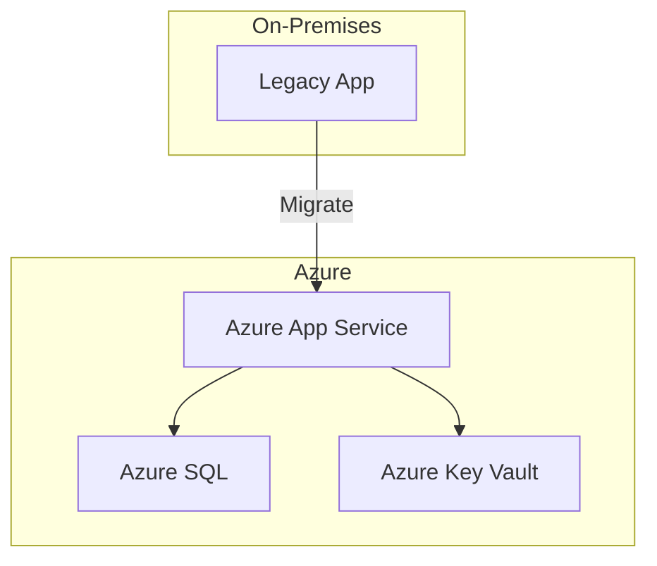
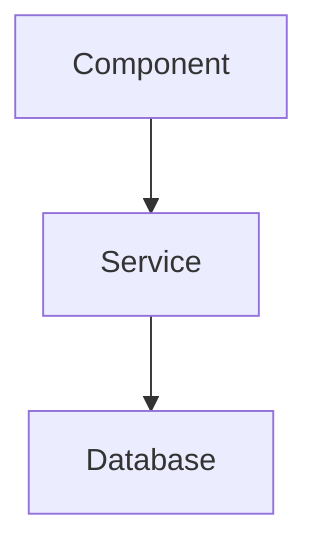
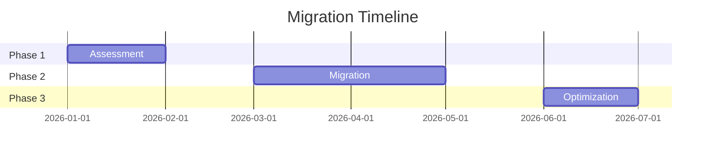

# Microsoft Cloud Advisor

## Installation

Install required MCP servers via npx:

```bash
# Azure MCP Server — live pricing, architecture, WAF, compute sizing
npx -y @azure/mcp@latest

# Microsoft Learn Documentation MCP — official docs search & fetch
npx -y @anthropic/microsoft-docs-mcp@latest

# Excel MCP Server (Windows only) — cost calculator workbook generation
npx -y excel-mcp-server@latest

# Markitdown MCP — document conversion (Word/PDF/PPT → markdown)
npx -y @microsoft/markitdown-mcp@latest
```

Add to `.vscode/mcp.json` in your workspace:
```json
{
  "servers": {
    "azure": { "command": "npx", "args": ["-y", "@azure/mcp@latest"] },
    "microsoft-lea": { "command": "npx", "args": ["-y", "@anthropic/microsoft-docs-mcp@latest"] },
    "excel-mcp": { "command": "npx", "args": ["-y", "excel-mcp-server@latest"] },
    "microsoft_mar": { "command": "npx", "args": ["-y", "@microsoft/markitdown-mcp@latest"] }
  }
}
```

## Purpose
Provide expert guidance on Microsoft Cloud technologies by combining official Microsoft Learn documentation with live Azure resource context. Covers Azure cloud, hybrid, migration, modernization, AI, data platforms (including Microsoft Fabric), reference architectures, **Azure cost calculators in Excel**, **document analysis from uploaded files**, and **presentation-ready markdown generation**.

## When to Use
- Compatibility and readiness assessments (on-prem → Azure)
- Migration strategy and planning (lift-and-shift, re-platform, re-architect)
- Application modernization paths (containers, PaaS, serverless)
- AI/ML architecture recommendations (Azure AI, Foundry, Cognitive Services)
- Data platform design (Fabric, Synapse, SQL, Cosmos DB, Data Factory)
- Hybrid cloud architecture (Azure Arc, Azure Stack, ExpressRoute)
- Reference architecture diagrams and best practices
- Well-Architected Framework pillar reviews
- Cost estimation and optimization guidance
- **Azure Pricing Calculator generation** (Excel workbooks with formulas)
- **Document processing** (user uploads Word, PDF, PPT → extract and advise)
- **Presentation-style markdown** (generate slide-ready content for PPT creation)

## Procedure

### Step 1: Understand the Customer Need
Classify the request into one or more categories:
- **Compatibility**: Can workload X run on Azure? What SKU/service fits?
- **Migration**: How to move from current state to Azure?
- **Modernization**: How to evolve an app to cloud-native?
- **AI/ML**: What Azure AI services fit this use case?
- **Data**: Which data platform (Fabric, Synapse, SQL, Cosmos) suits the scenario?
- **Hybrid**: How to span on-prem and cloud?
- **Architecture**: What's the recommended reference architecture?
- **Multi-Cloud**: How does Azure compare to AWS/GCP for this use case?
- **Cost Calculator**: Generate an Excel workbook with Azure pricing breakdown?
- **Document Analysis**: User uploaded a file (Word/PDF/PPT) — extract content and advise?
- **Presentation**: Generate slide-ready markdown for PowerPoint creation?
- **Hub-Spoke Networking** (Domain 9): Azure network topology, hub-spoke best practice, VNet peering, spoke decisions, landing zone networking, network cost comparison?

### Step 2: Research with MCP Microsoft Learn
Use these tools to gather authoritative guidance:

1. **`microsoft_docs_search`** — Search for relevant documentation chunks. Start broad, then narrow.
2. **`microsoft_code_sample_search`** — Find implementation examples when code is needed.
3. **`microsoft_docs_fetch`** — Fetch full pages for detailed walkthroughs, prerequisites, or architecture diagrams.

Example queries:
- "migrate SQL Server to Azure SQL managed instance"
- "Microsoft Fabric lakehouse architecture"
- "Azure AI Foundry deployment patterns"
- "hybrid connectivity Azure Arc"
- "Well-Architected Framework reliability pillar"

### Step 2b: 6R Migration Strategy Selection

When migration intent is detected, present the 6R decision tree before generating any plan:

```
User request contains migration keywords?
├── YES → Present 6R options table
│   ├── User selects Rehost → Generate lift-and-shift plan (VMs, Azure Migrate)
│   ├── User selects Replatform → Generate managed-services plan (App Service, SQL MI)
│   ├── User selects Refactor → Generate cloud-native plan (AKS, Functions, microservices)
│   ├── User selects Repurchase → Recommend SaaS alternatives (M365, Dynamics, Power Platform)
│   ├── User selects Retain → Document on-prem rationale, recommend Azure Arc management
│   └── User selects Retire → Decommission plan with dependency check
└── NO → Skip to appropriate domain
```

After selection:
1. Research strategy-specific best practices using `microsoft_docs_search`
2. Query `mcp_azure_mcp_azuremigrate` for tooling recommendations
3. Use `mcp_azure_mcp_pricing` for strategy-appropriate SKU pricing
4. Generate phased migration plan with Gantt timeline
5. Produce cost calculator if requested

### Step 3: Augment with Azure Context (when applicable)
Use MCP Azure tools to provide live, subscription-aware answers:

| Tool | Use Case |
|------|----------|
| `mcp_azure_mcp_cloudarchitect` | Architecture recommendations and patterns |
| `mcp_azure_mcp_wellarchitectedframework` | WAF pillar assessments |
| `mcp_azure_mcp_pricing` | Cost estimates and SKU pricing |
| `mcp_azure_mcp_documentation` | Azure-specific docs |
| `mcp_azure_mcp_get_azure_bestpractices` | Authoritative Azure best-practice guidance (complements `mcp_azure_mcp_documentation`) — use to validate and harden proposal recommendations |
| `mcp_azure_mcp_compute` | VM sizing and availability |
| `mcp_azure_mcp_sql` | SQL service options |
| `mcp_azure_mcp_cosmos` | Cosmos DB guidance |
| `mcp_azure_mcp_aks` | Kubernetes/container options |
| `mcp_azure_mcp_containerapps` | Serverless container guidance |
| `mcp_azure_mcp_appservice` | Web app hosting |
| `mcp_azure_mcp_advisor` | Optimization recommendations |
| `mcp_azure_mcp_azuremigrate` | Migration tooling and assessments |
| `mcp_azure_mcp_quota` | Region/SKU availability |
| `mcp_azure_mcp_get_available_region` | Region selection |

**Architecture Advisory (US1)**: For architecture requests, always:
1. Query `mcp_azure_mcp_cloudarchitect` for reference architecture patterns
2. Use `microsoft_docs_search` for official architecture guidance and diagrams
3. Check `mcp_azure_mcp_wellarchitectedframework` for relevant pillar considerations
4. Query `mcp_azure_mcp_pricing` for cost context on recommended services
5. Use `mcp_azure_mcp_compute` / `mcp_azure_mcp_aks` / `mcp_azure_mcp_appservice` for sizing
6. Call `mcp_azure_mcp_get_azure_bestpractices` to validate the recommendation against authoritative Azure best practices before finalizing the proposal — this complements `mcp_azure_mcp_documentation` to ensure precise, prescriptive guidance

### Step 4: Synthesize and Present
Structure the response with:

1. **Summary** — One-paragraph recommendation
2. **Architecture Diagram** — Use Mermaid diagrams to visualize the recommended architecture
3. **Service Mapping** — Table mapping requirements to Azure services
4. **Migration/Modernization Path** — Phased approach with milestones
5. **Considerations** — Cost, security, compliance, performance tradeoffs
6. **Next Steps** — Actionable items the user can take

### Step 5: Architecture Visualization
When showing architectures, use Mermaid diagrams:



## Decision Trees

### Migration Strategy Selection
```
Is downtime acceptable?
├── Yes → Lift-and-shift (Azure Migrate, VMs)
└── No → 
    ├── Is app containerizable? → Re-platform (AKS, Container Apps)
    └── Need full modernization? → Re-architect (App Service, Functions, microservices)
```

### Data Platform Selection
```
What's the primary workload?
├── Unified analytics + governance → Microsoft Fabric
├── Big data analytics (>100TB, complex ETL) → Synapse Dedicated Pools
├── Real-time streaming + analytics → Fabric Eventstreams + KQL
├── Transactional OLTP → Azure SQL / Cosmos DB
├── Document/graph queries → Cosmos DB
├── AI/ML training data → Azure ML + Fabric Lakehouse
└── Existing on-prem SQL Server → Azure SQL MI (replatform) or Fabric (modernize)
```

## Quality Criteria
- All recommendations cite official Microsoft documentation
- Architecture diagrams use standard Azure icons/naming
- Migration paths include effort estimates (low/medium/high)
- Cost implications are mentioned for each option
- Security and compliance considerations are addressed

---

## Step 5b: Multi-Cloud Comparison (US3)

When the user asks to compare Azure with AWS or GCP:

### Procedure
1. **Identify services to compare** — Map user's use case to equivalent services across providers
2. **Query each provider's MCP**:
   - Azure: Use `mcp_azure_mcp_pricing`, `mcp_azure_mcp_cloudarchitect`
   - AWS: Use `aws/*` tools for service catalog and pricing
   - GCP: Use `gcp/*` tools for service catalog and pricing
3. **Normalize results** — Create comparable metrics (monthly cost, features, SLA, regions)
4. **Generate comparison table** — Minimum 3 criteria per contracts/agent-interface.md
5. **Provide recommendation** — May recommend non-Azure where appropriate

### Handling Partial Data
If a provider's MCP is unavailable:
- Mark that column with "⚠️ Data unavailable"
- Note which MCP server needs to be installed
- Provide comparison with available data
- DO NOT block the entire comparison

### Common Comparison Scenarios
| Use Case | Azure | AWS | GCP |
|----------|-------|-----|-----|
| Kubernetes | AKS | EKS | GKE |
| Serverless Containers | Container Apps | Fargate | Cloud Run |
| Object Storage | Blob Storage | S3 | Cloud Storage |
| Managed SQL | Azure SQL | RDS | Cloud SQL |
| Data Warehouse | Fabric / Synapse | Redshift | BigQuery |
| AI/ML Platform | Azure AI / ML | SageMaker | Vertex AI |

### Cross-Cloud Service Mapping by Stack Layer

When the user asks to **map**, **translate**, or find the **equivalent** of a service across clouds, classify each mapping into the **stack layer** it belongs to, so the user understands the context the mapping comes from:

| Stack | Definition | Answers |
|-------|-----------|---------|
| **Application Stack** | Services the workload code consumes directly — compute runtimes, databases, messaging, app integration, AI/ML, analytics. | "What do I build my app on top of?" |
| **Infrastructure Stack** | Foundational services the app runs within — networking, security perimeter, storage primitives, IAM/governance, observability, DNS/edge. | "What environment does my app run inside?" |

Always state which stack a mapping belongs to. When a request spans both, split the output into an **Application Stack** table and an **Infrastructure Stack** table.

**Application Stack mapping**:
| Category | Azure | AWS | GCP |
|----------|-------|-----|-----|
| VM Compute | Virtual Machines | EC2 | Compute Engine |
| Containers | AKS | EKS | GKE |
| Serverless Containers | Container Apps | Fargate / App Runner | Cloud Run |
| Functions | Azure Functions | Lambda | Cloud Functions |
| PaaS Web | App Service | Elastic Beanstalk | App Engine |
| Relational DB | Azure SQL / PostgreSQL | RDS / Aurora | Cloud SQL / AlloyDB |
| NoSQL Document | Cosmos DB | DynamoDB | Firestore |
| Cache | Cache for Redis | ElastiCache | Memorystore |
| Data Warehouse | Fabric / Synapse | Redshift | BigQuery |
| Event Streaming | Event Hubs | Kinesis / MSK | Pub/Sub |
| Message Queue | Service Bus | SQS | Pub/Sub / Cloud Tasks |
| Event Routing | Event Grid | EventBridge | Eventarc |
| API Management | API Management | API Gateway | Apigee |
| AI/ML Platform | Azure AI Foundry / Azure ML | SageMaker / Bedrock | Vertex AI |

**Infrastructure Stack mapping**:
| Category | Azure | AWS | GCP |
|----------|-------|-----|-----|
| Virtual Network | VNet | VPC | VPC |
| Network Peering | VNet Peering | VPC Peering / Transit Gateway | VPC Network Peering |
| L7 LB / WAF | Application Gateway + WAF | ALB + AWS WAF | Cloud LB (HTTP) + Cloud Armor |
| CDN | Front Door / CDN | CloudFront | Cloud CDN |
| DNS | Azure DNS | Route 53 | Cloud DNS |
| Firewall | Azure Firewall | Network Firewall | Cloud NGFW |
| Private Connectivity | ExpressRoute | Direct Connect | Cloud Interconnect |
| Object Storage | Blob Storage | S3 | Cloud Storage |
| Block Storage | Managed Disks | EBS | Persistent Disk |
| File Storage | Azure Files | EFS / FSx | Filestore |
| Secrets / KMS | Key Vault | Secrets Manager / KMS | Secret Manager / Cloud KMS |
| IAM / Identity | Microsoft Entra ID | IAM / Identity Center | Cloud IAM |
| Governance / Policy | Azure Policy | SCP / Config | Organization Policy |
| Monitoring / Logs | Azure Monitor | CloudWatch | Cloud Monitoring / Logging |
| IaC | Bicep / ARM | CloudFormation | Deployment Manager |

**Mapping rules**:
1. Live `aws/*` or `gcp/*` MCP data overrides this reference table — cite the source.
2. Flag **non-1:1 mappings** (e.g., Pub/Sub spans both Event Hubs and Service Bus; Cosmos DB ≠ DynamoDB feature-for-feature).
3. When no equivalent exists, mark "⚠️ No direct equivalent" and describe the closest pattern.

---

## Step 5c: Data Platform Advisory with Fabric (US6)

When the user asks about data architecture, lakehouse, analytics, or streaming:

### Procedure
1. **Classify data workload** using the Data Platform Decision Tree above
2. **Query Fabric MCP** for live workspace context:
   - `mcp_microsoft_fab_kusto_list_databases` — Discover existing KQL databases
   - `mcp_microsoft_fab_kusto_list_tables` — Explore table schemas
   - `mcp_microsoft_fab_onelake_list_workspaces` — List Fabric workspaces
   - `mcp_microsoft_fab_onelake_list_items` — Browse lakehouse items
   - `mcp_microsoft_fab_eventstream_list` — List eventstreams
3. **Research with Microsoft Learn**:
   - `microsoft_docs_search` for "Microsoft Fabric lakehouse architecture"
   - `microsoft_docs_search` for "Fabric medallion architecture"
   - `microsoft_docs_search` for "Fabric eventstream real-time analytics"
4. **Design architecture** — Recommend pattern (lakehouse, medallion, real-time, hybrid)
5. **Include KQL examples** where applicable using `mcp_microsoft_fab_kusto_query`

### Fabric Architecture Patterns
- **Lakehouse**: OneLake + Delta tables + SQL analytics endpoint + Power BI
- **Medallion Architecture**: Bronze (raw ingestion) → Silver (cleaned/validated) → Gold (curated/aggregated)
- **Real-Time Analytics**: Eventstreams → KQL Database → Real-Time Dashboard
- **Hybrid with Synapse**: Fabric for unified analytics + Synapse Dedicated for heavy ETL workloads

---

## Step 6: Azure Pricing Calculator Generator (Excel MCP)

When the user requests cost estimation, TCO analysis, or Azure pricing breakdown, generate an **Excel workbook** using the Excel MCP tools.

### Mandatory Input Gate (Constitution Domain 6)

Before generating any calculator, the workbook MUST be parameterized by **three required inputs**. If any is missing from the request, ask the user before proceeding:

1. **Region** — Pricing varies by Azure region. Always pull region-specific pricing from `mcp_azure_mcp_pricing` for the user's chosen region. If the user wants to compare regions, generate side-by-side region columns. Region is an editable input cell on the Assumptions sheet that drives all unit-price lookups.
2. **Migration Strategy (6R)** — The workbook MUST reflect cost differences by selected strategy. Ask which 6R strategy applies if not stated:
   | Strategy | Cost Model | Primary Azure Targets |
   |----------|-----------|------------------------|
   | **Rehost** (lift-and-shift) | IaaS VM + managed disks | Virtual Machines, Managed Disks |
   | **Replatform** | PaaS, minimal changes | App Service, ACI, SQL MI |
   | **Refactor** | Serverless / containers | Functions, Container Apps |
   | **Rearchitect** | Cloud-native rebuild | AKS, microservices, Cosmos DB |
   | **Rebuild** | Greenfield Azure-native | Azure-native PaaS stack |
   | **Replace** | SaaS substitution | M365, Dynamics, Power Platform |
3. **Hybrid split** — When workloads span on-prem + Azure, capture the split percentage (% on-prem vs % Azure) and include hybrid line items: Azure Arc licensing/management, ExpressRoute / VPN Gateway connectivity, and Azure Stack HCI or AVS where applicable.

**Azure Hybrid Benefit (AHB)** — For any Windows Server or SQL Server workload, you MUST evaluate AHB and surface it as an explicit, toggleable input. AHB removes the **license uplift** portion of compute cost (not the base compute) when the customer has Software Assurance or a qualifying subscription. AHB **stacks** with Reserved Instances. Honesty rules:
- Only apply AHB when the customer actually owns eligible licenses with Software Assurance — never assume.
- Cap covered capacity at owned-license capacity (Windows Server: 8-core pack → up to 8 vCPU, 16-core min/server; SQL Enterprise: up to 4 vCore/license; SQL Standard: 1:1).
- AHB reduces the license portion only — never base compute, storage, or networking.
- Show AHB savings as an explicit memo line, do not silently bake it in.

The **Assumptions sheet MUST expose region, 6R strategy, hybrid split, and AHB toggles (Windows Server, SQL Server) as editable input cells** that drive all downstream formulas.

### Procedure
1. **Confirm the three mandatory inputs** (region, 6R strategy, hybrid split) — ask if missing
2. Research pricing with `mcp_azure_mcp_pricing` for relevant SKUs **in the chosen region**
3. Select the cost model and target services based on the **6R strategy** (see table above)
4. Use Excel MCP to create a workbook:
   - `mcp_excel-mcp_file` → Create/open workbook
   - `mcp_excel-mcp_worksheet` → Create sheets (Summary, Compute, Storage, Networking, PaaS, Strategy, Hybrid, AHB, Assumptions)
   - `mcp_excel-mcp_range_edit` → Populate pricing data
   - `mcp_excel-mcp_range_format` → Format as currency, headers, borders
   - `mcp_excel-mcp_table` → Create structured tables
   - `mcp_excel-mcp_chart` → Add cost breakdown charts

### Calculator Template Structure

| Sheet | Contents |
|-------|----------|
| **Summary** | Executive cost summary, monthly/annual totals, charts |
| **Compute** | VMs, AKS, App Service, Functions — SKU, qty, unit cost, total |
| **Storage** | Disks, Blob, Files, Data Lake — tier, capacity, cost |
| **Networking** | VPN, ExpressRoute, Load Balancer, Bandwidth — usage, cost |
| **PaaS & Data** | SQL, Cosmos, Fabric, AI services — tier, DTU/RU, cost |
| **Strategy (6R)** | Selected 6R strategy → cost model, target services, per-strategy multipliers |
| **Hybrid** | Azure Arc, ExpressRoute/VPN, AVS/HCI, on-prem vs Azure split % |
| **AHB** | Azure Hybrid Benefit — Windows/SQL license uplift avoided, eligibility & coverage rules, net savings |
| **Assumptions** | Editable inputs: **region**, **6R strategy**, **hybrid split %**, **AHB Windows/SQL toggles**, reserved vs PAYG, growth % |

### Excel Formulas to Include
```
=SUMPRODUCT(qty, unit_price)          -- Line item totals
=SUM(monthly_costs)                    -- Category subtotals
=monthly_total * 12                    -- Annual projection
=monthly_total * (1 + growth_rate)^months  -- Growth forecast
=IF(reserved, price*0.6, price)        -- Reserved instance discount
=VLOOKUP(region, region_pricing, col)  -- Region-driven unit price
=base_cost * strategy_multiplier       -- 6R strategy cost adjustment
=azure_cost*azure_split + onprem_cost*(1-azure_split)  -- Hybrid split
=IF(ahb_applied, 0, license_uplift)    -- AHB removes Windows/SQL license uplift
=IF(AND(ahb_eligible, ahb_applied), covered_units*uplift_rate*730, 0)  -- AHB net savings (capped at owned licenses)
```

---

## Step 7: Document Processing (Upload Handling)

When a user uploads a document (Word, PDF, PowerPoint, or other file), extract and analyze its content to provide Azure advisory.

### Supported Inputs
| Format | MCP Tool | Action |
|--------|----------|--------|
| `.xlsx` / `.xlsm` | `mcp_excel-mcp_file` + `mcp_excel-mcp_range` | Open and read cell data |
| `.docx` / `.pdf` | `mcp_microsoft_mar_convert_to_markdown` | Convert to markdown for analysis |
| `.pptx` | `mcp_microsoft_mar_convert_to_markdown` | Convert slides to markdown |
| Image attachments | Vision/multimodal | Analyze architecture diagrams |

### Procedure for Uploaded Documents
1. **Identify file type** from the attachment
2. **Extract content**:
   - Excel → Use Excel MCP to read ranges/tables
   - Word/PDF/PPT → Use `mcp_microsoft_mar_convert_to_markdown` to get text
   - Images → Analyze visually for architecture patterns
3. **Classify intent** — Is this an existing architecture doc? A requirements list? A cost sheet?
4. **Apply advisory** — Run through Steps 1-5 using extracted content as context
5. **Respond** with recommendations tailored to the document content

---

## Step 8: Presentation-Style Markdown Generator (PPT-Ready)

Generate markdown formatted specifically for PowerPoint/presentation creation. Use this when the user asks for slides, presentations, decks, or executive summaries.

### PPT Markdown Format

Use the following structure — each `---` separator = one slide:

```markdown
---
# Slide Title

## Subtitle or Context Line

- Bullet point 1
- Bullet point 2  
- Bullet point 3

> Speaker notes: Additional detail for the presenter

---
```

### Slide Templates

#### Title Slide
```markdown
---
# [Project/Topic Name]
## Azure Cloud Advisory

**Prepared by**: [Team]  
**Date**: [Date]  
**Classification**: [Internal/Confidential]

---
```

#### Architecture Slide
```markdown
---
# Recommended Architecture



**Key Design Decisions:**
- Decision 1 with rationale
- Decision 2 with rationale

> Speaker notes: Walk through data flow left to right

---
```

#### Comparison Slide
```markdown
---
# Option Comparison

| Criteria | Option A | Option B | Option C |
|----------|----------|----------|----------|
| Cost/mo | $X | $Y | $Z |
| Effort | Low | Medium | High |
| Risk | Low | Low | Medium |

**Recommendation**: Option B — best balance of cost and capability

---
```

#### Cost Summary Slide
```markdown
---
# Cost Estimation

| Category | Monthly | Annual |
|----------|---------|--------|
| Compute | $X | $Y |
| Storage | $X | $Y |
| Network | $X | $Y |
| **Total** | **$X** | **$Y** |

📊 *Detailed calculator attached as Excel workbook*

---
```

#### Timeline/Roadmap Slide
```markdown
---
# Migration Roadmap



---
```

### Presentation Generation Rules
1. **Max 6 bullets per slide** — keep content scannable
2. **One key message per slide** — don't overload
3. **Use Mermaid** for architecture and timeline diagrams
4. **Include speaker notes** with `> Speaker notes:` for context

---

## Step 9: Hub-and-Spoke Network Architecture Advisory (Domain 9)

When the request is classified as hub-spoke networking, follow this specialized procedure.

### Domain 9 Triggers

Activate this domain when the user query contains ANY of these triggers:
- "best practice" (networking context)
- "price comparison" (networking context)
- "VNet peering"
- "multiple environments"
- "landing zone"
- "network topology"
- "hub-spoke" / "hub and spoke"
- "spoke"
- "Virtual WAN" / "VWAN"
- "network architecture"
- "shared services network"

### Domain 9 Routing

After trigger detection, sub-classify into one of these flows:

| Sub-Flow | Additional Triggers | Procedure |
|----------|---------------------|-----------|
| **Best Practice** | "best practice", "recommend", "how should I design" | → Step 9a |
| **Cost Comparison** | "cost", "price", "savings", "compare cost" | → Step 9b |
| **Decision Matrix** | "single spoke vs multiple", "how many spokes", "topology" | → Step 9c |
| **Diagram** | "diagram", "show me", "architecture diagram", "visualize" | → Step 9d |
| **Landing Zone** | "landing zone", "enterprise-scale", "connectivity subscription" | → Step 9e |
| **Virtual WAN** | "Virtual WAN", "VWAN", "managed hub" | → Step 9f |

### L-Level Depth Scaling (Domain 9)

When hub-spoke domain is classified, check user's requested depth and scale response:

| Level | Diagram Detail | Cost Detail | Advisory Detail |
|-------|---------------|-------------|-----------------|
| **L100** | Hub + spoke boxes only | Monthly range estimate | 1-paragraph summary |
| **L200** | Hub services labeled, spokes named | Comparison table with savings | + Hub services table + alternatives |
| **L300** | Subnet names, IP ranges, NSGs | + SKU breakdown + peering math | + Security controls + UDRs |
| **L400** | Route tables, FW rules, DNS zones | + TCO + Reserved Instance | + Threat model + compliance mapping |

If user hasn't specified L-level, default to L200 and confirm.

### Firewall SKU Clarification Gate

**MANDATORY**: When a cost or pricing question is detected AND Firewall SKU is not provided in the query:

1. STOP before generating any cost figures
2. Present the SKU comparison table:

> **Which Azure Firewall SKU should I use for the cost comparison?**
>
> | SKU | Throughput | Monthly Cost (approx) | Best For |
> |-----|-----------|----------------------|----------|
> | **Basic** | ~250 Mbps | ~$285/mo | SMB, dev/test, low-traffic |
> | **Standard** | ~30 Gbps | ~$730/mo | Enterprise general purpose |
> | **Premium** | ~100 Gbps | ~$1,752/mo | Regulated industries (TLS inspection, IDPS) |

3. Wait for user response before proceeding with cost calculations
4. Also ask for spoke count and region if not provided

### MCP Pricing with Graceful Degradation

When generating cost comparisons:

1. **Attempt**: Call `mcp_azure_mcp_pricing` for Firewall, VPN Gateway, and Bastion pricing in user's region
2. **If successful**: Use live prices, state "Pricing source: Live Azure MCP (as of {date})"
3. **If unavailable/error**: 
   - State clearly: "⚠️ Live pricing unavailable — using approximate estimates"
   - Use well-known approximate monthly costs:
     - Firewall Basic: ~$285/mo | Standard: ~$730/mo | Premium: ~$1,752/mo
     - VPN Gateway VpnGw1: ~$140/mo
     - Azure Bastion Standard: ~$278/mo
     - DNS Private Resolver: ~$130/mo
   - Add disclaimer: "Verify current pricing at https://azure.microsoft.com/pricing/"
   - Show date: "Estimates as of {current date}"
   - Offer: "I can retry the live pricing lookup if you'd like"

### Step 9a: Best Practice Advisory

When classified as best-practice trigger, output the following sections in order:

1. **Summary Recommendation** — 2-3 sentences stating hub-spoke as the recommended Azure networking pattern. Cite Azure Architecture Center.

2. **Hub Services Table**:
   | Service | Purpose | Shared Benefit |
   |---------|---------|----------------|
   | Azure Firewall | Centralized network security, FQDN filtering, threat intelligence | Single policy for all spokes |
   | VPN/ExpressRoute Gateway | Cross-premises connectivity to on-prem/branches | One gateway serves all spokes via transit |
   | Azure Bastion | Secure RDP/SSH access without public IPs | Access VMs in any spoke from hub |
   | DNS Private Resolver | Hybrid DNS resolution (Azure ↔ on-prem) | Centralized DNS for all spokes |

3. **Mermaid Diagram** — Select from `templates/hub-spoke-diagram.md` at the appropriate L-level

4. **WAF Pillar Alignment** (L200+):
   - **Security**: Centralized firewall inspection for all spoke traffic
   - **Cost Optimization**: Shared hub resources instead of per-spoke duplication
   - **Reliability**: Spoke isolation — one spoke failure doesn't cascade
   - **Operational Excellence**: Single point of management for network policies
   - **Performance**: Low-latency VNet peering on Azure backbone

5. **Alternatives Note** — Brief mention of Virtual WAN as Microsoft-managed alternative (1-2 sentences)

6. **Next Steps** — 3-5 actionable items (e.g., "Plan IP address spaces", "Choose Firewall SKU", "Define spoke boundaries")

**Best-practice validation**: Before finalizing, call `mcp_azure_mcp_get_azure_bestpractices` to confirm the recommendation aligns with current Azure prescriptive guidance. Use it together with `mcp_azure_mcp_documentation` so the proposal reflects precise, authoritative best practices.

**Source**: https://learn.microsoft.com/azure/architecture/networking/architecture/hub-spoke

### Step 9b: Cost Comparison

When classified as cost/pricing trigger:

1. **Firewall SKU Gate** — Ask for SKU if not provided (see Firewall SKU Clarification Gate above)
2. **Gather inputs** — Ensure you have:
   - **Firewall SKU** (Basic/Standard/Premium) — ask if missing
   - **Spoke count** (N) — ask if missing
   - **Target Azure region** — ask if missing; when unknown, default to **East US 2** and label it clearly as an editable assumption
   - **Expected inter-VNet data transfer** (GB/month per spoke) — ask if missing; when unknown, default to **1,000 GB/month per spoke** and label it clearly as an editable assumption
3. **Call MCP pricing** — `mcp_azure_mcp_pricing` for Firewall, Gateway, Bastion in the resolved region (with graceful degradation)
4. **Calculate savings** — Shared (1×) vs. duplicated (N× spokes):
   - Savings per resource = monthly_cost × (N - 1)
   - Total shared savings = sum of all resource savings
5. **Add VNet peering cost** — $0.01/GB × (GB/month per spoke) × 2 directions × N spokes
6. **Present net savings** — Total savings minus peering overhead. State the region and peering-volume assumptions explicitly so the user can adjust them.

**Output format** — Use `templates/hub-spoke-cost-comparison.md` structure:
- Pricing Source statement
- Hub Shared Resources Table
- VNet Peering Cost table
- Net Savings Summary
- Assumptions list
- Next Steps (include "Generate Excel calculator" option)

**Spoke count rendering**:
- ≤ 10 spokes: individual rows per spoke
- > 10 spokes: "N spokes × unit cost" summary

**Excel Integration**: When the user requests a detailed calculator (offer "Generate Excel calculator" as a next step), reference `templates/cost-calculator-template.md` and use Domain 6 format: region-parameterized pricing (resolved region or East US 2 default), peering volume assumption (GB/month per spoke, or 1,000 default), Networking sheet placement, and editable Assumptions sheet input cells (region, spoke count, peering volume).

### Step 9c: Decision Matrix (Single vs. Multiple Spokes)

When classified as spoke-topology trigger:

1. **Decision Summary** — 1-2 sentences framing the choice
2. **Comparison Table** — Use `templates/hub-spoke-decision-matrix.md` with 6 factors:
   - Isolation, Cost, Compliance, Management, Scalability, Team Autonomy
3. **Scenario Recommendations**:
   - Dev/test or small org → single spoke (or 2: prod + non-prod)
   - Production with compliance → multiple spokes per compliance boundary
   - Multi-team / enterprise → multiple spokes per team or business unit
4. **Next Steps** — 2-3 actionable items

### Step 9d: Diagram Generation

When a diagram is requested:

1. **Detect L-level** — From user query or conversation context (default L200)
2. **Get spoke count** — Ask if not specified (default: 3 for examples)
3. **Select template section** — From `templates/hub-spoke-diagram.md`:
   - L100 → Executive Overview section
   - L200 → Architecture Overview section
   - L300 → Engineering Detail section (subnets, IPs, NSGs)
   - L400 → Deep Dive section (UDRs, FW rules, DNS zones)
4. **Render with user context** — Replace example values with user's:
   - Spoke names/purposes if provided
   - Spoke count (max 10 individual; >10 use collapsed "Spoke Group (N spokes)" node)
   - On-premises connectivity if specified (add On-Prem element from template)
5. **Include diagram key** — Label explanation for L300+ diagrams

### Step 9e: Landing Zone Foundation

When classified as landing-zone trigger:

1. **Frame hub-spoke as Enterprise-Scale connectivity foundation**:
   - Hub VNet lives in the **Connectivity subscription** under the Platform management group
   - Spokes map to **Landing Zone subscriptions** (one per workload/team)
   - Management group hierarchy: Root → Platform (Connectivity, Identity, Management) → Landing Zones (Corp, Online)

2. **Reference Azure Landing Zone accelerator**:
   - Hub-spoke is the networking component of the Cloud Adoption Framework landing zone
   - Connectivity subscription owns: Firewall, Gateway, DNS, DDoS Protection Plan
   - Landing zone subscriptions peer to hub — inherit connectivity and security policies

3. **L300+ detail** (when depth is L300 or L400):
   - Azure Firewall policies with rule collection groups per spoke/BU
   - Route tables for forced tunneling (0.0.0.0/0 → Firewall private IP)
   - DNS Private Resolver in hub linked to all Private DNS Zones
   - Azure Landing Zone accelerator reference: https://aka.ms/alz

4. **Next Steps** — Reference Azure Landing Zone accelerator for full deployment

### Step 9f: Virtual WAN Comparison

When "Virtual WAN" or "VWAN" trigger is detected, provide a **qualitative tradeoff comparison by default**. Only produce a quantified cost table when the user **explicitly** asks to compare costs (see step 4).

1. **Summary** — Distinguish customer-managed hub-spoke from Microsoft-managed Virtual WAN hub

2. **Comparison Table** (qualitative — always include):
   | Aspect | Customer-Managed Hub-Spoke | Azure Virtual WAN |
   |--------|---------------------------|-------------------|
   | Management | Full control — you manage Firewall, UDRs, peering | Microsoft-managed routing and connectivity |
   | Cost | Pay per resource (Firewall, Gateway, Bastion) | Virtual WAN hub fee + per-connection unit pricing |
   | Routing | Manual UDRs per spoke, custom route tables | Automatic any-to-any routing, route propagation |
   | Multi-region | Requires manual multi-hub peering | Built-in global transit between hubs |
   | Flexibility | Full NVA choice, custom topology | Limited to supported configurations |
   | Branch connectivity | Site-to-Site VPN or ExpressRoute to hub GW | Integrated SD-WAN, VPN, ER with simplified onboarding |
   | Best for | Custom topologies, NVA preference, cost control | Large branch networks (>50), simplified routing |

3. **Recommendation Criteria**:
   - Choose customer-managed hub-spoke when: < 50 branches, need custom NVAs, cost sensitivity, want full control
   - Choose Virtual WAN when: > 50 branches, need simplified global routing, SD-WAN integration, any-to-any transit

4. **Quantified cost comparison (only on explicit request)** — If, and only if, the user explicitly asks for a VWAN vs. hub-spoke cost comparison:
   - Call `mcp_azure_mcp_pricing` (with graceful degradation) for both options in the resolved region
   - Virtual WAN side: VWAN hub unit fee + connection unit pricing + data processing per GB
   - Hub-spoke side: Firewall + Gateway + Bastion (per Step 9b)
   - Present a side-by-side monthly cost table with the region and traffic-volume assumptions labeled as editable
   - Otherwise, keep the response qualitative and offer: "I can produce a quantified VWAN vs. hub-spoke cost table if you'd like."

4. **Next Steps**

**Source**: https://learn.microsoft.com/azure/architecture/networking/architecture/hub-spoke#architecture

### Edge Case Handling

- **Mesh networking asked**: Acknowledge as alternative, explain hub-spoke preference (centralized security, cost efficiency, simpler management). Note mesh may suit peer-to-peer microservices but lacks centralized control.
- **Flat network detected**: Recommend phased migration to hub-spoke — start with hub + 2 spokes (prod/non-prod), migrate workloads incrementally.
- **Multi-region asked**: Note this feature covers single-region only. For multi-region, mention Azure Virtual WAN or multi-hub pattern, and offer to elaborate.

### Security Controls (L300+)

When depth is L300 or higher, include security controls section:

- **NSG Rules**: Spoke subnets should have deny-all-inbound by default, with explicit allow rules for required flows
- **Private Endpoints**: Place in spokes for PaaS access (SQL, Storage, Key Vault) — DNS resolution via hub DNS Resolver
- **Azure Firewall Network Rules**: Control spoke-to-spoke and spoke-to-internet traffic centrally
- **Azure Firewall Application Rules**: FQDN filtering for outbound web access
- **DDoS Protection Plan**: Attach to hub VNet — protection extends to peered spokes (Standard plan)
