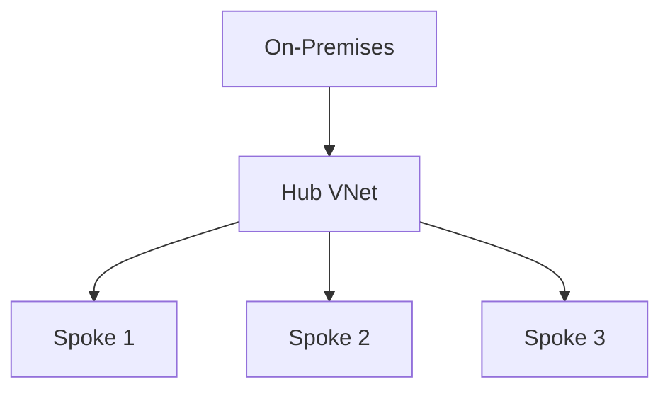
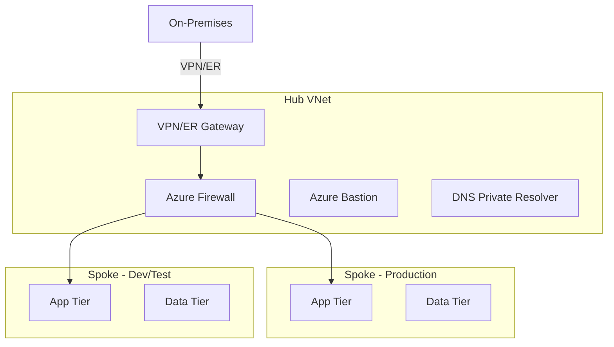
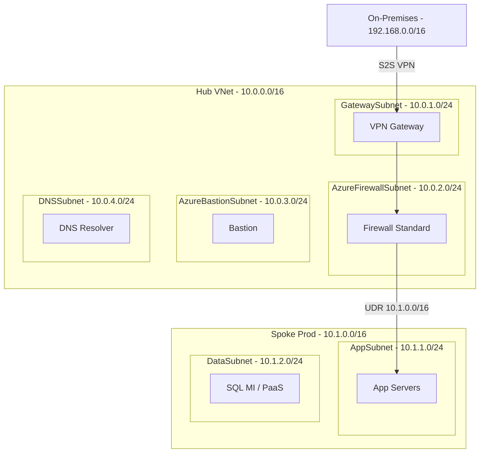
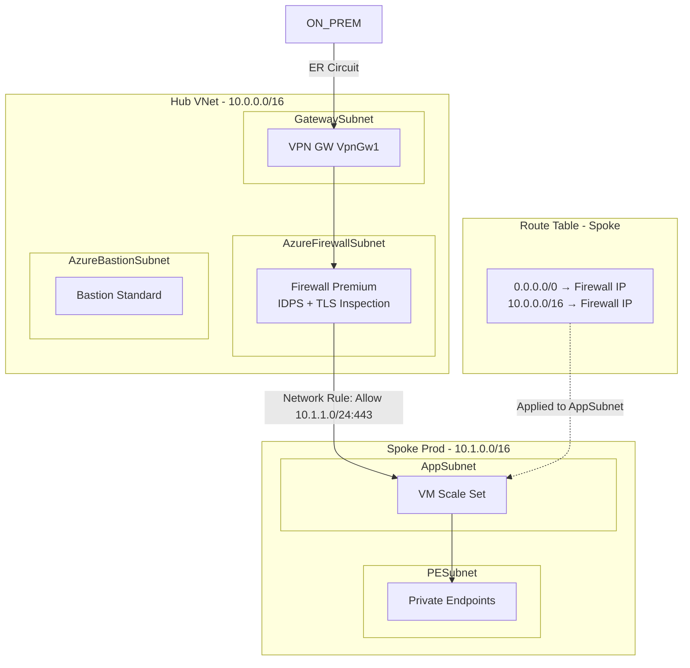

# Hub-Spoke Patterns Reference

## Mermaid Diagram Templates

### L100 -- Simple Hub-Spoke


### L200 -- Hub Services Labeled


### L300 -- With Subnets and IP Ranges


### L400 -- With Route Tables and Firewall Rules


## Firewall SKU Decision Table

| Factor | Basic | Standard | Premium |
|--------|-------|----------|---------|
| Throughput | ~250 Mbps | ~30 Gbps | ~100 Gbps |
| IDPS | No | No | Yes |
| TLS Inspection | No | No | Yes |
| URL Filtering | Limited | FQDN-based | Full category-based |
| Threat Intel | Basic deny | Full deny/alert | Full + custom feeds |
| IP Groups | Limited | Yes | Yes |
| Monthly Approx | ~$285 | ~$730 | ~$1,752 |
| Best For | SMB, dev/test, PoC | Enterprise general purpose | Regulated, PCI, HIPAA |

## Cost Comparison Template

| Resource | Shared Hub (1x) | Per-Spoke (Nx) | Savings (N-1)x |
|----------|-----------------|----------------|----------------|
| Azure Firewall ({SKU}) | ${fw_monthly} | ${fw_monthly} x N | ${fw_monthly} x (N-1) |
| VPN Gateway ({sku}) | ${gw_monthly} | ${gw_monthly} x N | ${gw_monthly} x (N-1) |
| Azure Bastion Standard | ${bas_monthly} | ${bas_monthly} x N | ${bas_monthly} x (N-1) |
| DNS Private Resolver | ${dns_monthly} | ${dns_monthly} x N | ${dns_monthly} x (N-1) |
| **VNet Peering (overhead)** | $0.01/GB x GB x 2 x N | $0 | -${peering_total} |
| **Net Monthly Savings** | -- | -- | ${total_savings} |

## VNet Peering Cost Formula

```
peering_cost_monthly = spoke_count × data_gb_per_spoke × $0.01/GB × 2 (bidirectional)
```

Notes:
- Same-region peering: $0.01/GB each direction
- Cross-region peering: $0.02-$0.08/GB (varies by region pair)
- Always multiply by 2 for bidirectional traffic
- Compare peering cost against savings from shared hub resources
