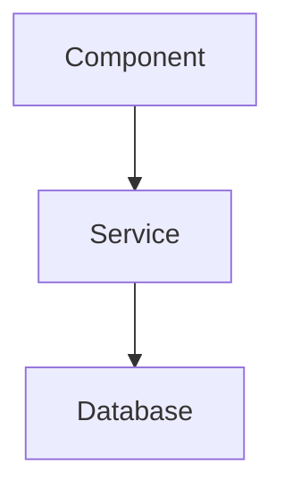
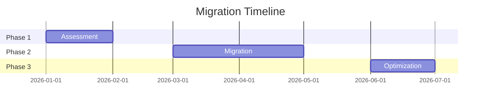

# Presentation Generation Workflow

## Trigger
Request contains: presentation, slides, deck, PPT, executive summary, "create slides".

## Slide Formatting Constraints
- **Max 30 slides per deck** -- consolidate if content exceeds 30
- **Max 6 bullets per slide** -- keep content scannable
- **One key message per slide** -- do not overload
- **`---` separators** between slides
- **Speaker notes** on every slide using `> Speaker notes:` blockquote
- **Mermaid diagrams** where visual adds value

## Slide Format

```markdown
---
# Slide Title

## Subtitle or Context Line

- Bullet point 1
- Bullet point 2
- Bullet point 3

> Speaker notes: Additional detail for the presenter

---
```

## Standard Slide Templates

### Title Slide
```markdown
---
# [Project/Topic Name]
## Azure Cloud Advisory

**Prepared by**: [Team]
**Date**: [Date]
**Classification**: [Internal/Confidential]
---
```

### Architecture Slide
```markdown
---
# Recommended Architecture



**Key Design Decisions:**
- Decision 1 with rationale
- Decision 2 with rationale

> Speaker notes: Walk through data flow left to right
---
```

### Comparison Slide
```markdown
---
# Option Comparison

| Criteria | Option A | Option B | Option C |
|----------|----------|----------|----------|
| Cost/mo | $X | $Y | $Z |
| Effort | Low | Medium | High |
| Risk | Low | Low | Medium |

**Recommendation**: Option B -- best balance of cost and capability
---
```

### Cost Summary Slide
```markdown
---
# Cost Estimation

| Category | Monthly | Annual |
|----------|---------|--------|
| Compute | $X | $Y |
| Storage | $X | $Y |
| Network | $X | $Y |
| **Total** | **$X** | **$Y** |

*Detailed calculator attached as Excel workbook*
---
```

### Timeline/Roadmap Slide
```markdown
---
# Migration Roadmap


---
```

## Generation Rules
1. Max 6 bullets per slide
2. One key message per slide
3. Use Mermaid for architecture and timeline diagrams
4. Include speaker notes on every slide
5. If content exceeds 30 slides, consolidate and offer a follow-up deck
