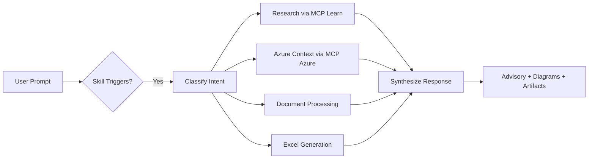

# Cloud Advisor Agent — Microsoft Cloud & Azure Advisory for Copilot

A comprehensive **GitHub Copilot custom agent and skill** that transforms Copilot into a Microsoft Cloud & Azure expert advisor. It leverages MCP (Model Context Protocol) tools for live Azure context, Microsoft Learn documentation, Excel workbook generation, document processing, and presentation-ready markdown.

## Install

Scaffold the agent files directly into your current folder with `npx` — no `git clone` or `cd` required:

```bash
npx degit ibranibeny/Cloud-Advisor-Agent
```

## Getting Started

From zero to your first answer in four steps:

1. **Scaffold the files** into your workspace root:
   ```bash
   npx degit ibranibeny/Cloud-Advisor-Agent
   ```
   This drops `.github/agents/`, `.vscode/mcp.json`, and the skill files into the current folder.

2. **Install the MCP servers** (one-time, see [Install MCP Servers](#install-mcp-servers-npx)):
   ```bash
   npx -y @azure/mcp@latest
   ```

3. **Reload VS Code** so it picks up the agent and MCP config: `Ctrl+Shift+P` → **Developer: Reload Window**.

4. **Open Copilot Chat** (agent mode) and invoke the advisor:
   ```
   @cloud-advisor Design a hub-spoke network for my Azure landing zone
   ```

> Tip: append an L-level (`L100`–`L400`) to any prompt to control depth — `L100` for executive summaries, `L400` for detailed architecture specs.

## Capabilities

| Feature | Description |
|---------|-------------|
| **Azure Advisory** | Architecture recommendations, migration planning, modernization paths |
| **Cost Calculator** | Generates Excel workbooks with Azure pricing breakdown using Excel MCP |
| **Document Processing** | Extracts content from uploaded Word/PDF/PPT files and provides advisory |
| **Presentation Generator** | Creates slide-ready markdown formatted for PowerPoint generation |
| **Well-Architected Reviews** | WAF pillar assessments with live Azure context |
| **Reference Architectures** | Mermaid diagrams for recommended topologies |
| **Enterprise Infra Planning + IaC** | Architect end-to-end Azure infrastructure and generate Bicep or Terraform via the bundled Microsoft [`azure-enterprise-infra-planner`](skills/azure-enterprise-infra-planner/SKILL.md) skill |
| **Cost Management (live billing)** | Query actual spend, forecast future costs, and find savings on deployed resources via the bundled Microsoft [`azure-cost`](skills/azure-cost/SKILL.md) skill |

## Bundled Skills

| Skill | Source | Use For |
|-------|--------|---------|
| **microsoft-cloud-advisor** | This repo | Advisory, cost calculators, multi-cloud comparison, WAF reviews, presentations |
| **azure-enterprise-infra-planner** | [microsoft/azure-skills](https://github.com/microsoft/azure-skills/tree/main/skills/azure-enterprise-infra-planner) (MIT) | Architect/provision enterprise infrastructure and generate deployable Bicep or Terraform via a 7-phase workflow |
| **azure-cost** | [microsoft/azure-skills](https://github.com/microsoft/azure-skills/tree/main/skills/azure-cost) (MIT) | Query historical Azure spend, forecast future costs, and optimize/reduce waste on deployed resources via the Cost Management API |

The agent loads `microsoft-cloud-advisor` for advisory/costing/comparison, escalates to `azure-enterprise-infra-planner` to generate deployable IaC, and uses `azure-cost` for live billing data, forecasts, and cost optimization on already-deployed resources.


## Prerequisites

- [VS Code](https://code.visualstudio.com/) 1.100+ with GitHub Copilot
- GitHub Copilot Chat extension (agent mode)
- [Node.js](https://nodejs.org/) 18+ (for npx)
- MCP servers installed via npx (see [MCP Setup](#mcp-servers-required))

### Install MCP Servers (npx)

Run these one-time commands to install and verify:

```bash
# Install all required MCP servers
npx -y @azure/mcp@latest
npx -y @anthropic/microsoft-docs-mcp@latest
npx -y excel-mcp-server@latest
npx -y @microsoft/markitdown-mcp@latest
```

> **If MCP servers fail to start:** Ensure Node.js 18+ is installed (`node --version`), then re-run the npx commands above. The agent will detect missing MCP servers and prompt you with install instructions automatically.

## Quick Install

### Option 1: Agent Mode (recommended — full agent with MCP tools)

Copy the agent definition and MCP config into your workspace:

```powershell
# Windows
xcopy /E /I ".github\agents" "<your-repo>\.github\agents"
copy ".vscode\mcp.json" "<your-repo>\.vscode\mcp.json"
copy ".vscode\settings.json" "<your-repo>\.vscode\settings.json"
```

```bash
# macOS/Linux
cp -r .github/agents <your-repo>/.github/agents
cp .vscode/mcp.json <your-repo>/.vscode/mcp.json
cp .vscode/settings.json <your-repo>/.vscode/settings.json
```

Then invoke the agent directly in Copilot Chat:
```
@cloud-advisor Design a hub-spoke network for my Azure landing zone
```

### Option 2: Skill Mode (skill procedure without agent wrapper)

```powershell
# Windows — workspace-level
xcopy /E /I "skills\microsoft-cloud-advisor" "<your-repo>\.github\skills\microsoft-cloud-advisor"

# macOS/Linux
cp -r skills/microsoft-cloud-advisor <your-repo>/.github/skills/microsoft-cloud-advisor
```

### Option 3: Manual

1. Copy `.github/agents/cloud-advisor.agent.md` to your repo's `.github/agents/` folder
2. Copy `.vscode/mcp.json` to your repo's `.vscode/` folder
3. Optionally copy `skills/microsoft-cloud-advisor/SKILL.md` to `.github/skills/microsoft-cloud-advisor/`

### Option 4: GitHub Copilot CLI

The agent also works in the [GitHub Copilot CLI](https://docs.github.com/en/copilot/concepts/agents/about-copilot-cli) (`copilot`), which reads custom agents from `.github/agents/` in the current directory.

1. **Install the CLI** (one-time):
   ```bash
   npm install -g @github/copilot
   ```

2. **Scaffold the agent + skill files** into your project root (drops `.github/agents/` and the skills):
   ```bash
   npx degit ibranibeny/Cloud-Advisor-Agent
   ```

3. **Register the MCP servers** so the agent's tools work. Add them to `~/.copilot/mcp-config.json` (global) or run the `/mcp add` command inside the CLI:
   ```json
   {
     "mcpServers": {
       "azure": { "command": "npx", "args": ["-y", "@azure/mcp@latest"] },
       "microsoft-lea": { "command": "npx", "args": ["-y", "@anthropic/microsoft-docs-mcp@latest"] },
       "excel-mcp": { "command": "npx", "args": ["-y", "excel-mcp-server@latest"] },
       "microsoft_mar": { "command": "npx", "args": ["-y", "@microsoft/markitdown-mcp@latest"] }
     }
   }
   ```

4. **Start the CLI from your project root and select the agent:**
   ```bash
   copilot
   # then inside the session:
   /agent cloud-advisor
   Design a hub-spoke network for my Azure landing zone
   ```

   > The CLI must be launched from the folder that contains `.github/agents/cloud-advisor.agent.md` for the agent to be discovered. Verify available MCP tools with `/mcp` inside the session.

## Usage

In VS Code Copilot Chat, invoke the agent with `@cloud-advisor`. The agent uses L-levels (L100–L400) for response depth:

```
# Architecture advisory (L200 default)
@cloud-advisor Design an Azure architecture for a multi-region e-commerce platform

# Migration planning with 6R strategy
@cloud-advisor How do I migrate my on-prem SQL Server 2019 to Azure?

# Cost calculator (generates Excel workbook)
@cloud-advisor Generate an Azure pricing calculator for a 3-tier web app with AKS

# Multi-cloud comparison
@cloud-advisor Compare Azure Container Apps vs AWS Fargate vs GCP Cloud Run

# Document processing
[Attach a .docx or .pptx file] @cloud-advisor Analyze this architecture document

# Presentation generation
@cloud-advisor Create a 10-slide executive presentation on our Azure migration at L100

# Data platform advisory
@cloud-advisor Recommend a data platform for real-time IoT analytics with Fabric
```

## MCP Servers Required

This skill leverages these MCP tool families:

| MCP Server | Tools Used | Purpose |
|------------|-----------|---------|
| **Azure MCP** | `mcp_azure_mcp_*` | Live Azure context, pricing, architecture |
| **Microsoft Learn MCP** | `mcp_microsoft-lea_*` | Official documentation search & fetch |
| **Excel MCP** | `mcp_excel-mcp_*` | Cost calculator workbook generation |
| **Markitdown MCP** | `mcp_microsoft_mar_convert_to_markdown` | Document conversion (Word/PDF/PPT → MD) |

### Configuring MCP Servers

Add to your workspace `.vscode/mcp.json`:

```json
{
  "servers": {
    "azure": { "command": "npx", "args": ["-y", "@azure/mcp@latest"] },
    "microsoft-lea": { "command": "npx", "args": ["-y", "@anthropic/microsoft-docs-mcp@latest"] },
    "excel-mcp": { "command": "npx", "args": ["-y", "excel-mcp-server@latest"] },
    "microsoft_mar": { "command": "npx", "args": ["-y", "@microsoft/markitdown-mcp@latest"] }
  }
}
```

After adding the config, reload VS Code (`Ctrl+Shift+P` → "Developer: Reload Window").

> **Troubleshooting**: If the agent reports MCP tools are unavailable:
> 1. Verify Node.js 18+ is installed: `node --version`
> 2. Re-run the npx install commands above
> 3. Check `.vscode/mcp.json` exists in your workspace root
> 4. Reload VS Code window
> 5. Look for MCP server status in the Output panel (`Ctrl+Shift+U` → select "MCP")

## Repository Structure

```
microsoft-cloud-advisor/
├── README.md                          # This file
├── LICENSE                            # MIT License
├── .github/
│   ├── agents/
│   │   └── microsoft-cloud-advisor.agent.md  # Agent definition (primary)
│   ├── skills/
│   │   ├── microsoft-cloud-advisor/
│   │   │   └── SKILL.md              # Skill procedure (canonical)
│   │   ├── azure-enterprise-infra-planner/  # Microsoft skill (MIT), vendored
│   │   │   ├── SKILL.md
│   │   │   └── references/           # workflow, phases, constraints, resources, IaC
│   │   └── azure-cost/               # Microsoft skill (MIT), vendored
│   │       ├── SKILL.md
│   │       └── cost-query/ cost-forecast/ cost-optimization/
│   └── copilot-instructions.md       # Copilot workspace instructions
├── .vscode/
│   ├── mcp.json                       # MCP server configuration
│   └── settings.json                  # VS Code workspace settings
├── skills/
│   ├── microsoft-cloud-advisor/
│   │   └── SKILL.md                   # Skill definition (synced copy)
│   ├── azure-enterprise-infra-planner/  # Microsoft skill (MIT), synced copy
│   │   ├── SKILL.md
│   │   └── references/
│   └── azure-cost/                   # Microsoft skill (MIT), synced copy
│       ├── SKILL.md
│       └── cost-query/ cost-forecast/ cost-optimization/
├── templates/
│   ├── ppt-slide-templates.md         # PPT markdown format reference
│   └── cost-calculator-template.md    # Excel calculator structure guide
├── examples/
│   ├── migration-advisory.md          # Example output: migration plan
│   └── l400-migration-advisory.md     # Example output: L400 deep-dive (cost + arch + steps)
└── docs/
    ├── DEPLOY.md                      # Detailed deployment instructions
    └── CONTRIBUTING.md                # How to extend the skill
```

## How It Works



## Example: L400 Migration Advisory

A full implementation-ready (L400) advisory — with a costed comparison, architecture spec,
and migration steps — is in [examples/l400-migration-advisory.md](examples/l400-migration-advisory.md).
A condensed view:

**Prompt**

> "We have an on-prem 3-tier app — 2 web servers (8 vCPU / 32 GB), 2 app servers
> (16 vCPU / 64 GB), and a SQL Server 2019 cluster (32 vCPU / 256 GB). Give me an L400
> lift-and-shift plan to Azure with a hub-spoke network, a full cost comparison including
> Azure Hybrid Benefit and 3-year Reserved Instances, the architecture spec, and the
> migration steps. Target region East US 2."

**Solution** — lift web/app tiers to zone-redundant Azure VMs in a spoke VNet; re-platform
SQL Server to Azure SQL Managed Instance (Business Critical); centralize Firewall, Bastion,
and hybrid connectivity in a hub VNet with all egress forced through Azure Firewall via UDR.

| Tier | Source (each) | Count | Azure target | SKU |
|------|---------------|-------|--------------|-----|
| Web | 8 vCPU / 32 GB | 2 | Azure VM | `D8s_v5` |
| App | 16 vCPU / 64 GB | 2 | Azure VM | `D16s_v5` |
| Data | 32 vCPU / 256 GB | 1 cluster | Azure SQL MI | Business Critical, 32 vCore Gen5 |

**Cost comparison** (whole solution, East US 2, monthly)

| Strategy | Monthly | vs PAYG |
|----------|---------|---------|
| PAYG, no AHB | $11,128 | baseline |
| PAYG + AHB | $8,448 | −24% |
| **3Y RI + AHB (recommended)** | **$6,678** | **−40%** |

> Combining Azure Hybrid Benefit with 3-year Reserved Instances saves ~**$4,450/month
> (~$53K/year)** versus on-demand list pricing.

**Architecture spec** — hub `10.0.0.0/16` (AzureFirewallSubnet `/26`, AzureBastionSubnet
`/26`, GatewaySubnet `/27`); spoke `10.1.0.0/16` (snet-web `10.1.0.0/24`, snet-app
`10.1.1.0/24`, snet-data `10.1.2.0/24` delegated to SQL MI). Deny-all-inbound NSGs,
`0.0.0.0/0` UDR → Azure Firewall, Private DNS for SQL MI private endpoint, Defender for
Cloud + DDoS Standard. Full subnet/NSG/firewall tables in the linked file.

**Migration steps** — (1) Assess with Azure Migrate + DMA → (2) deploy hub-spoke landing
zone via Bicep → (3) establish ExpressRoute/VPN → (4) DMS online migration to SQL MI →
(5) replicate web/app VMs across zones → (6) test & validate → (7) cutover.

See the [full L400 example](examples/l400-migration-advisory.md) for per-VM pricing,
complete NSG/firewall rule tables, the DNS/identity design, and a validation checklist.

## Contributing

See [docs/CONTRIBUTING.md](docs/CONTRIBUTING.md) for guidelines on extending the skill.

## License

MIT — see [LICENSE](LICENSE).
