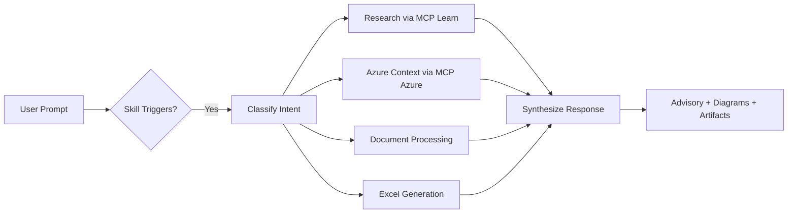

# Cloud Advisor Agent — Microsoft Cloud & Azure Advisory for Copilot

A comprehensive **GitHub Copilot custom agent and skill** that transforms Copilot into a Microsoft Cloud & Azure expert advisor. It leverages MCP (Model Context Protocol) tools for live Azure context, Microsoft Learn documentation, Excel workbook generation, document processing, and presentation-ready markdown.

## Clone

```bash
git clone https://github.com/ibranibeny/Cloud-Advisor-Agent.git
cd Cloud-Advisor-Agent
```

## Capabilities

| Feature | Description |
|---------|-------------|
| **Azure Advisory** | Architecture recommendations, migration planning, modernization paths |
| **Cost Calculator** | Generates Excel workbooks with Azure pricing breakdown using Excel MCP |
| **Document Processing** | Extracts content from uploaded Word/PDF/PPT files and provides advisory |
| **Presentation Generator** | Creates slide-ready markdown formatted for PowerPoint generation |
| **Well-Architected Reviews** | WAF pillar assessments with live Azure context |
| **Reference Architectures** | Mermaid diagrams for recommended topologies |

## Prerequisites

- [VS Code](https://code.visualstudio.com/) 1.100+ with GitHub Copilot
- GitHub Copilot Chat extension (agent mode)
- [Node.js](https://nodejs.org/) 18+ (for npx)
- MCP servers installed via npx (see [MCP Setup](#mcp-servers-required))

### Install MCP Servers (npx)

Run these one-time commands to install and verify:

```bash
# Install all required MCP servers
npx -y @azure/mcp@latest
npx -y @anthropic/microsoft-docs-mcp@latest
npx -y excel-mcp-server@latest
npx -y @microsoft/markitdown-mcp@latest
```

> **If MCP servers fail to start:** Ensure Node.js 18+ is installed (`node --version`), then re-run the npx commands above. The agent will detect missing MCP servers and prompt you with install instructions automatically.

## Quick Install

### Option 1: Agent Mode (recommended — full agent with MCP tools)

Copy the agent definition and MCP config into your workspace:

```powershell
# Windows
xcopy /E /I ".github\agents" "<your-repo>\.github\agents"
copy ".vscode\mcp.json" "<your-repo>\.vscode\mcp.json"
copy ".vscode\settings.json" "<your-repo>\.vscode\settings.json"
```

```bash
# macOS/Linux
cp -r .github/agents <your-repo>/.github/agents
cp .vscode/mcp.json <your-repo>/.vscode/mcp.json
cp .vscode/settings.json <your-repo>/.vscode/settings.json
```

Then invoke the agent directly in Copilot Chat:
```
@microsoft-cloud-advisor Design a hub-spoke network for my Azure landing zone
```

### Option 2: Skill Mode (skill procedure without agent wrapper)

```powershell
# Windows — workspace-level
xcopy /E /I "skills\microsoft-cloud-advisor" "<your-repo>\.github\skills\microsoft-cloud-advisor"

# macOS/Linux
cp -r skills/microsoft-cloud-advisor <your-repo>/.github/skills/microsoft-cloud-advisor
```

### Option 3: Manual

1. Copy `.github/agents/microsoft-cloud-advisor.agent.md` to your repo's `.github/agents/` folder
2. Copy `.vscode/mcp.json` to your repo's `.vscode/` folder
3. Optionally copy `skills/microsoft-cloud-advisor/SKILL.md` to `.github/skills/microsoft-cloud-advisor/`

## Usage

In VS Code Copilot Chat, invoke the agent with `@microsoft-cloud-advisor`. The agent uses L-levels (L100–L400) for response depth:

```
# Architecture advisory (L200 default)
@microsoft-cloud-advisor Design an Azure architecture for a multi-region e-commerce platform

# Migration planning with 6R strategy
@microsoft-cloud-advisor How do I migrate my on-prem SQL Server 2019 to Azure?

# Cost calculator (generates Excel workbook)
@microsoft-cloud-advisor Generate an Azure pricing calculator for a 3-tier web app with AKS

# Multi-cloud comparison
@microsoft-cloud-advisor Compare Azure Container Apps vs AWS Fargate vs GCP Cloud Run

# Document processing
[Attach a .docx or .pptx file] @microsoft-cloud-advisor Analyze this architecture document

# Presentation generation
@microsoft-cloud-advisor Create a 10-slide executive presentation on our Azure migration at L100

# Data platform advisory
@microsoft-cloud-advisor Recommend a data platform for real-time IoT analytics with Fabric
```

## MCP Servers Required

This skill leverages these MCP tool families:

| MCP Server | Tools Used | Purpose |
|------------|-----------|---------|
| **Azure MCP** | `mcp_azure_mcp_*` | Live Azure context, pricing, architecture |
| **Microsoft Learn MCP** | `mcp_microsoft-lea_*` | Official documentation search & fetch |
| **Excel MCP** | `mcp_excel-mcp_*` | Cost calculator workbook generation |
| **Markitdown MCP** | `mcp_microsoft_mar_convert_to_markdown` | Document conversion (Word/PDF/PPT → MD) |

### Configuring MCP Servers

Add to your workspace `.vscode/mcp.json`:

```json
{
  "servers": {
    "azure": { "command": "npx", "args": ["-y", "@azure/mcp@latest"] },
    "microsoft-lea": { "command": "npx", "args": ["-y", "@anthropic/microsoft-docs-mcp@latest"] },
    "excel-mcp": { "command": "npx", "args": ["-y", "excel-mcp-server@latest"] },
    "microsoft_mar": { "command": "npx", "args": ["-y", "@microsoft/markitdown-mcp@latest"] }
  }
}
```

After adding the config, reload VS Code (`Ctrl+Shift+P` → "Developer: Reload Window").

> **Troubleshooting**: If the agent reports MCP tools are unavailable:
> 1. Verify Node.js 18+ is installed: `node --version`
> 2. Re-run the npx install commands above
> 3. Check `.vscode/mcp.json` exists in your workspace root
> 4. Reload VS Code window
> 5. Look for MCP server status in the Output panel (`Ctrl+Shift+U` → select "MCP")

## Repository Structure

```
microsoft-cloud-advisor/
├── README.md                          # This file
├── LICENSE                            # MIT License
├── .github/
│   ├── agents/
│   │   └── microsoft-cloud-advisor.agent.md  # Agent definition (primary)
│   ├── skills/
│   │   └── microsoft-cloud-advisor/
│   │       └── SKILL.md              # Skill procedure (canonical)
│   └── copilot-instructions.md       # Copilot workspace instructions
├── .vscode/
│   ├── mcp.json                       # MCP server configuration
│   └── settings.json                  # VS Code workspace settings
├── skills/
│   └── microsoft-cloud-advisor/
│       └── SKILL.md                   # Skill definition (synced copy)
├── templates/
│   ├── ppt-slide-templates.md         # PPT markdown format reference
│   └── cost-calculator-template.md    # Excel calculator structure guide
├── examples/
│   └── migration-advisory.md          # Example output: migration plan
└── docs/
    ├── DEPLOY.md                      # Detailed deployment instructions
    └── CONTRIBUTING.md                # How to extend the skill
```

## How It Works



## Contributing

See [docs/CONTRIBUTING.md](docs/CONTRIBUTING.md) for guidelines on extending the skill.

## License

MIT — see [LICENSE](LICENSE).
