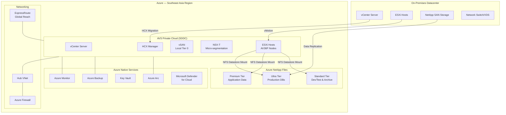
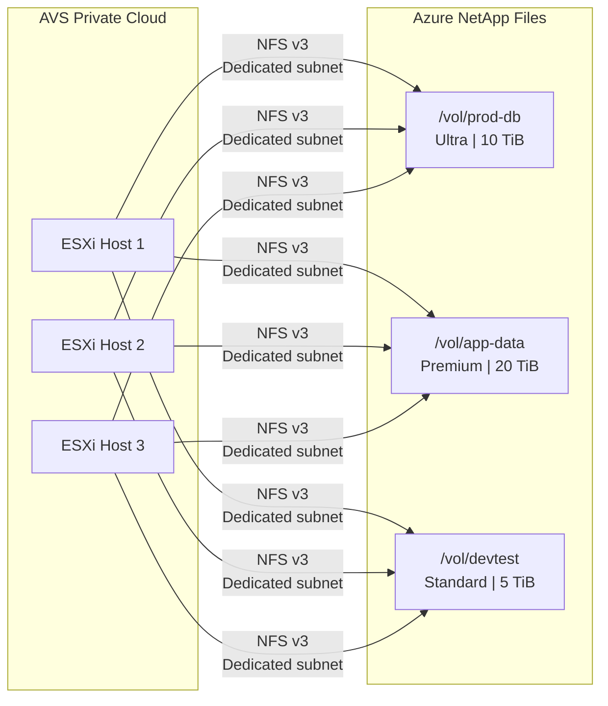
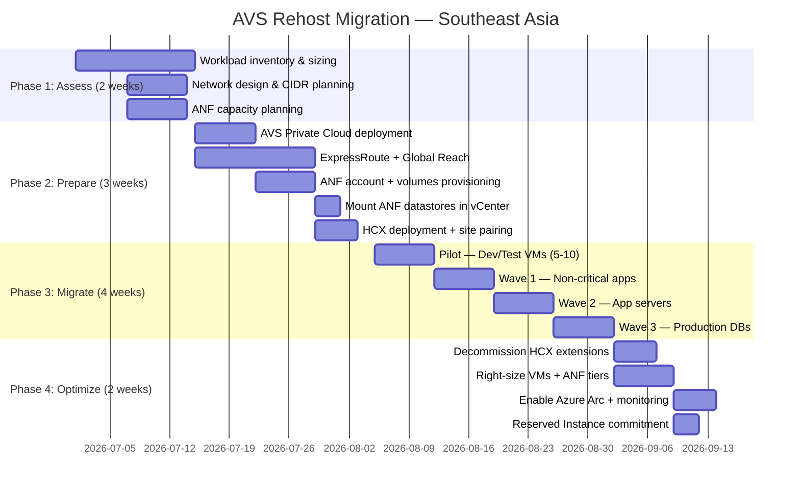
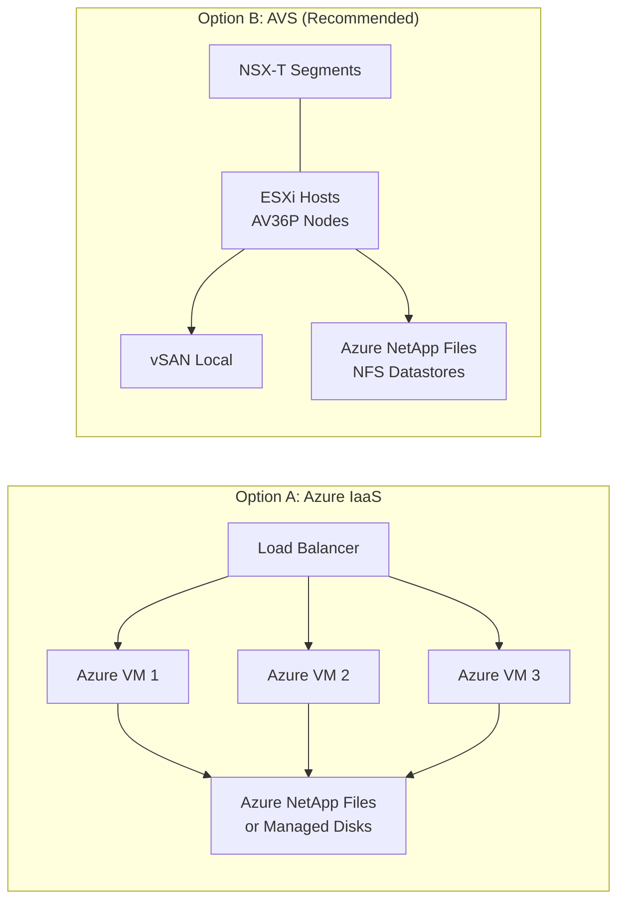

# Azure VMware Solution (AVS) — Rehost Migration Proposal

## Azure Region: Southeast Asia (Singapore)

---

# ข้อเสนอการย้ายระบบสู่ Azure VMware Solution
## Lift-and-Shift Migration with Azure NetApp Files Storage

**จัดเตรียมโดย**: Microsoft Cloud Advisor  
**วันที่**: 2 มิถุนายน 2569 (June 2, 2026)  
**ระดับความลับ**: Confidential  
**อ้างอิงข้อมูล**: ข้อกำหนดการใช้งาน.xlsx

> Speaker notes: This proposal presents a Rehost (lift-and-shift) strategy using Azure VMware Solution in Southeast Asia with Azure NetApp Files as external SAN storage — enabling seamless migration with zero application changes and enterprise-grade NFS/iSCSI storage performance.

---

# Executive Summary

## Why AVS + Azure NetApp Files?

- **Zero application refactoring** — Move VMware workloads as-is to Azure
- **Familiar VMware tools** — vSphere, vSAN, NSX-T, HCX (same operations team)
- **Enterprise SAN storage** — Azure NetApp Files replaces on-premises NetApp SAN
- **Southeast Asia region** — Low latency for ASEAN operations, PDPA compliant
- **Near-zero downtime** — HCX live vMotion for production workloads
- **Cost optimized** — Decouple compute from storage scaling

> Speaker notes: The key differentiator of this proposal is using Azure NetApp Files as external NFS datastores for AVS. This decouples storage scaling from compute scaling — you don't need to add expensive AVS nodes just for storage capacity.

---

# Migration Strategy Selection

| Decision Point | Choice | Rationale |
|---------------|--------|-----------|
| **6R Strategy** | **Rehost** (Lift & Shift) | Fastest path, no app changes, minimal risk |
| **Platform** | Azure VMware Solution | VMware-native, same tooling |
| **Region** | Southeast Asia (Singapore) | Lowest latency for Thailand/ASEAN |
| **Storage** | Azure NetApp Files (ANF) | Enterprise NFS, replaces on-prem NetApp |
| **Migration Tool** | VMware HCX (included) | Live vMotion + bulk migration |
| **Network** | ExpressRoute + Global Reach | High bandwidth, private connectivity |

> Speaker notes: Rehost was chosen because it delivers the fastest time-to-cloud with minimal risk. The existing VMware skills transfer directly. Azure NetApp Files provides the same NetApp experience your storage team already knows (ONTAP-based).

---

# Solution Architecture



> Speaker notes: The architecture separates compute (AVS nodes with local vSAN) from capacity storage (Azure NetApp Files). VMs with high IOPS requirements stay on vSAN. VMs needing large capacity use ANF NFS datastores mounted directly into ESXi. This is the recommended pattern per Microsoft — Azure NetApp Files is a first-party integrated datastore for AVS.

---

# Azure NetApp Files — Storage Design

## Why ANF for AVS (Not Just vSAN)?

| Criteria | vSAN (Built-in) | Azure NetApp Files |
|----------|-----------------|-------------------|
| **Scaling** | Tied to node count | Independent scaling |
| **Max capacity** | Limited by nodes × disk | Up to 500 TiB per account |
| **Performance** | NVMe local (fast) | Up to 4,500 MiB/s (Ultra) |
| **Cost model** | Bundled with nodes | Pay-per-TB provisioned |
| **Best for** | Tier 0, low-latency | Tier 1-2, capacity-heavy |
| **Snapshots** | vSAN snapshots | ANF snapshots (instant) |
| **Replication** | vSphere replication | Cross-region replication |
| **NetApp familiarity** | No | Yes — ONTAP-based |

## ANF Storage Tier Recommendation

| Tier | Service Level | Use Case | Throughput | Latency |
|------|--------------|----------|------------|---------|
| **Ultra** | 128 MiB/s per TiB | Production databases, high-IOPS VMs | Up to 4,500 MiB/s | <1ms |
| **Premium** | 64 MiB/s per TiB | Application servers, file shares | Up to 4,500 MiB/s | 1-2ms |
| **Standard** | 16 MiB/s per TiB | Dev/test, cold data, archives | Up to 320 MiB/s | 5-10ms |

## ANF as AVS Datastore — How It Works



> Speaker notes: ANF volumes are mounted as NFS datastores directly in vCenter — your VMware admins manage VMs on ANF the same way they manage VMs on vSAN. No special drivers or agents needed. This is a Microsoft-supported, first-party integration.

---

# AVS Node Sizing (Pending Workload Data)

## Available SKUs in Southeast Asia

| SKU | Cores | RAM | vSAN Storage | Best For | List Price/node/mo |
|-----|-------|-----|-------------|----------|--------------------|
| **AV36P** | 36 (Xeon 6240) | 768 GB | 19.2 TB NVMe | **Recommended** — balanced | ~$10,500 |
| **AV52** | 52 (Xeon 8270) | 1,536 GB | 38.4 TB NVMe | Memory-intensive (SAP, Oracle) | ~$17,500 |
| **AV64** | 64 (Xeon 8370) | 1,024 GB | 15.4 TB NVMe | Compute-intensive, high density | ~$14,000 |

## Sizing Template (To Be Populated from ข้อกำหนดการใช้งาน.xlsx)

| Workload Group | vCPUs | RAM (GB) | Storage (TB) | Target | ANF Tier |
|---------------|-------|----------|--------------|--------|----------|
| Production DB | _TBD_ | _TBD_ | _TBD_ | vSAN (AV36P) | Ultra (backup) |
| Application Servers | _TBD_ | _TBD_ | _TBD_ | ANF Datastore | Premium |
| File/Data Shares | _TBD_ | _TBD_ | _TBD_ | ANF Datastore | Premium |
| Dev/Test | _TBD_ | _TBD_ | _TBD_ | ANF Datastore | Standard |
| Archive/Cold | _TBD_ | _TBD_ | _TBD_ | ANF Datastore | Standard |

### Sizing Formula

```
Minimum AVS Nodes = MAX(
    CEILING(Total_vCPUs / (cores_per_node × overcommit_ratio)),
    CEILING(Total_RAM_GB / RAM_per_node × 0.8),
    3  ← minimum cluster size
)

Recommended overcommit: 4:1 CPU, 1.25:1 RAM
```

> Speaker notes: With ANF datastores, you size AVS nodes primarily for COMPUTE (CPU + RAM). Storage scales independently via ANF. This typically reduces node count by 30-50% compared to vSAN-only sizing.

---

# Cost Estimation — Southeast Asia Region

## Monthly Cost Breakdown (Template)

| Component | Configuration | Monthly (PAYG) | Monthly (3-yr RI) | Savings |
|-----------|--------------|----------------|-------------------|---------|
| **AVS Nodes** | 3× AV36P (minimum) | $31,500 | $18,585 | 41% |
| **Azure NetApp Files — Ultra** | 10 TiB | $8,192 | $8,192 | — |
| **Azure NetApp Files — Premium** | 20 TiB | $8,192 | $8,192 | — |
| **Azure NetApp Files — Standard** | 5 TiB | $1,024 | $1,024 | — |
| **ExpressRoute** | Standard 1 Gbps | $1,500 | $1,500 | — |
| **Azure Backup for AVS** | Per VM (est. 50 VMs) | $750 | $750 | — |
| **Azure Monitor** | Log Analytics | $200 | $200 | — |
| **Azure Firewall** | Standard | $912 | $912 | — |
| | | | | |
| **Monthly Total** | | **$52,270** | **$39,355** | **25%** |
| **Annual Total** | | **$627,240** | **$472,260** | **$154,980 saved** |

## Cost Optimization Opportunities

| Lever | Potential Savings | Action |
|-------|-------------------|--------|
| **3-Year Reserved Instance (AVS)** | 41% on compute | Commit after 3-month validation |
| **Azure Hybrid Benefit** | 100% Windows Server license cost | Apply existing SA licenses |
| **ANF Tier Optimization** | 30-50% on storage | Use Standard for non-prod |
| **ANF Cool Access** | 40% on cold data | Auto-tier inactive data |
| **Dev/Test Pricing** | Up to 55% on non-prod | Enroll non-prod subscriptions |
| **Right-sizing post-migration** | 10-30% on compute | Azure Advisor recommendations |

> Speaker notes: The biggest savings lever is Reserved Instances for AVS nodes (41% off). Combined with Azure Hybrid Benefit for Windows/SQL licenses and ANF tiering, total savings typically reach 40-55% vs. PAYG. Recommend committing to RI after the 3-month stabilization period.

---

# Network Architecture — Southeast Asia

```mermaid
graph TB
    subgraph OnPrem["On-Premises (Thailand)"]
        DC[Datacenter]
        WAN[WAN / MPLS]
    end

    subgraph Azure_SEA["Azure Southeast Asia"]
        subgraph Hub["Hub VNet (10.0.0.0/16)"]
            GW[ExpressRoute Gateway]
            FW[Azure Firewall]
            BAS[Azure Bastion]
            DNS[Private DNS Zones]
        end

        subgraph AVS_Net["AVS Network (/22 CIDR)"]
            MGMT[Management: /24]
            VMOT[vMotion: /24]
            VSANNET[vSAN: /24]
            HCX_NET[HCX Uplink: /24]
        end

        subgraph Spoke1["Spoke VNet — Shared Services"]
            AD[Azure AD DS]
            JUMP[Jump Servers]
            NVA[NVA (if needed)]
        end

        subgraph ANF_Sub["ANF Delegated Subnet"]
            ANF_EP[ANF Volumes<br/>NFS Endpoints]
        end
    end

    DC -->|ExpressRoute<br/>Global Reach| GW
    GW --> FW
    FW --> AVS_Net
    FW --> Spoke1
    AVS_Net -->|Dedicated fast path| ANF_EP
    Hub --> Spoke1
```

### Network Requirements

| Requirement | Design Decision |
|-------------|----------------|
| **AVS CIDR** | `/22` non-overlapping (1,024 IPs) |
| **ANF Subnet** | Dedicated `/24` delegated to ANF |
| **ExpressRoute** | Standard circuit, Global Reach enabled |
| **HCX Network Extension** | Stretch L2 during migration (avoid re-IP) |
| **DNS** | Azure Private DNS → on-prem conditional forwarders |
| **Firewall** | Azure Firewall for N-S traffic inspection |
| **NSX-T** | Micro-segmentation for E-W traffic within AVS |

> Speaker notes: The /22 CIDR block for AVS must NOT overlap with on-premises or any Azure VNet. ExpressRoute Global Reach provides direct connectivity between on-prem and AVS without transiting through the hub. ANF gets its own delegated subnet for optimal NFS performance.

---

# Migration Roadmap



### Migration Wave Strategy

| Wave | Workloads | Method | Downtime | Duration |
|------|-----------|--------|----------|----------|
| **Pilot** | Dev/Test (5-10 VMs) | HCX Bulk | Scheduled | 1 week |
| **Wave 1** | Non-critical apps | HCX Bulk | Scheduled window | 1 week |
| **Wave 2** | Application servers | HCX vMotion | Near-zero | 1 week |
| **Wave 3** | Production databases | HCX vMotion + ANF replication | Near-zero | 1 week |

> Speaker notes: Total timeline is approximately 11 weeks from kickoff to production. AVS deployment takes only 2-3 hours once initiated. The bulk of time is in network setup and migration validation. Each wave includes smoke testing before the next wave proceeds.

---

# Security & Compliance

| Control | Implementation | Status |
|---------|---------------|--------|
| **Data Sovereignty** | Southeast Asia region (Singapore) | ✅ ASEAN data residency |
| **PDPA (Thailand)** | Data stays in-region, no cross-border transfer | ✅ Compliant |
| **Encryption at rest** | vSAN AES-256 + ANF encryption | ✅ Default enabled |
| **Encryption in transit** | ExpressRoute private peering (not internet) | ✅ |
| **Identity & Access** | Entra ID SSO → vCenter + NSX-T | ✅ |
| **Network micro-segmentation** | NSX-T distributed firewall (E-W) | ✅ |
| **Perimeter security** | Azure Firewall + NSGs (N-S) | ✅ |
| **Backup** | Azure Backup for AVS (immutable vaults) | ✅ |
| **Monitoring** | Microsoft Defender for Cloud + Sentinel | ✅ |
| **Key management** | Azure Key Vault (HSM-backed) | ✅ |
| **Compliance certifications** | ISO 27001, SOC 1/2/3, CSA STAR | ✅ Azure-inherited |

> Speaker notes: AVS in Southeast Asia inherits all Azure compliance certifications. For Thai PDPA compliance, all data remains within the Singapore datacenter region. ExpressRoute ensures data never traverses the public internet.

---

# Recommendations & Suggestions

## Critical Recommendations

| # | Recommendation | Priority | Impact |
|---|---------------|----------|--------|
| 1 | **Use AV36P nodes** for balanced compute/memory ratio | High | Right-sized for most workloads |
| 2 | **Deploy ANF with Ultra tier** for production databases | High | Replaces on-prem NetApp SAN performance |
| 3 | **Use ANF Standard tier** for dev/test to save 75% on storage | High | Significant cost reduction |
| 4 | **Enable HCX Network Extension** during migration | High | Avoid IP re-addressing |
| 5 | **Commit to 3-year RI** after 90-day validation | Medium | 41% compute savings |
| 6 | **Enable ANF cross-region replication** to East Asia | Medium | DR/BC capability |
| 7 | **Deploy Azure Arc** on AVS VMs | Medium | Unified Azure management, policy |
| 8 | **Use ANF snapshots** for near-instant backup/restore | Medium | RPO < 1 hour achievable |

## Storage-Specific Suggestions (ANF)

| Suggestion | Rationale |
|------------|-----------|
| **Separate ANF volumes by workload tier** | Different service levels = cost optimization |
| **Enable ANF snapshot policies** | Automated hourly/daily/weekly snapshots |
| **Use ANF volume cloning** for dev/test | Instant clones from production (space-efficient) |
| **Plan ANF Cool Access** for archive data | Auto-tier cold blocks to cheaper storage |
| **Size ANF capacity pools larger** | Better throughput per TiB ratio |
| **Use `/vol` naming convention** | Match on-prem NetApp conventions for team familiarity |

## Risk Mitigation

| Risk | Probability | Impact | Mitigation |
|------|-------------|--------|------------|
| Network latency on-prem ↔ Azure | Medium | High | ExpressRoute Global Reach (not VPN) |
| ANF throughput insufficient for peak | Low | High | Start with Ultra tier; monitor and adjust |
| AVS node shortage in region | Low | Medium | Pre-reserve capacity with Microsoft |
| Team skill gap (NSX-T) | Medium | Medium | Microsoft FastTrack training included |
| CIDR conflict | Low | High | Plan /22 carefully before deployment |

---

# Option Comparison: AVS vs Azure IaaS (VMs)

## Side-by-Side Analysis

| Criteria | Azure IaaS (VMs) | Azure VMware Solution (AVS) |
|----------|-------------------|----------------------------|
| **Migration approach** | Convert VMDKs → VHDs, rebuild networking | Move VMs as-is via HCX vMotion |
| **Downtime** | Hours per VM (conversion + testing) | Minutes (live vMotion) |
| **Application changes** | OS driver updates, guest agent install | **None** — identical hypervisor |
| **Storage** | Azure NetApp Files (SMB/NFS) or Managed Disks | Azure NetApp Files (NFS datastore) + vSAN |
| **Networking** | Azure VNet, NSGs, Load Balancers | NSX-T (same as on-prem) + Azure VNet |
| **Operations team impact** | Must learn Azure IaaS management | **No retraining** — same vSphere/vCenter |
| **Licensing** | Azure Hybrid Benefit (Windows/SQL) | VMware licenses included |
| **Minimum commitment** | Pay-per-VM (no minimum) | 3 nodes minimum (~$31K/mo PAYG) |
| **Scaling granularity** | Per-VM (1 vCPU increments) | Per-node (36-64 cores at a time) |
| **Management tools** | Azure Portal, ARM, Bicep | vCenter + Azure Portal (dual) |
| **DR** | Azure Site Recovery | VMware SRM or Azure Site Recovery |
| **Time to migrate (50 VMs)** | 6-10 weeks | 3-5 weeks |

## Architecture Comparison



## Cost Comparison (50 VMs, Southeast Asia, 3-Year RI)

| Component | Azure IaaS | AVS |
|-----------|-----------|-----|
| **Compute** | 50× D4s_v5 = ~$12,500/mo | 3× AV36P = ~$18,585/mo |
| **Storage (ANF Premium 25TB)** | ~$10,240/mo | ~$10,240/mo |
| **vSAN (included)** | N/A | Included (19.2 TB/node) |
| **Networking** | VNet + LB = ~$500/mo | NSX-T included + ~$200/mo |
| **ExpressRoute** | ~$1,500/mo | ~$1,500/mo |
| **OS Licensing** | AHB (free w/ SA) | Included in AVS |
| **VMware Licensing** | Not needed | Included |
| **Backup** | ~$750/mo | ~$750/mo |
| **Monitoring** | ~$300/mo | ~$300/mo |
| | | |
| **Monthly Total** | **~$25,790** | **~$31,575** |
| **Annual Total** | **~$309,480** | **~$378,900** |
| **Delta** | Baseline | +22% (~$69K/yr more) |

## Migration Effort Comparison

| Effort Dimension | Azure IaaS | AVS |
|-----------------|------------|-----|
| VM conversion | Required (VMDK→VHD) | Not needed |
| Network redesign | Required (VNets, NSGs) | Minimal (HCX extends L2) |
| IP re-addressing | Usually required | Not required |
| Agent installation | Azure VM agent + extensions | None |
| Driver changes | Hyper-V drivers | None (same ESXi) |
| Testing effort | High (new platform) | Low (same hypervisor) |
| Rollback complexity | High (re-convert) | Low (vMotion back) |
| Team training | 2-4 weeks Azure IaaS | None |
| **Total FTE-weeks** | **~15-20 FTE-weeks** | **~8-10 FTE-weeks** |

## Risk Comparison

| Risk | Azure IaaS | AVS |
|------|------------|-----|
| App compatibility | Medium — driver changes | Very Low — same platform |
| Performance regression | Medium — different I/O | Low — same vSAN + ANF |
| Migration failure | High effort to revert | Low — vMotion back |
| Vendor lock-in | Azure-native (Hyper-V) | VMware portable |
| Cost overrun | Low — per-VM pricing | Medium — node-based |
| Skill gap | High — new platform | Very Low — same tools |
| Future modernization | Easier — Azure-native | Harder — VMware silo |

## When to Choose Each

| Choose **Azure IaaS** When | Choose **AVS** When |
|---------------------------|---------------------|
| Cost is #1 priority | Zero downtime required |
| Small estate (<20 VMs) | Large VMware estate (50+ VMs) |
| Team ready to learn Azure | Operational continuity critical |
| Granular VM scaling needed | Existing NetApp SAN investment |
| No VMware to maintain | Complex NSX networking |
| Cloud-native roadmap | Short migration timeline |
| Mostly Windows workloads (AHB) | Team cannot retrain |

## 🎯 Recommendation: AVS

**For this scenario, AVS is recommended because:**

1. **NetApp SAN** → ANF NFS datastores = same ONTAP experience (zero storage retraining)
2. **Rehost strategy** = zero changes required → AVS delivers exactly that
3. **Migration is 50% faster** (no VM conversion, no re-IP, no driver changes)
4. **Risk is significantly lower** (identical platform, instant rollback)
5. **22% cost premium is offset by**: 50% less FTE effort, near-zero downtime, zero retraining, lower failure risk

> **If budget is the absolute constraint → Choose Azure IaaS**  
> **If speed, risk, and operational continuity matter → Choose AVS**

---

# Next Steps

| # | Action | Owner | Target Date |
|---|--------|-------|-------------|
| 1 | **Open ข้อกำหนดการใช้งาน.xlsx in Excel** and share workload details | Customer | Immediate |
| 2 | Finalize VM inventory (vCPU, RAM, Storage per VM) | Customer IT | Week 1 |
| 3 | AVS sizing workshop + ANF capacity planning | Microsoft / Partner | Week 2 |
| 4 | Generate detailed cost calculator (Excel) | Cloud Advisor | Week 2 |
| 5 | Network design review (CIDR, ExpressRoute) | Network Team | Week 2 |
| 6 | Procurement approval (AVS + ANF + ER) | Management | Week 3 |
| 7 | Deploy AVS Private Cloud | Azure Team | Week 4 |
| 8 | Begin pilot migration | Migration Team | Week 5 |

---

# Appendix A: ANF + AVS Integration Reference

## Mounting ANF as AVS Datastore (Azure Portal Steps)

1. Create ANF account in same region (Southeast Asia)
2. Create capacity pool (Ultra/Premium/Standard)
3. Create volume with NFSv3 protocol
4. In AVS portal → Storage → Add datastore → Select ANF volume
5. Volume appears as NFS datastore in vCenter

## ANF Performance Characteristics

| Metric | Ultra | Premium | Standard |
|--------|-------|---------|----------|
| Throughput per TiB | 128 MiB/s | 64 MiB/s | 16 MiB/s |
| Max throughput/volume | 4,500 MiB/s | 4,500 MiB/s | 320 MiB/s |
| Latency | <1ms | 1-2ms | 5-10ms |
| IOPS (4K random read) | ~160K per TiB | ~80K per TiB | ~20K per TiB |
| Snapshots | Instant, space-efficient | Same | Same |
| Cross-region replication | ✅ | ✅ | ✅ |

## Useful Links

- [AVS documentation](https://learn.microsoft.com/azure/azure-vmware/)
- [ANF as AVS datastore](https://learn.microsoft.com/azure/azure-vmware/attach-azure-netapp-files-to-azure-vmware-solution-hosts)
- [AVS pricing - Southeast Asia](https://azure.microsoft.com/pricing/details/azure-vmware/)
- [ANF pricing](https://azure.microsoft.com/pricing/details/netapp/)
- [AVS network planning](https://learn.microsoft.com/azure/azure-vmware/tutorial-network-checklist)

---

*Document generated by Microsoft Cloud Advisor Agent — June 2, 2026*  
*Pending: Workload inventory data from ข้อกำหนดการใช้งาน.xlsx for final sizing*
