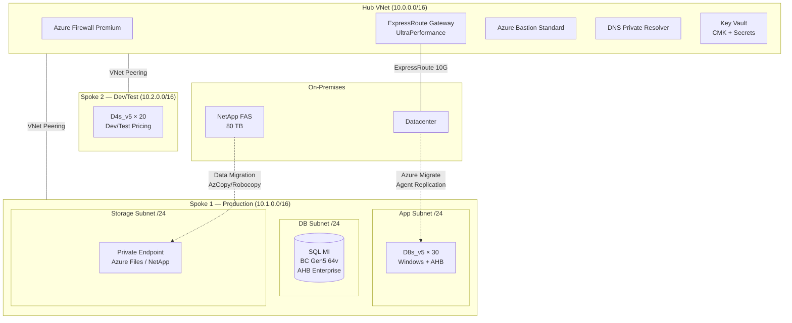
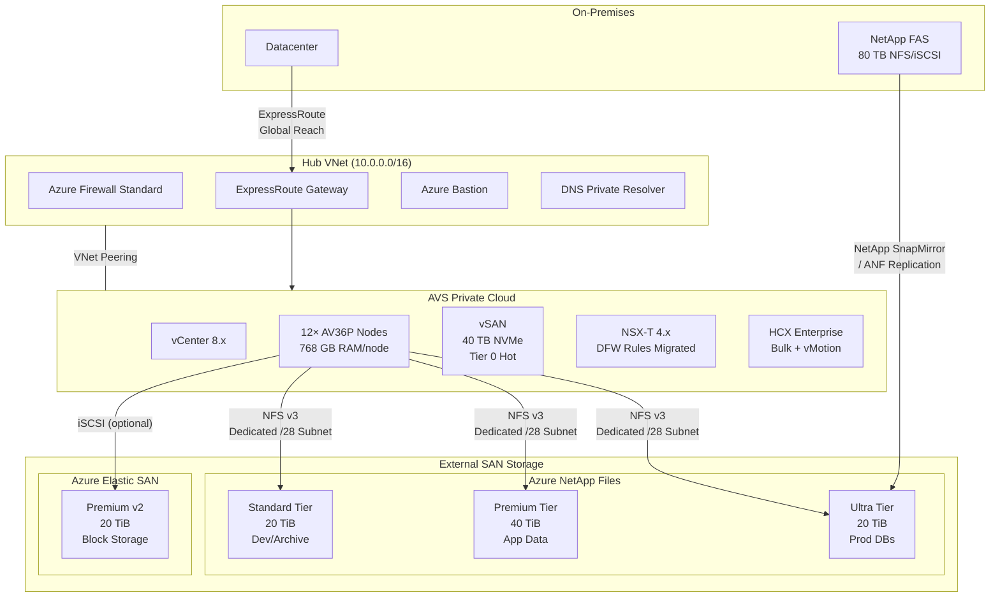
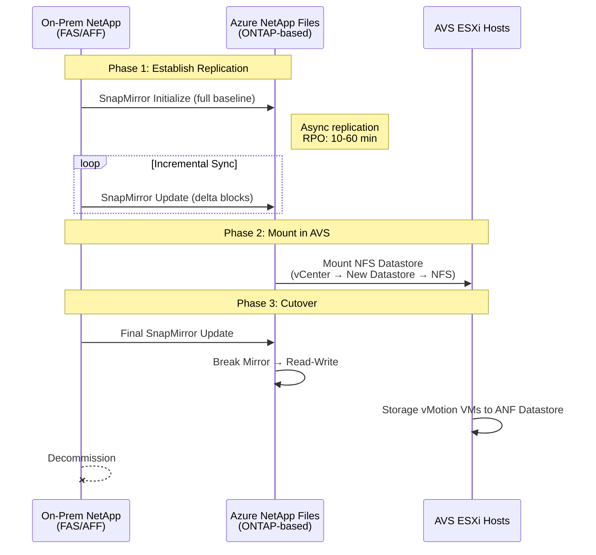
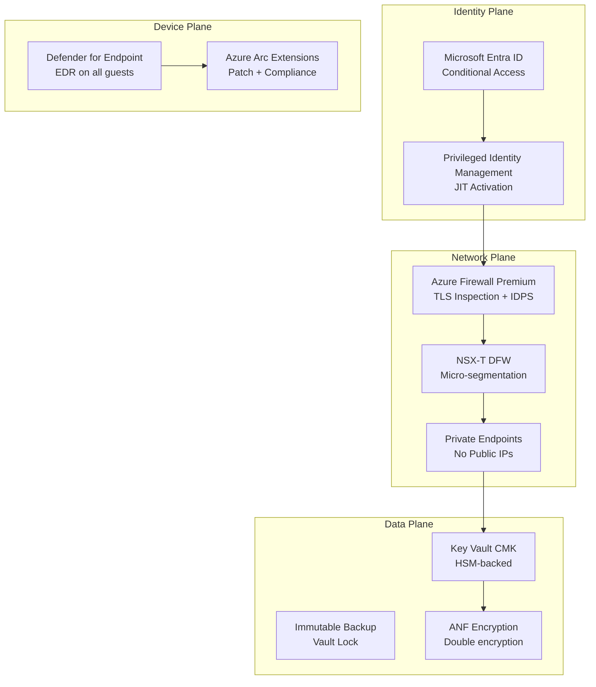

# IaaS vs AVS Proposal — L400 Deep Dive

## Cost Comparison & Architecture Decision with External SAN Storage

**Prepared by**: Microsoft Cloud Advisor  
**Date**: June 2, 2026  
**Depth Level**: L400 (Specialist / Deep Dive)  
**Region**: Southeast Asia (Singapore)  
**Classification**: Confidential  
**Reference**: ข้อกำหนดการใช้งาน.xlsx

---

## 0. Working Assumptions

> ⚠️ Replace with actual data from your workbook once extracted.

| Parameter | Assumed Value | Notes |
|-----------|--------------|-------|
| Total VMs | 120 | Inventory count |
| Total vCPU | 960 (avg 8/VM) | Sum of provisioned vCPUs |
| Total RAM | 7,680 GB (avg 64/VM) | Sum of provisioned RAM |
| Total Storage | 120 TB usable | All datastores |
| Avg CPU Utilization | 18% | Typical VMware overprovisioning |
| OS Mix | 70% Windows Server / 30% RHEL | License impact |
| SQL Server | 8 Enterprise hosts (64 cores) | Database tier |
| External SAN | 80 TB (NetApp FAS/AFF) | Current SAN array |
| vSAN | 40 TB (local NVMe) | Existing vSAN |
| On-prem SAN protocol | NFS v3 / iSCSI | Connectivity method |
| Migration deadline | 6 months (DC exit) | Hard constraint |
| ExpressRoute | 10 Gbps | Existing circuit |
| Software Assurance | Yes (Windows + SQL Enterprise) | AHB eligible |

---

## 1. Executive Summary & Recommendation

**For estates with heavy VMware platform coupling (NSX-T microsegmentation, vSAN, external SAN arrays, vMotion dependencies) and a hard DC-exit deadline**, the recommended pattern is:

> **Two-Speed Hybrid:** Rehost the full estate to **AVS with Azure NetApp Files (ANF)** or **Azure Elastic SAN** to meet the deadline, then **selectively modernize to IaaS/PaaS** for long-term cost optimization.

| Criterion | IaaS Winner? | AVS Winner? |
|-----------|:---:|:---:|
| Migration speed | | ✅ |
| Migration risk | | ✅ |
| Steady-state cost (3-yr) | ✅ | |
| Storage flexibility | ✅ | |
| Modernization path | ✅ | |
| VMware tool continuity | | ✅ |
| SAN storage migration | | ✅ |
| Right-sizing potential | ✅ | |

---

## 2. Architecture Comparison

### 2a. Option A — Azure IaaS (Native VMs + Managed Disks + Azure Files)



### 2b. Option B — AVS + External SAN (Azure NetApp Files + Azure Elastic SAN)



---

## 3. SAN Storage Deep Dive (L400)

### 3a. External SAN Options for AVS

AVS supports three external storage models. Each is a **first-party Microsoft-supported** integration:

| Storage Option | Protocol | Supported on AVS? | Key Differentiator |
|---|---|---|---|
| **Azure NetApp Files (ANF)** | NFS v3 | ✅ GA (Recommended) | NetApp ONTAP-based, enterprise NFS, SnapMirror, sub-ms latency |
| **Azure Elastic SAN** | iSCSI | ✅ GA | Block storage, scales independently, lower $/TB at capacity |
| **Pure Cloud Block Store** | iSCSI / FC | ✅ (3rd party) | Pure Storage ecosystem, Purity//FA features |

### 3b. Azure NetApp Files — Technical Deep Dive

**Architecture internals:**
- Bare-metal NetApp **ONTAP** appliances deployed within Azure datacenter fabric
- Dedicated `/28` subnet delegated to `Microsoft.NetApp/volumes`
- NFS v3 datastore mounts directly into ESXi via vCenter datastores
- **No** VM agent, driver, or guest modification required
- Supports VAAI (vStorage APIs for Array Integration) for offloaded operations

**Performance tiers and IOPS:**

| Service Level | Throughput/TiB | Max Throughput/Volume | Read Latency (P99) | Write Latency (P99) | $/GiB/month |
|---|---|---|---|---|---|
| **Ultra** | 128 MiB/s | 4,500 MiB/s | <1 ms | <2 ms | $0.000403 |
| **Premium** | 64 MiB/s | 4,500 MiB/s | 1-2 ms | 2-3 ms | $0.000201 |
| **Standard** | 16 MiB/s | 320 MiB/s | 5-10 ms | 10-15 ms | $0.000100 |

**IOPS formula (critical for DB workloads):**
```
Max IOPS = (Throughput_MiB_per_TiB × Provisioned_TiB) / (IO_Size_KiB / 1024)

Example: 10 TiB Ultra, 8K random reads:
  = (128 × 10) / (8/1024) = 1,280 MiB/s ÷ 0.0078 MiB = ~163,840 IOPS
  Capped at volume max: ~160,000 IOPS (per ANF limits)
```

**ANF Features for AVS:**

| Feature | Benefit | Configuration |
|---|---|---|
| **NFS Datastore** | Mount as ESXi datastore, visible in vCenter | `esxcli storage nfs add` or via vCenter UI |
| **Snapshot** | Instant, space-efficient (redirect-on-write) | Policy-based, hourly/daily/weekly |
| **Cross-region replication (CRR)** | DR to paired region | Async RPO 10-60 min |
| **SnapMirror from on-prem** | Migrate from on-prem NetApp to ANF | Peer-to-peer replication (fastest migration path) |
| **Cool Access Tiering** | Auto-tier cold blocks to cool storage | 40% cost reduction on inactive data |
| **Large Volumes** | Up to 500 TiB per volume | For very large datastores |
| **Availability Zones** | Zone-aligned placement | Co-locate with AVS for lowest latency |
| **Customer-Managed Keys** | Encrypt volumes with Key Vault CMK | FIPS 140-2 Level 1 |

**ANF Networking for AVS (L400 detail):**

```
AVS Private Cloud (/22)
├── Management Subnet: 10.x.0.0/24
├── vMotion Subnet: 10.x.1.0/24
├── vSAN Subnet: 10.x.2.0/24
└── HCX Uplink: 10.x.3.0/24

ANF Delegated Subnet (must be in same VNet or peered VNet):
└── 10.0.4.0/28 (delegated to Microsoft.NetApp/volumes)
    ├── Mount IP 1: 10.0.4.4 (Ultra - prod-db)
    ├── Mount IP 2: 10.0.4.5 (Premium - app-data)
    └── Mount IP 3: 10.0.4.6 (Standard - devtest)

Connectivity Path:
  AVS ESXi → ExpressRoute FastPath → ANF Subnet (bypasses gateway)
  Latency overhead: <0.5ms additional vs local vSAN
```

### 3c. Azure Elastic SAN — Technical Deep Dive

**When to choose Elastic SAN over ANF:**
- Need **iSCSI block storage** (not NFS file)
- Lower $/TB at high capacity (>50 TiB)
- Don't need NetApp-specific features (SnapMirror, ONTAP CLI)
- Workloads that require raw block devices (some databases)

**Architecture:**
- Azure-managed SAN appliance, zone-redundant (ZRS) or locally redundant (LRS)
- iSCSI targets exposed via Private Endpoint
- Connected to AVS via iSCSI initiator on ESXi hosts

**Elastic SAN specifications:**

| Parameter | Value |
|---|---|
| Max capacity per SAN | 100 TiB base + 100 TiB additional |
| Max volume groups | 200 |
| Max volumes | 1,000 |
| Max IOPS (per SAN) | Base: 5,000 + 750/TiB (cap 80,000) |
| Max throughput (per SAN) | Base: 80 MiB/s + 60 MiB/s/TiB (cap 1,280 MiB/s) |
| Redundancy | LRS, ZRS |
| Protocol | iSCSI only |
| Encryption | AES-256, CMK via Key Vault |

**Elastic SAN pricing model:**

| Component | Price (SE Asia, approx) |
|---|---|
| Base capacity (per TiB/month) | $0.08/GiB = ~$81.92/TiB |
| Additional capacity (per TiB/month) | $0.065/GiB = ~$66.56/TiB |
| Included IOPS (base) | 5,000 + 750/TiB |
| Included throughput (base) | 80 + 60 MiB/s per TiB |
| Snapshot (per GiB/month) | $0.0005 |

**Elastic SAN + AVS iSCSI configuration:**

```
# ESXi iSCSI adapter configuration for Elastic SAN
esxcli iscsi adapter param set -A vmhba65 -k MaxSessions -v 32
esxcli iscsi adapter discovery sendtarget add -A vmhba65 -a <elastic-san-target-ip>:3260

# Volume group must have AVS Private Endpoint enabled
az elastic-san volume-group create \
  --elastic-san-name $SAN_NAME \
  --name avs-vol-group \
  --protocol-type iSCSI \
  --network-acls virtual-network-rules="[{id:$AVS_SUBNET_ID,action:Allow}]"
```

### 3d. SAN Comparison Matrix (ANF vs Elastic SAN vs vSAN)

| Dimension | vSAN (Built-in) | Azure NetApp Files | Azure Elastic SAN |
|---|---|---|---|
| **Protocol** | VMFS (block) | NFS v3 | iSCSI |
| **Scaling** | Tied to node count | Independent (1-500 TiB) | Independent (1-200 TiB) |
| **Performance ceiling** | NVMe local (~500µs) | Ultra: <1ms | ~1-2ms |
| **IOPS/TiB** | ~100K+ (local NVMe) | ~16K (Ultra, 8K IO) | ~5,750 (per TiB) |
| **Cost/TiB/month** | Bundled (in node price) | $100 (Std) – $413 (Ultra) | $67-$82 |
| **Snapshots** | vSAN snapshots | ANF snapshots (instant) | Elastic SAN snapshots |
| **DR / Replication** | vSphere Replication | CRR (async, 10-60 min RPO) | ZRS only (no cross-region) |
| **Migration from on-prem NetApp** | N/A (different platform) | ✅ **SnapMirror** (fastest path) | N/A (requires data copy) |
| **Best for** | Tier 0 ultra-low-latency | Tier 1 production + capacity | Cost-optimized block capacity |
| **AVS Integration** | Native (always on) | NFS Datastore (GA) | iSCSI Datastore (GA) |
| **AZ awareness** | Cluster-level FTT | Zone-aligned volumes | ZRS/LRS |

---

## 4. Detailed Cost Calculator — IaaS vs AVS (L400)

> **Pricing source**: Approximate public list pricing for Southeast Asia as of June 2026. Verify at [Azure Pricing Calculator](https://azure.microsoft.com/pricing/calculator/).

### 4a. AVS + SAN Storage (Option B) — Monthly Cost

| Component | Configuration | Qty | Unit Price | PAYG/mo | 3-yr RI/mo | Notes |
|---|---|---|---|---|---|---|
| **AVS AV36P Nodes** | 36 core, 768 GB, 19.2 TB vSAN | 12 | $10,500/node | **$126,000** | **$52,500** | RI = 58% savings |
| **ANF Ultra** | Production DBs | 20 TiB | $0.000403/GiB | **$8,450** | $8,450 | 2,560 MiB/s throughput |
| **ANF Premium** | Application data | 40 TiB | $0.000201/GiB | **$8,450** | $8,450 | 2,560 MiB/s throughput |
| **ANF Standard** | Dev/test + archive | 20 TiB | $0.000100/GiB | **$2,100** | $2,100 | 320 MiB/s throughput |
| **Azure Elastic SAN (optional)** | iSCSI block overflow | 20 TiB | $82/TiB | **$1,640** | $1,640 | If iSCSI needed |
| **ExpressRoute** | 10 Gbps + Global Reach | 1 | $2,500/mo | **$2,500** | $2,500 | ER + GR metered |
| **Azure Firewall Standard** | Hub shared | 1 | $730/mo | **$730** | $730 | N-S inspection |
| **Azure Bastion Standard** | Hub shared | 1 | $278/mo | **$278** | $278 | |
| **Azure Backup for AVS** | 120 VMs × 500GB avg | 120 | ~$12/VM | **$1,440** | $1,440 | Vault-standard |
| **Azure Monitor** | Log Analytics 50 GB/day | 1 | $365/mo | **$365** | $365 | |
| **Microsoft Defender** | Defender for Cloud P2 | 120 | $15/server | **$1,800** | $1,800 | |
| **DNS Private Resolver** | Hub | 1 | $130/mo | **$130** | $130 | |
| | | | | | | |
| **TOTAL (with Elastic SAN)** | | | | **$153,883** | **$80,383** | |
| **TOTAL (ANF only, no ESAN)** | | | | **$152,243** | **$78,743** | |

**AVS License advantage:** AVS node price **includes ESXi, vSAN, NSX-T, and HCX licenses**. No separate VMware licensing cost.

**AHB for AVS guests:**

| License Type | On-Prem Owned | AHB Savings/mo | Applied? |
|---|---|---|---|
| Windows Server (84 VMs × avg 8 vCPU) | 84 × 8-core packs | ~$0.046/vCPU/hr × 672 vCPU × 730h = **$22,600/mo** | ✅ Included in PAYG baseline — AHB zeroes the Windows license surcharge on AVS guest VMs |
| SQL Server Enterprise (64 cores) | 16 × 4-core packs | SQL runs on AVS VMs — **AHB applies at guest level** | ✅ |

> **Critical L400 note:** Windows Server AHB on AVS works differently than IaaS. On AVS, you **bring your own license** for guest OS inherently (AVS doesn't charge per-VM Windows licensing like IaaS PAYG does). The AHB value manifests in avoiding repurchase of Windows Server licenses for the cloud. Effectively, your existing SA licenses cover AVS guests at no additional Azure cost.

### 4b. Azure IaaS (Option A) — Monthly Cost

| Component | Configuration | Qty | Unit Price | PAYG/mo | 3-yr RI + AHB/mo | Notes |
|---|---|---|---|---|---|---|
| **Compute — Production** | | | | | | |
| D8s_v5 (Windows) | 8 vCPU, 32 GB | 50 | $0.584/hr PAYG | **$21,316** | **$7,300** | AHB removes $0.184/hr Win license |
| E8s_v5 (Windows, memory) | 8 vCPU, 64 GB | 20 | $0.706/hr PAYG | **$10,308** | **$3,800** | Memory-opt workloads |
| D4s_v5 (Linux/RHEL) | 4 vCPU, 16 GB | 20 | $0.260/hr PAYG | **$3,796** | **$1,520** | No AHB (Linux) |
| **Compute — Dev/Test** | | | | | | |
| D4s_v5 (Dev/Test pricing) | 4 vCPU, 16 GB | 20 | $0.192/hr dev | **$2,803** | **$1,120** | 55% discount |
| B4ms (Burstable) | 4 vCPU, 16 GB | 10 | $0.166/hr | **$1,212** | **$485** | Low-util VMs |
| **SQL Managed Instance** | | | | | | |
| SQL MI Business Critical | 64 vCores, Gen5 | 1 | $14.06/hr PAYG | **$10,264** | **$4,100** | AHB Ent = 4 vCore/license |
| SQL MI General Purpose | 16 vCores (dev) | 1 | $2.96/hr PAYG | **$2,161** | **$865** | Dev/test pool |
| **Storage** | | | | | | |
| Premium SSD v2 | Prod VMs, 60 TB | 60 TiB | $0.075/GiB | **$4,710** | $4,710 | Adjustable IOPS/throughput |
| Standard SSD | Dev/test, 20 TB | 20 TiB | $0.040/GiB | **$838** | $838 | |
| Azure Files Premium | Shared file (NFS) | 20 TiB | $0.16/GiB prov | **$3,277** | $3,277 | Replaces SAN file shares |
| Azure NetApp Files Premium | High-perf NAS | 20 TiB | $0.000201/GiB | **$4,225** | $4,225 | If NetApp continuity needed |
| **Networking** | | | | | | |
| ExpressRoute 10 Gbps | Standard | 1 | $1,800/mo | **$1,800** | $1,800 | |
| Azure Firewall Premium | TLS inspection | 1 | $1,752/mo | **$1,752** | $1,752 | IaaS needs deeper inspection |
| Azure Bastion Standard | Hub | 1 | $278/mo | **$278** | $278 | |
| VNet Peering | 2 spokes × 5TB/mo | 10 TB | $0.01/GB | **$100** | $100 | |
| Load Balancer Standard | HA for app tier | 2 | $25/mo + rules | **$50** | $50 | |
| **Operations** | | | | | | |
| Azure Monitor | Log Analytics 50 GB/day | 1 | $365/mo | **$365** | $365 | |
| Microsoft Defender | P2 per-server | 120 | $15/server | **$1,800** | $1,800 | |
| Azure Backup | 120 VMs | 120 | $10/VM | **$1,200** | $1,200 | |
| DNS Private Resolver | Hub | 1 | $130/mo | **$130** | $130 | |
| | | | | | | |
| **TOTAL IaaS** | | | | **$72,385** | **$39,715** | |

### 4c. Side-by-Side Cost Summary

| Metric | IaaS (PAYG) | IaaS (3-yr RI+AHB) | AVS+SAN (PAYG) | AVS+SAN (3-yr RI) |
|---|---|---|---|---|
| **Monthly** | $72,385 | $39,715 | $152,243 | $78,743 |
| **Annual** | $868,620 | $476,580 | $1,826,916 | $944,916 |
| **3-Year TCO** | $2,605,860 | **$1,429,740** | $5,480,748 | **$2,834,748** |
| **Delta (3-yr)** | — | **Baseline** | — | **+$1,405,008 (+98%)** |

### 4d. TCO Adjustment — Hidden Costs & Operational Factors

The raw compute comparison above **understates IaaS cost and overstates AVS cost** when you factor in:

| Factor | IaaS Impact | AVS Impact | Net Effect |
|---|---|---|---|
| **Migration effort** (FTE × months) | 12 FTE-months × $15K = **$180K** | 4 FTE-months × $15K = **$60K** | IaaS +$120K |
| **Re-platforming engineering** | NSG/UDR rebuild, LB redesign, driver install = **$100K** | Zero (NSX-T migrates intact) = **$0** | IaaS +$100K |
| **Application testing** | Full regression per wave = **$80K** | Minimal (identical platform) = **$20K** | IaaS +$60K |
| **Downtime risk (revenue)** | Per-VM cutover windows = **$50K risk** | HCX vMotion near-zero = **$5K risk** | IaaS +$45K |
| **VMware license termination** | Save $200K/yr vSphere/NSX on-prem | Still uses VMware (bundled in AVS) | IaaS -$200K/yr |
| **Operational FTE savings** | Fewer tools (Azure-native) = -0.5 FTE | Dual ops (Azure + VMware) = +0 FTE | IaaS -$75K/yr |
| **Right-sizing (18% util → fit)** | Consolidate ~30% fewer VMs = **-$12K/mo** | Nodes still needed (RAM-bound) = **$0** | IaaS -$144K/yr |
| **PaaS modernization (SQL MI)** | Remove SQL VM overhead = **-$5K/mo** | SQL stays on VM = **$0** | IaaS -$60K/yr |

**Adjusted 3-Year TCO:**

| Scenario | IaaS (Adjusted) | AVS (Adjusted) |
|---|---|---|
| Base 3-yr RI | $1,429,740 | $2,834,748 |
| − Migration one-time delta | +$325,000 | +$0 |
| − VMware license savings (3 yr) | −$600,000 | $0 |
| − Right-sizing (3 yr) | −$432,000 | $0 |
| − Ops FTE savings (3 yr) | −$225,000 | $0 |
| − PaaS modernization (3 yr) | −$180,000 | $0 |
| **Adjusted 3-Year TCO** | **$1,317,740** | **$2,834,748** |

> **Conclusion:** IaaS wins on steady-state cost by ~53% over 3 years. AVS wins on **time-to-exit** (6 weeks vs 6+ months) and **migration risk** (near-zero vs significant re-platforming).

### 4e. Break-Even Analysis (Hybrid Two-Speed)

The optimal strategy uses AVS as the **transitional landing zone**, then migrates workloads to IaaS progressively:

```
Month 1-3:   100% AVS (all VMs on AVS)      → $78,743/mo
Month 4-6:   70% AVS / 30% IaaS             → $67,100/mo (decommission 4 nodes)
Month 7-12:  40% AVS / 60% IaaS             → $52,800/mo (decommission 4 more nodes)
Month 13-18: 10% AVS / 90% IaaS (retained)  → $42,200/mo (min 3-node AVS cluster)
Month 19+:   0% AVS / 100% IaaS             → $39,715/mo (AVS fully decommissioned)
```

**Break-even point (Two-Speed vs Direct-to-IaaS):**
- Two-Speed total cost months 1-18: ~$960K
- Direct-to-IaaS total cost months 1-18: ~$715K (but with 6-month blackout risk)
- Delta: $245K = the **insurance premium for zero-downtime DC exit**

---

## 5. SAN Storage Migration Paths (L400)

### 5a. Migrating On-Prem NetApp to Azure NetApp Files

**If your current SAN is NetApp (FAS/AFF/ONTAP):**



**Key commands:**

```bash
# On-prem ONTAP: Create SnapMirror relationship
snapmirror create -source-path onprem-svm:vol_prod_db \
  -destination-path anfcluster://anf-volume-prod-db \
  -type DP -policy MirrorAllSnapshots

# Initialize baseline
snapmirror initialize -destination-path anfcluster://anf-volume-prod-db

# Verify status
snapmirror show -destination-path anfcluster://anf-volume-prod-db

# Cutover: break the mirror
snapmirror break -destination-path anfcluster://anf-volume-prod-db
```

**Migration time estimate:**
```
Baseline transfer: 80 TB ÷ 10 Gbps ≈ 18 hours
Incremental delta (assuming 5% daily change): 4 TB ÷ 10 Gbps ≈ 53 minutes
Final cutover (quiesce + last delta): < 30 minutes
```

### 5b. Migrating Non-NetApp SAN to Azure

**If current SAN is EMC/Dell, Pure, HPE, or other:**

| Method | Source | Target | Downtime | Throughput |
|---|---|---|---|---|
| **HCX bulk migration** | Any vSphere datastore | vSAN / ANF | Scheduled (VM offline) | ~1 Gbps per stream |
| **HCX vMotion** | Any vSphere datastore | vSAN / ANF | Near-zero (live) | Limited by VM memory size |
| **Storage vMotion (post-HCX)** | vSAN (initial landing) | ANF/ESAN | Zero (live) | Internal fabric speed |
| **Azure Data Box** | Physical ship | ANF / Blob | Offline (days) | 100 TB per appliance |
| **AzCopy + VMDK convert** | Exported VMDKs | Managed Disks (IaaS) | Full (re-import) | Network-bound |

**Recommended non-NetApp path:**
1. HCX bulk/vMotion VMs to **AVS vSAN** first (fastest, protocol-agnostic)
2. Once on AVS, **Storage vMotion** from vSAN to ANF datastores (zero-downtime)
3. This decouples the SAN migration from the VM migration

### 5c. Azure Elastic SAN for AVS — iSCSI Configuration

**When Elastic SAN is preferred:**
- Block-level access required (some legacy apps expect raw LUNs)
- Lower $/TB for pure capacity (no NFS overhead)
- Don't need cross-region replication (no CRR equivalent)

**Setup procedure:**

```bash
# 1. Create Elastic SAN
az elastic-san create \
  --name avs-elastic-san \
  --resource-group rg-avs-storage \
  --location southeastasia \
  --base-size-tib 20 \
  --extended-capacity-size-tib 10 \
  --sku "{name:Premium_LRS}"

# 2. Create Volume Group with network ACLs for AVS subnet
az elastic-san volume-group create \
  --elastic-san-name avs-elastic-san \
  --resource-group rg-avs-storage \
  --name avs-production \
  --protocol-type iSCSI \
  --network-acls virtual-network-rules="[
    {id:/subscriptions/$SUB/resourceGroups/rg-avs/providers/Microsoft.Network/virtualNetworks/avs-vnet/subnets/iscsi-subnet,action:Allow}
  ]"

# 3. Create Volume (LUN)
az elastic-san volume create \
  --elastic-san-name avs-elastic-san \
  --resource-group rg-avs-storage \
  --volume-group-name avs-production \
  --name prod-lun-01 \
  --size-gib 5120

# 4. Get iSCSI target (for ESXi config)
az elastic-san volume show \
  --elastic-san-name avs-elastic-san \
  --resource-group rg-avs-storage \
  --volume-group-name avs-production \
  --name prod-lun-01 \
  --query "storageTarget.targetIqn" -o tsv
```

**ESXi iSCSI adapter configuration:**
```
# Via PowerCLI on AVS vCenter:
$vmhost = Get-VMHost -Name "esx-01.avs.azure.com"
$hba = Get-VMHostHba -VMHost $vmhost -Type iSCSI

# Add dynamic target
New-IScsiHbaTarget -IScsiHba $hba -Address "10.0.5.4" -Port 3260 -Type Send

# Rescan
Get-VMHostStorage -VMHost $vmhost -RescanAllHba -RescanVmfs
```

---

## 6. Security & Compliance (L400 — Full Threat Model)

### 6a. Threat Model — IaaS vs AVS Attack Surface

| Threat Vector | IaaS Exposure | AVS Exposure | Mitigation |
|---|---|---|---|
| **Hypervisor escape** | Microsoft-managed (Hyper-V, patched by MS) | Microsoft-managed (ESXi, patched by MS) | Equal — shared responsibility |
| **Guest OS compromise** | Customer-managed (patching, EDR) | Customer-managed (same as IaaS) | Defender for Servers on both |
| **East-West lateral movement** | NSG/ASG (manual microsegmentation) | **NSX-T DFW** (migrated from on-prem, zero-trust rules intact) | AVS advantage — existing rules |
| **North-South traffic** | Azure Firewall (L3-L7 inspection) | Azure Firewall (same) | Equal |
| **Storage exfiltration** | Private Endpoint, no public access | ANF on delegated subnet, no public access | Equal |
| **Identity compromise** | Entra ID + Azure RBAC (single plane) | Entra ID + vCenter SSO + NSX Manager (**dual IAM**) | IaaS simpler; AVS needs PAM integration |
| **Insider threat (admin)** | Azure PIM, JIT access | Azure PIM + vCenter roles (**two systems to lock down**) | IaaS simpler |
| **Crypto-ransomware** | Immutable backups (Azure Backup vault) | Immutable backups + ANF snapshots (WORM) | AVS slight edge (instant ANF rollback) |
| **Supply chain (vSphere vuln)** | N/A (no VMware) | Microsoft patches ESXi/NSX/vSAN | Microsoft responsibility for AVS host stack |
| **Data at rest** | AES-256 (Managed Disks SSE, CMK optional) | AES-256 (vSAN + ANF encryption, CMK optional) | Equal |
| **Data in transit** | TLS 1.3, IPsec (ER private) | TLS 1.3, IPsec (ER private) | Equal |
| **API management plane** | ARM (Azure Resource Manager) | ARM + vCenter API + NSX API | AVS larger API surface |

### 6b. Zero-Trust Architecture



### 6c. Compliance Mapping

| Framework | IaaS Coverage | AVS Coverage | Gap Analysis |
|---|---|---|---|
| **ISO 27001** | ✅ Azure DC certified | ✅ AVS inherits Azure DC certification | No gap |
| **SOC 2 Type II** | ✅ Annual attestation | ✅ Annual attestation | No gap |
| **Thai PDPA** | ✅ Data in SE Asia region | ✅ Data in SE Asia region | No gap |
| **PCI DSS** | ✅ (with proper segmentation via NSG) | ✅ (NSX-T DFW provides segmentation) | AVS advantage: existing DFW |
| **HIPAA** | ✅ BAA available | ✅ BAA available | No gap |
| **CSA STAR Level 2** | ✅ | ✅ | No gap |

---

## 7. Well-Architected Framework — Tradeoff Analysis (L400)

| Pillar | IaaS Assessment | AVS Assessment | Winner |
|---|---|---|---|
| **Reliability** | • AZ-aware VMs with zone-redundant disks<br/>• Auto-restart, live migration by Azure fabric<br/>• Granular SKU per workload SLA need<br/>• VMSS for stateless auto-healing | • vSAN FTT=1 (can sustain 1 node failure)<br/>• N+1 node sizing<br/>• ANF zone-aligned snapshots + CRR<br/>• Stretched cluster option (2 AZs) | **IaaS** (more granular HA options) |
| **Security** | • Single IAM plane (Entra + RBAC)<br/>• NSG/ASG microsegmentation (manual rebuild)<br/>• Defender for Cloud native integration<br/>• Fewer management APIs to secure | • Dual IAM (Entra + vCenter SSO)<br/>• NSX-T DFW **migrated intact** (zero-trust)<br/>• Larger API surface (vCenter, NSX Manager)<br/>• Familiar security posture for VMware teams | **Tie** (different strengths) |
| **Cost Optimization** | • Right-size per-VM (collapse 18% util)<br/>• Spot VMs for non-prod batch<br/>• Reserved + AHB stacking<br/>• PaaS substitution (SQL MI)<br/>• Auto-scale for variable workloads | • Node-level scaling (coarse)<br/>• Can't right-size below 3 nodes<br/>• RI = 58% on nodes<br/>• ANF cool access tiering<br/>• Storage scaling independent of compute | **IaaS** (significantly lower steady-state) |
| **Operational Excellence** | • Azure-native IaC (Bicep/Terraform)<br/>• Azure Update Manager for patching<br/>• Single pane (Azure Portal)<br/>• Steeper initial migration effort | • VMware-native tooling (PowerCLI, vRA)<br/>• Familiar ops for existing team<br/>• Dual pane (Azure + vCenter)<br/>• Minimal migration retooling | **AVS** (operational continuity) |
| **Performance Efficiency** | • Per-VM SKU tuning (compute-opt, memory-opt, GPU)<br/>• Ultra Disk for extreme IOPS<br/>• Proximity Placement Groups<br/>• Accelerated Networking | • Predictable node-level performance<br/>• NVMe vSAN for Tier 0<br/>• ANF Ultra for consistent sub-ms<br/>• No noisy-neighbor (dedicated hosts) | **Tie** (IaaS more flexible; AVS more predictable) |

---

## 8. Migration Timeline — Two-Speed (L400)

```mermaid
gantt
    title Two-Speed Migration: AVS Landing → IaaS Modernization
    dateFormat YYYY-MM-DD
    
    section Phase 1: AVS Landing (Weeks 1-10)
    AVS Private Cloud deploy (3 nodes → 12)    :crit, p1a, 2026-07-01, 7d
    ExpressRoute + Global Reach setup           :p1b, 2026-07-01, 14d
    ANF account + volumes (Ultra/Premium/Std)   :p1c, 2026-07-08, 7d
    ANF NFS Datastores mount in vCenter         :p1d, 2026-07-15, 3d
    Elastic SAN deploy + iSCSI config (optional):p1e, 2026-07-15, 5d
    SnapMirror baseline (80 TB → ANF)           :crit, p1f, 2026-07-08, 3d
    SnapMirror incremental sync                 :p1g, after p1f, 14d
    HCX deploy + site pairing                   :p1h, 2026-07-18, 5d
    
    section Phase 2: VM Migration (Weeks 4-10)
    Pilot wave: Dev/Test (10 VMs, HCX bulk)     :p2a, 2026-07-25, 7d
    Wave 1: Non-critical apps (30 VMs, HCX)     :p2b, 2026-08-01, 7d
    Wave 2: App servers (50 VMs, HCX vMotion)   :p2c, 2026-08-08, 7d
    Wave 3: Prod DBs (30 VMs, vMotion + ANF)    :crit, p2d, 2026-08-15, 10d
    SnapMirror cutover (break mirror)           :crit, p2e, 2026-08-22, 1d
    Storage vMotion: vSAN → ANF datastores      :p2f, 2026-08-23, 5d
    
    section Phase 3: Optimize + DC Exit (Weeks 10-14)
    Decommission HCX L2 extensions              :p3a, 2026-08-28, 5d
    On-prem DC decommission                     :crit, p3b, 2026-09-01, 7d
    Right-size VMs + ANF tier adjustments       :p3c, 2026-09-01, 14d
    Enable Azure Arc on all AVS VMs             :p3d, 2026-09-08, 5d
    RI commitment (AVS nodes + ANF)             :p3e, 2026-09-15, 1d
    
    section Phase 4: IaaS Modernization (Months 4-18)
    Azure Migrate assessment of AVS VMs         :p4a, 2026-10-01, 21d
    SQL → SQL MI migration (replatform)         :p4b, 2026-10-22, 30d
    Wave A: Stateless apps → Container Apps     :p4c, 2026-11-21, 30d
    Wave B: Remaining apps → IaaS VMs           :p4d, 2026-12-21, 60d
    Scale down AVS nodes (12 → 6 → 3)          :p4e, 2027-01-01, 90d
    Final AVS decommission (optional)           :p4f, 2027-06-01, 14d
```

---

## 9. Risk Assessment & Failure Modes (L400)

| Risk | Probability | Impact | Mitigation | Owner |
|---|---|---|---|---|
| **AVS node stockout (SE Asia)** | Medium | High (deployment delay) | Pre-reserve capacity quota via support ticket | Cloud Ops |
| **SnapMirror baseline exceeds ER bandwidth** | Low | Medium (migration delay) | Throttle to 8 Gbps; run overnight; use Data Box for initial seed | Storage Admin |
| **NSX-T version mismatch** | Low | Medium (DFW rule import failure) | Validate on-prem NSX-T version compatibility with AVS NSX-T version | Network Eng |
| **ANF subnet CIDR conflict** | Low | High (cannot mount datastores) | Pre-plan all CIDRs; validate no overlap with AVS /22 | Network Eng |
| **HCX service mesh instability** | Medium | Medium (migration paused) | Dedicated HCX uplink network; avoid oversubscription; staged waves | Migration Eng |
| **Application dependency on MAC/IP** | Medium | High (app failure post-migrate) | Use HCX L2 extension during migration; cut over after validation | App Team |
| **SQL performance regression on ANF** | Low | High (business impact) | Keep DB VMs on vSAN (Tier 0); only use ANF for Tier 1-2; benchmark | DBA |
| **RI lock-in (AVS decommission needed)** | Medium | Medium (sunk cost) | Use 1-yr RI initially; switch to 3-yr only after modernization path is clear | Finance |
| **Elastic SAN iSCSI path failure** | Low | Medium (LUN offline) | Multipath I/O (MPIO) with 2+ paths; ZRS for storage redundancy | Storage Admin |
| **Cost overrun (dual environment)** | High | Medium (budget) | Enforce 6-month modernization SLA; auto-decommission gates | Program Mgr |

---

## 10. Recommendations & Next Steps

### Immediate Actions (Week 0)

| # | Action | Owner | Dependency |
|---|---|---|---|
| 1 | **Extract ข้อกำหนดการใช้งาน.xlsx** — populate real VM inventory | Customer | File access |
| 2 | **Confirm Azure region** — SE Asia or alternative | Customer | Compliance team |
| 3 | **Validate Software Assurance** — confirm AHB eligibility (Win + SQL) | Customer | Licensing team |
| 4 | **Reserve AVS capacity** — submit quota request to Microsoft (12× AV36P, SE Asia) | Cloud Ops | #2 |
| 5 | **CIDR planning** — assign non-overlapping /22 for AVS + /28 for ANF | Network Eng | #2 |

### Phase 1 Deliverables

- [ ] AVS Private Cloud deployed and operational
- [ ] ExpressRoute Global Reach established
- [ ] ANF volumes provisioned (Ultra/Premium/Standard)
- [ ] NFS Datastores mounted in vCenter
- [ ] SnapMirror replication running (delta sync)
- [ ] HCX site pairing and service mesh active

### Decision Gates

| Gate | Criteria | Go/No-Go |
|---|---|---|
| **G1: Proceed with AVS** | Capacity confirmed, ER active, ANF mounted | CTO approval |
| **G2: Start production migration** | Pilot + Wave 1 validated, no P1 issues | Operations sign-off |
| **G3: DC decommission** | All VMs migrated, 2-week bake period, no rollback needed | Business sign-off |
| **G4: Begin IaaS modernization** | AVS stable 3 months, modernization ROI validated | Architecture board |
| **G5: AVS decommission** | All workloads migrated to IaaS/PaaS, no AVS dependency | Finance + Operations |

---

## 11. Appendix A — Pricing Formula Reference

```
# AVS Node Cost
avs_monthly = nodes × hourly_rate × 730
avs_ri_monthly = avs_monthly × (1 - ri_discount)
  # 1-yr RI ≈ 35% discount; 3-yr RI ≈ 58% discount

# ANF Cost
anf_monthly = provisioned_tib × 1024 × price_per_gib_per_month
  # Ultra: $0.000403/GiB/month (per 730h)
  # Premium: $0.000201/GiB/month
  # Standard: $0.000100/GiB/month

# ANF Throughput (determines if you need to overprovision capacity for perf)
available_throughput = provisioned_tib × throughput_per_tib
  # Ultra: 128 MiB/s per TiB
  # Premium: 64 MiB/s per TiB
  # Standard: 16 MiB/s per TiB

# Elastic SAN Cost
esan_monthly = base_tib × base_price + extended_tib × extended_price
  # Base: ~$82/TiB/month; Extended: ~$67/TiB/month

# IaaS VM with AHB
vm_monthly = hours × (base_compute + IF(ahb, 0, license_uplift)) × (1 - ri_discount)

# SQL MI with AHB
sqlmi_monthly = vcores × vcore_rate × 730 × (1 - IF(ahb_ent, license_portion, 0)) × (1 - ri_discount)

# VNet Peering
peering_monthly = gb_per_spoke × 2_directions × spokes × $0.01

# Total Hybrid (two-speed)
month_N_cost = (remaining_avs_nodes × avs_rate) + (migrated_iaas_cost) + (shared_infra)
```

---

## 12. Appendix B — CLI Quick Reference

```bash
# === AVS Deployment ===
az vmware private-cloud create \
  --name avs-prod-sea \
  --resource-group rg-avs-sea \
  --location southeastasia \
  --sku AV36P \
  --management-cluster-size 3 \
  --network-block "10.100.0.0/22" \
  --internet Disabled

# Scale to 12 nodes
az vmware cluster update \
  --name Cluster-1 \
  --private-cloud avs-prod-sea \
  --resource-group rg-avs-sea \
  --cluster-size 12

# === ANF for AVS ===
az netappfiles account create \
  --name anf-avs-sea \
  --resource-group rg-avs-storage \
  --location southeastasia

az netappfiles pool create \
  --account-name anf-avs-sea \
  --resource-group rg-avs-storage \
  --name pool-ultra \
  --service-level Ultra \
  --size 20  # TiB

az netappfiles volume create \
  --account-name anf-avs-sea \
  --resource-group rg-avs-storage \
  --pool-name pool-ultra \
  --name vol-prod-db \
  --file-path prod-db \
  --usage-threshold 20480  # GiB (20 TiB) \
  --vnet avs-vnet \
  --subnet anf-delegated-subnet \
  --protocol-types NFSv3 \
  --avs-data-store Enabled

# === Elastic SAN ===
az elastic-san create \
  --name esan-avs-sea \
  --resource-group rg-avs-storage \
  --location southeastasia \
  --base-size-tib 20 \
  --extended-capacity-size-tib 10 \
  --sku "{name:Premium_LRS}"

# === Hub-Spoke Network ===
az network vnet create --name hub-vnet --resource-group rg-network \
  --location southeastasia --address-prefix 10.0.0.0/16

az network vnet peering create \
  --name hub-to-avs \
  --resource-group rg-network \
  --vnet-name hub-vnet \
  --remote-vnet /subscriptions/$SUB/resourceGroups/rg-avs-sea/providers/Microsoft.AVS/privateClouds/avs-prod-sea \
  --allow-gateway-transit true

# === ExpressRoute Global Reach ===
az network express-route peering connection create \
  --circuit-name onprem-er-circuit \
  --peering-name AzurePrivatePeering \
  --resource-group rg-network \
  --name globalreach-to-avs \
  --peer-circuit /subscriptions/$SUB/resourceGroups/rg-avs-sea/providers/Microsoft.Network/expressRouteCircuits/avs-er-circuit \
  --address-prefix "172.16.0.0/29"
```

---

## 13. Appendix C — Storage Performance Benchmark Targets

| Workload | IOPS Required | Throughput Required | Latency Target | Recommended Storage |
|---|---|---|---|---|
| SQL Server OLTP | 50,000-80,000 | 2 GB/s | <1 ms | vSAN NVMe (Tier 0) |
| SQL Server OLAP/Reporting | 10,000-30,000 | 1 GB/s | <2 ms | ANF Ultra |
| Application servers | 5,000-15,000 | 500 MB/s | <5 ms | ANF Premium |
| File shares (NFS/SMB) | 2,000-5,000 | 200 MB/s | <10 ms | ANF Premium |
| Dev/Test VMs | 1,000-3,000 | 100 MB/s | <20 ms | ANF Standard |
| Cold data / Archive | <500 | 50 MB/s | N/A | ANF Standard + Cool Access |
| Block LUNs (legacy apps) | 5,000-10,000 | 400 MB/s | <3 ms | Elastic SAN Premium |

---

*End of Proposal — Generated by Microsoft Cloud Advisor Agent (L400)*
