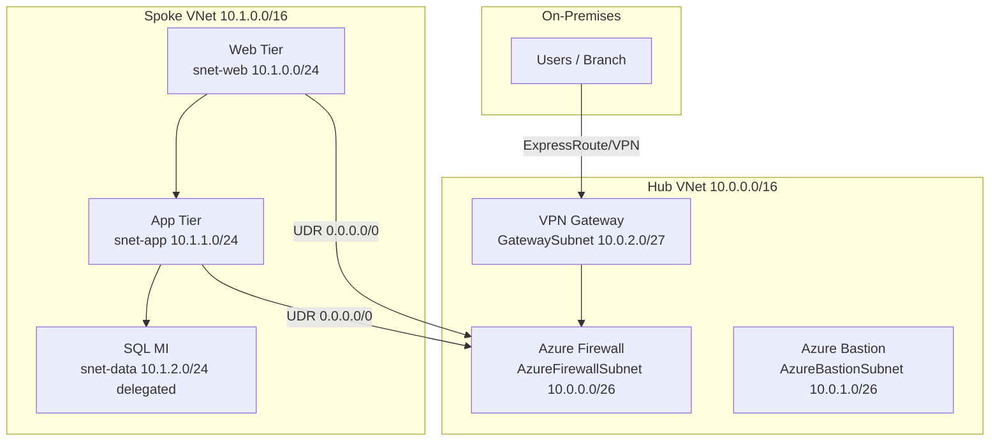

# Example: L400 Migration Advisory Output

A deep, implementation-ready (L400) advisory for a lift-and-shift migration of a 3-tier
on-premises application to an Azure hub-spoke landing zone. L400 means production-grade
detail: explicit subnet CIDRs, NSG rules, UDRs, DNS private zones, firewall policy,
SKU-level sizing, and a costed comparison including Azure Hybrid Benefit (AHB) and
Reserved Instances (RI).

---

## Prompt

> "We have an on-prem 3-tier app — 2 web servers (8 vCPU / 32 GB), 2 app servers
> (16 vCPU / 64 GB), and a SQL Server 2019 cluster (32 vCPU / 256 GB). Give me an L400
> lift-and-shift plan to Azure with a hub-spoke network, a full cost comparison including
> Azure Hybrid Benefit and 3-year Reserved Instances, the architecture spec, and the
> migration steps. Target region East US 2."

---

## 1. Solution Summary

Lift-and-shift the web and app tiers to **Azure VMs** in a zone-redundant **spoke VNet**,
and re-platform SQL Server 2019 to **Azure SQL Managed Instance (SQL MI)** for near-100%
compatibility without managing OS/patching. A **hub VNet** centralizes Azure Firewall,
Bastion, and hybrid connectivity. All egress is forced through Azure Firewall via UDR.

| Tier | Source (each) | Count | Azure target | SKU | Zones |
|------|---------------|-------|--------------|-----|-------|
| Web | 8 vCPU / 32 GB | 2 | Azure VM (Windows) | `D8s_v5` | 1, 2 |
| App | 16 vCPU / 64 GB | 2 | Azure VM (Windows) | `D16s_v5` | 1, 2 |
| Data | 32 vCPU / 256 GB | 1 cluster | Azure SQL MI | Business Critical, 32 vCore Gen5 | Zone-redundant |
| Disks | — | — | Premium SSD P-series | `P30` OS + `P40` data | — |

> **Sizing rule:** never downsize — map to the next equal-or-larger SKU. `D8s_v5` =
> 8 vCPU / 32 GB and `D16s_v5` = 16 vCPU / 64 GB match exactly; SQL MI Business Critical
> chosen for the HA cluster's always-on requirement.

---

## 2. Cost Comparison

Region **East US 2**, Windows Server, 730 hrs/month. Figures are list-price estimates for
planning — validate with the live Azure Pricing MCP before quoting.

### 2.1 Compute — pricing options per VM tier

| Resource | Qty | PAYG (no AHB) /mo | PAYG + AHB /mo | 3Y RI + AHB /mo |
|----------|-----|-------------------|----------------|-----------------|
| Web `D8s_v5` | 2 | $1,121 | $561 | $231 |
| App `D16s_v5` | 2 | $2,242 | $1,122 | $462 |
| **Compute subtotal** | | **$3,363** | **$1,683** | **$693** |

> AHB removes the Windows license cost (uses existing Software Assurance); 3-year RI
> discounts the compute base ~60%. Stacking both is the lowest-cost option.

### 2.2 Full monthly estimate (recommended: 3Y RI + AHB)

| Component | SKU | Monthly |
|-----------|-----|---------|
| Web + App VMs | `D8s_v5` ×2, `D16s_v5` ×2 (3Y RI + AHB) | $693 |
| Managed disks | 4× P30 OS + 2× P40 data | $430 |
| Azure SQL MI | Business Critical, 32 vCore Gen5 (3Y RI + AHB) | $4,150 |
| Azure Firewall | Standard + 1 public IP | $950 |
| Azure Bastion | Standard | $140 |
| VPN Gateway | VpnGw1 | $140 |
| Load Balancer | Standard, 1 rule | $25 |
| Log Analytics | ~50 GB/mo ingest | $115 |
| Private DNS / peering | zones + ~1,000 GB inter-VNet | $35 |
| **Total** | | **≈ $6,678 / mo** |

### 2.3 Strategy comparison (whole solution, monthly)

| Strategy | Monthly | vs PAYG |
|----------|---------|---------|
| PAYG, no AHB | $11,128 | baseline |
| PAYG + AHB | $8,448 | −24% |
| **3Y RI + AHB (recommended)** | **$6,678** | **−40%** |

> **Takeaway:** combining Azure Hybrid Benefit with 3-year Reserved Instances saves
> roughly **$4,450/month (~$53K/year)** versus on-demand list pricing.

---

## 3. Architecture Spec (L400)

### 3.1 Network design

| VNet | CIDR | Subnet | CIDR | Purpose |
|------|------|--------|------|---------|
| Hub `vnet-hub` | 10.0.0.0/16 | AzureFirewallSubnet | 10.0.0.0/26 | Azure Firewall |
| | | AzureBastionSubnet | 10.0.1.0/26 | Bastion |
| | | GatewaySubnet | 10.0.2.0/27 | VPN/ER gateway |
| Spoke `vnet-spoke-prod` | 10.1.0.0/16 | snet-web | 10.1.0.0/24 | Web VMs |
| | | snet-app | 10.1.1.0/24 | App VMs |
| | | snet-data | 10.1.2.0/24 | SQL MI (delegated) |

- **Peering:** hub ↔ spoke, `allowGatewayTransit` (hub) + `useRemoteGateways` (spoke).
- **UDR `rt-spoke`:** `0.0.0.0/0` → next hop **Azure Firewall private IP** (10.0.0.4),
  associated to snet-web and snet-app.

### 3.2 NSG rules (deny-all-inbound default)

| NSG | Priority | Direction | Src → Dst | Port | Action |
|-----|----------|-----------|-----------|------|--------|
| `nsg-web` | 100 | Inbound | LoadBalancer → snet-web | 443 | Allow |
| `nsg-web` | 4096 | Inbound | Any → Any | Any | Deny |
| `nsg-app` | 100 | Inbound | snet-web → snet-app | 8080 | Allow |
| `nsg-app` | 4096 | Inbound | Any → Any | Any | Deny |
| `nsg-data` | 100 | Inbound | snet-app → snet-data | 1433 | Allow |
| `nsg-data` | 4096 | Inbound | Any → Any | Any | Deny |

### 3.3 Azure Firewall policy

- **Network rule:** allow snet-app → SQL MI subnet on 1433; allow AzureKMS/Windows Update tags.
- **Application rule:** allow `*.windowsupdate.com`, `*.azure.com`, org FQDNs from spokes.
- **Threat intelligence:** Alert + Deny mode.

### 3.4 DNS & identity

- **Private DNS zones:** `privatelink.database.windows.net` linked to hub + spoke for
  SQL MI private endpoint resolution.
- **Key Vault** with private endpoint for SQL connection strings & VM secrets.
- **Microsoft Entra ID** authentication enabled on SQL MI.

### 3.5 Security & compliance

- DDoS Protection (Standard) on hub VNet.
- Microsoft Defender for Cloud (Servers P2 + SQL) enabled.
- Diagnostic settings on every resource → Log Analytics.
- Azure Policy: enforce tags (`environment`, `migrated-from`, `cost-center`), allowed SKUs/regions.

---

## 4. Migration Steps

1. **Assess (2 weeks)** — Azure Migrate appliance for VM discovery + dependency mapping;
   Data Migration Assistant (DMA) for SQL 2019 → SQL MI compatibility; right-size from
   collected utilization.
2. **Landing zone (1 week)** — Deploy hub-spoke via Bicep: VNets, peering, Firewall +
   policy, Bastion, gateway, NSGs, UDRs, Private DNS zones, Log Analytics, Defender.
3. **Connectivity (3 days)** — Establish ExpressRoute/VPN; validate on-prem ↔ hub routing
   through the firewall.
4. **Data migration (1 week)** — Azure Database Migration Service (DMS) **online** mode to
   SQL MI Business Critical; configure private endpoint + Private DNS; validate.
5. **Compute migration (2 weeks)** — Azure Migrate server replication for web/app VMs into
   the spoke across zones 1 & 2; attach Premium SSD; join domain; install agents.
6. **Test & validate (1 week)** — Functional + load tests; verify NSG/UDR/firewall paths,
   private DNS resolution, Defender posture, backup policies.
7. **Cutover (1 day)** — Final DMS sync, DNS switch to Azure Load Balancer, decommission
   source after a stabilization window.

---

## 5. Validation Checklist

- [ ] All spoke egress traverses Azure Firewall (UDR verified)
- [ ] SQL MI reachable only via private endpoint (no public endpoint)
- [ ] NSGs deny-all-inbound except documented flows
- [ ] VMs distributed across availability zones
- [ ] AHB applied to all Windows VMs and SQL MI
- [ ] 3-year RI purchased for steady-state compute
- [ ] Diagnostic settings + Defender for Cloud enabled
- [ ] Tags enforced via Azure Policy
