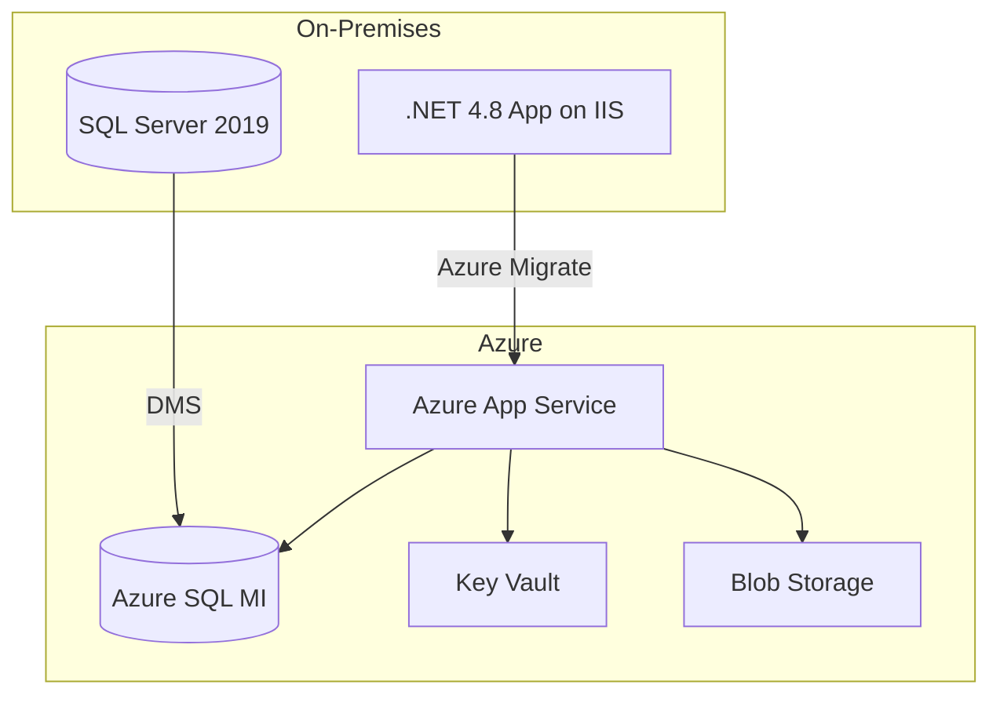

# Example: Migration Advisory Output

This is a sample of what the skill produces when asked about migration.

---

## Prompt
> "How should I migrate my on-prem .NET Framework 4.8 app with SQL Server 2019 to Azure?"

## Skill Response (Abbreviated)

### Summary
Recommend a **re-platform** approach: containerize the .NET app to Azure App Service (or AKS if microservices needed) and migrate SQL Server to Azure SQL Managed Instance for near-100% compatibility.

### Architecture

### Service Mapping

| Requirement | Azure Service | SKU |
|-------------|--------------|-----|
| Web hosting | App Service | P2v3 |
| Database | SQL Managed Instance | GP Gen5 4-core |
| Secrets | Key Vault | Standard |
| Static assets | Blob Storage | Hot LRS |

### Migration Phases

1. **Assessment** (2 weeks) — Run Azure Migrate, DMA for SQL compatibility
2. **Preparation** (2 weeks) — Set up landing zone, networking, Key Vault
3. **Data Migration** (1 week) — DMS online migration with minimal downtime
4. **App Migration** (2 weeks) — Deploy to App Service, test, validate
5. **Cutover** (1 day) — DNS switch, monitoring validation

### Cost Estimate
~$650/month (App Service P2v3 + SQL MI GP 4-core + storage)
