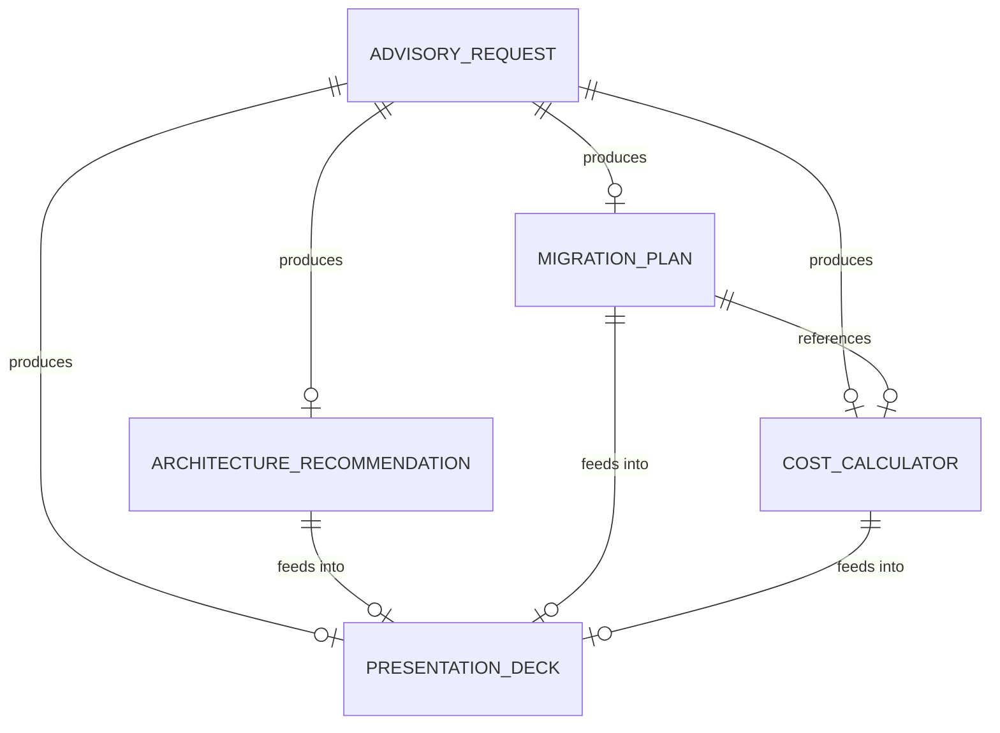
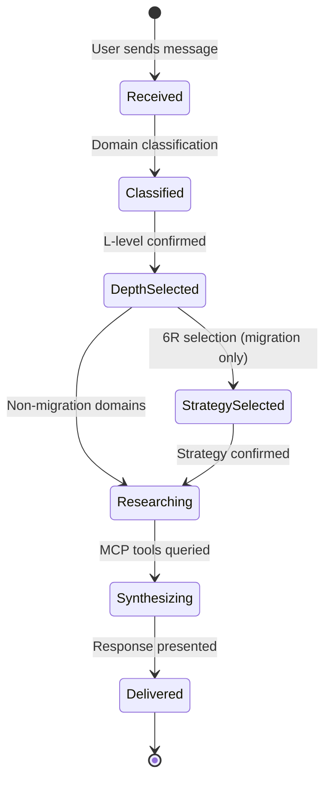
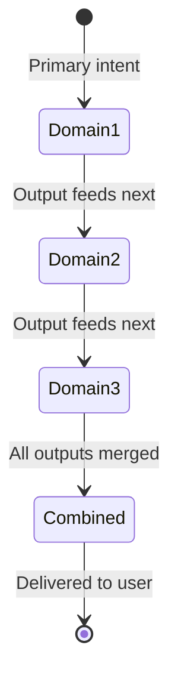

# Data Model: Cloud Advisory Custom Agent

**Phase**: 1 — Design & Contracts  
**Date**: 2026-06-02  
**Feature**: [spec.md](spec.md)

## Entities

### Advisory Request

The user's input that triggers the agent. Classified at intake.

| Field | Type | Description |
|-------|------|-------------|
| intent | string | Primary domain: architecture, migration, modernization, data, waf, cost, document, presentation |
| secondary_intents | string[] | Additional domains when request spans multiple (chained sequentially) |
| depth_level | enum | L100, L200, L300, L400 — set by user at session start |
| workload_description | string | User's description of their workload, environment, or scenario |
| region | string? | Azure region preference (if specified) |
| migration_strategy | enum? | Rehost, Replatform, Refactor, Rearchitect, Rebuild, Replace (if migration domain) |
| uploaded_file | file? | Attached document for Domain 7 processing |

### Architecture Recommendation

Structured output for architecture advisory responses.

| Field | Type | Description |
|-------|------|-------------|
| summary | string | One-paragraph recommendation |
| diagram | mermaid | Architecture visualization (Mermaid syntax) |
| service_mapping | table | Requirements → Azure services mapping |
| waf_considerations | table | Relevant WAF pillar tradeoffs |
| next_steps | string[] | Numbered actionable items |
| documentation_urls | url[] | Microsoft Learn citations |

### Cost Calculator

Excel workbook entity generated via Excel MCP.

| Field | Type | Description |
|-------|------|-------------|
| region | string | Azure region driving pricing lookups |
| strategy | enum | 6R strategy determining cost line items |
| hybrid_split | number? | % on-prem vs % Azure (0-100) |
| sheets | Sheet[] | Workbook sheets (Summary, Compute, Storage, Networking, PaaS, Assumptions) |
| formulas | boolean | Must contain dynamic formulas, not static values |
| charts | Chart[] | Cost breakdown visualizations |

**Sheet structure**:

| Sheet Name | Columns | Purpose |
|------------|---------|---------|
| Summary | Category, Monthly, Annual, % of Total | Executive rollup with charts |
| Compute | Service, SKU, Qty, Unit Price, Monthly | VMs, AKS, App Service, Functions |
| Storage | Service, Tier, Capacity, Monthly | Disks, Blob, Files, Data Lake |
| Networking | Service, Usage, Monthly | VPN, ExpressRoute, Load Balancer |
| PaaS & Data | Service, Tier, Units, Monthly | SQL, Cosmos, Fabric, AI |
| Assumptions | Parameter, Value, Notes | Region, strategy, hybrid %, growth rate, RI discount |

### Migration Plan

Phased roadmap with timeline and effort estimates.

| Field | Type | Description |
|-------|------|-------------|
| strategy | enum | Selected 6R strategy |
| phases | Phase[] | Sequential migration phases |
| gantt_diagram | mermaid | Gantt timeline (Mermaid syntax) |
| effort_total | enum | Overall effort: low, medium, high |
| cost_projection | reference | Link to generated Cost Calculator |

**Phase structure**:

| Field | Type | Description |
|-------|------|-------------|
| name | string | Phase name (e.g., "Assessment", "Pilot Migration") |
| duration | string | Estimated duration (weeks/months) |
| effort | enum | low, medium, high |
| milestones | string[] | Key deliverables |
| dependencies | string[] | What must complete first |

### Presentation Deck

Slide-ready markdown output.

| Field | Type | Description |
|-------|------|-------------|
| title | string | Deck title |
| slides | Slide[] | Ordered slide collection |
| slide_count | number | Total slides generated |

**Slide structure**:

| Field | Type | Description |
|-------|------|-------------|
| title | string | Slide heading |
| content | markdown | Bullets, tables, or diagrams (max 6 bullets) |
| diagram | mermaid? | Optional Mermaid visualization |
| speaker_notes | string | Presenter context |

## Relationships

## State Transitions

### Advisory Request Lifecycle

### Multi-Domain Chaining

## Validation Rules

| Entity | Rule | Enforcement |
|--------|------|-------------|
| Advisory Request | depth_level must be set before generation | Agent prompts if missing |
| Advisory Request | migration_strategy must be set for migration domain | Agent prompts 6R options |
| Architecture Recommendation | Must have all 5 fields populated | Agent checklist before delivery |
| Cost Calculator | Assumptions sheet must have editable cells | SC-002 validation |
| Cost Calculator | formulas = true (no static values) | SC-008 validation |
| Migration Plan | Each phase must have effort estimate | FR-012 |
| Presentation Deck | Max 6 bullets per slide | FR-009 formatting rule |
| Presentation Deck | Speaker notes required on each slide | SC-007 |
