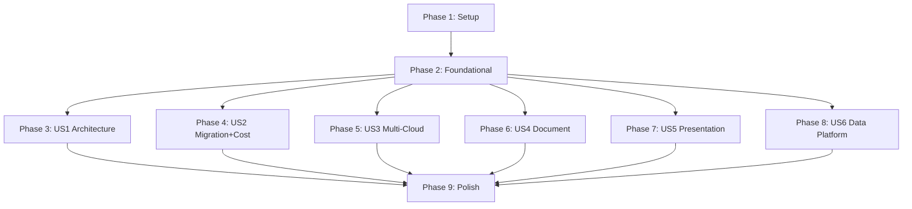

# Tasks: Cloud Advisory Custom Agent

**Input**: Design documents from `specs/001-cloud-advisory/`

**Prerequisites**: plan.md ✅, spec.md ✅, research.md ✅, data-model.md ✅, contracts/ ✅, quickstart.md ✅

**Organization**: Tasks grouped by user story to enable independent implementation and testing.

## Format: `[ID] [P?] [Story] Description`

- **[P]**: Can run in parallel (different files, no dependencies)
- **[Story]**: Which user story (US1–US6)
- Exact file paths included in descriptions

---

## Phase 1: Setup (Project Initialization)

**Purpose**: Create project scaffolding, MCP configuration, and shared infrastructure files

- [X] T001 Create `.vscode/mcp.json` with all 7 MCP server definitions (Azure, Microsoft Learn, Excel, Markitdown, AWS, GCP, Fabric)
- [X] T002 [P] Create `.vscode/settings.json` with recommended VS Code settings for agent development
- [X] T003 [P] Update `.github/copilot-instructions.md` to reference plan.md path between SPECKIT markers

---

## Phase 2: Foundational (Blocking Prerequisites)

**Purpose**: Core agent definition updates that ALL user stories depend on

**⚠️ CRITICAL**: No user story work can begin until this phase is complete

- [X] T004 Update `.github/agents/microsoft-cloud-advisor.agent.md` YAML frontmatter tools line to include AWS, GCP, and Fabric MCP tool prefixes
- [X] T005 Add L-level depth prompting protocol to agent.md First Interaction section (L100–L400 selection table with defaults)
- [X] T006 Add 6R strategy user selection protocol to agent.md (present options, require selection before migration/cost work)
- [X] T007 Add graceful degradation instructions to agent.md (replace "Do NOT proceed with degraded answers" with catch-and-continue pattern per research.md decision #8)
- [X] T008 [P] Add multi-domain chaining instructions to agent.md (sequential dependency-order routing per contracts/agent-interface.md)
- [X] T009 [P] Add region service gap handling to agent.md (suggest alternative region with tradeoff table per contracts/agent-interface.md error contract)
- [X] T047 [P] Add MCP Health Check Protocol to agent.md (startup verification that all configured MCP servers respond — FR-001)
- [X] T048 [P] Add unified domain classification dispatcher to agent.md (8-domain routing table with priority ordering for multi-domain requests — FR-002)
- [X] T049 [P] Add security and compliance considerations instruction to agent.md (FR-014: include in all advisory responses)
- [X] T050 [P] Add cost implications instruction to agent.md (FR-013: include for each recommended option)

**Checkpoint**: Foundation ready — agent has all cross-cutting protocols. User story implementation can begin in parallel.

---

## Phase 3: User Story 1 — Azure Architecture Advisory (Priority: P1) 🎯 MVP

**Goal**: Agent provides structured Azure architecture guidance with diagram, service mapping, WAF considerations, and next steps — all cited from Microsoft Learn

**Independent Test**: Ask "What Azure architecture do you recommend for a 3-tier web application serving 5,000 concurrent users?" and verify response includes Mermaid diagram, service mapping table, WAF considerations, and actionable next steps with Microsoft Learn URLs.

### Implementation for User Story 1

- [X] T010 [US1] Add architecture advisory domain classification rules to agent.md (trigger keywords: architecture, design, hub-spoke, landing zone, workload)
- [X] T011 [US1] Add architecture response template to agent.md with L-level variants (L100: summary+diagram+bullets; L200: full structure; L300: +networking+SKU; L400: +CLI+Bicep)
- [X] T012 [P] [US1] Update `.github/skills/microsoft-cloud-advisor/SKILL.md` Step 1 (Architecture Advisory) to reference Azure MCP and Microsoft Learn MCP tool calls
- [X] T013 [P] [US1] Add WAF pillar reference requirement to architecture advisory section in agent.md (FR-007: must reference at least one pillar tradeoff)
- [X] T014 [US1] Add Mermaid diagram generation instructions to agent.md architecture section (FR-004: specify diagram types — C4, network topology, data flow)
- [X] T015 [US1] Add service mapping table format to agent.md (columns: Requirement, Azure Service, SKU, Justification)

**Checkpoint**: User Story 1 complete — agent delivers full architecture advisory responses

---

## Phase 4: User Story 2 — Migration Planning with Cost Calculator (Priority: P2)

**Goal**: Agent applies 6R decision tree, generates phased migration roadmap with Gantt, and produces Excel cost calculator with region-specific pricing

**Independent Test**: Say "Help me migrate 20 Windows Server VMs from our datacenter to Azure East US using a lift-and-shift approach" and verify agent produces migration roadmap with Gantt AND Excel workbook with formulas.

### Implementation for User Story 2

- [X] T016 [US2] Add migration domain classification rules to agent.md (trigger keywords: migrate, lift-and-shift, VM sizing, 6R, on-premises)
- [X] T017 [US2] Add 6R decision tree procedure to SKILL.md Step 2 (present options, capture selection, generate strategy-specific plan)
- [X] T018 [US2] Add migration plan response template to agent.md (phases, Gantt mermaid, effort estimates per FR-012)
- [X] T019 [US2] Add cost calculator generation procedure to SKILL.md Step 6 (Excel MCP workflow: create workbook, populate sheets per data-model.md Cost Calculator entity)
- [X] T020 [P] [US2] Update `templates/cost-calculator-template.md` with sheet structure from data-model.md (Summary, Compute, Storage, Networking, PaaS, Assumptions)
- [X] T021 [US2] Add hybrid scenario handling to agent.md migration section (Azure Arc, ExpressRoute/VPN, split-percentage formulas when hybrid_split > 0)
- [X] T022 [US2] Add Gantt timeline generation instructions to agent.md (Mermaid gantt with dateFormat YYYY-MM, phases from Migration Plan entity)

**Checkpoint**: User Story 2 complete — agent generates migration plans and Excel cost calculators

---

## Phase 5: User Story 3 — Multi-Cloud Comparison Advisory (Priority: P3)

**Goal**: Agent queries AWS MCP, GCP MCP, and Azure MCP to provide honest multi-cloud comparisons with structured comparison tables

**Independent Test**: Ask "Compare Azure Kubernetes Service vs AWS EKS vs Google GKE for running 50 microservices" and verify comparison table with pricing, features, and recommendation.

### Implementation for User Story 3

- [X] T023 [US3] Add multi-cloud comparison domain classification rules to agent.md (trigger keywords: vs AWS, vs GCP, compare, multi-cloud)
- [X] T024 [US3] Add multi-cloud comparison response template to agent.md (comparison table with minimum 3 criteria per FR-010, SC-005)
- [X] T025 [P] [US3] Update SKILL.md to add multi-cloud comparison procedure (query each provider MCP, normalize results, generate comparison table; handle partial/incomplete responses by marking gaps in table)
- [X] T026 [US3] Add AWS MCP tool usage instructions to agent.md (which tools to query for service catalog, pricing, capabilities)
- [X] T027 [P] [US3] Add GCP MCP tool usage instructions to agent.md (which tools to query for service catalog, pricing, capabilities)
- [X] T028 [US3] Add honest recommendation protocol to agent.md (may recommend non-Azure where appropriate per contracts/agent-interface.md)

**Checkpoint**: User Story 3 complete — agent delivers multi-cloud comparison tables

---

## Phase 6: User Story 4 — Document Upload and Advisory (Priority: P4)

**Goal**: Agent extracts content from uploaded Word/PDF/PPT files via Markitdown MCP and routes to appropriate advisory domain

**Independent Test**: Upload a Word document containing a network topology description and verify agent extracts key details and provides migration recommendations.

### Implementation for User Story 4

- [X] T029 [US4] Add document processing domain classification rules to agent.md (trigger: file attachment detected, keywords: analyze this document, review this)
- [X] T030 [US4] Add document extraction procedure to SKILL.md Step 7 (Markitdown MCP call → extract markdown → classify intent → route to domain)
- [X] T031 [P] [US4] Add supported/unsupported format handling to agent.md (supported: Word, PDF, PPT, Excel, images; unsupported: reject with guidance per edge case)
- [X] T032 [US4] Add intent classification after extraction to agent.md (classify as architecture/migration/modernization/data/other → delegate to that domain's procedure)

**Checkpoint**: User Story 4 complete — agent processes uploaded documents and provides domain-specific advisory

---

## Phase 7: User Story 5 — Presentation Generation (Priority: P5)

**Goal**: Agent generates slide-ready markdown with proper formatting (separators, max 6 bullets, speaker notes, Mermaid diagrams)

**Independent Test**: Ask "Generate a 5-slide executive summary for migrating our SQL Server estate to Azure SQL" and verify proper slide-separator formatting with speaker notes.

### Implementation for User Story 5

- [X] T033 [US5] Add presentation domain classification rules to agent.md (trigger keywords: presentation, slides, deck, PPT, executive summary)
- [X] T034 [US5] Add presentation generation procedure to SKILL.md Step 8 (slide structure, formatting rules, speaker notes requirement)
- [X] T035 [P] [US5] Update `templates/ppt-slide-templates.md` with slide format from data-model.md Presentation Deck entity (title, content, diagram, speaker_notes)
- [X] T036 [US5] Add slide formatting constraints to agent.md (max 6 bullets, one key message, `---` separators, speaker notes in blockquote per FR-009, SC-007)

**Checkpoint**: User Story 5 complete — agent generates properly formatted presentation markdown

---

## Phase 8: User Story 6 — Data Platform Advisory with Fabric (Priority: P6)

**Goal**: Agent uses Fabric MCP to query OneLake, eventstreams, and KQL databases and provides data platform architecture recommendations

**Independent Test**: Ask "Design a lakehouse architecture for our 50TB data warehouse migration from on-premises SQL Server" and verify Fabric-specific recommendations with architecture diagrams.

### Implementation for User Story 6

- [X] T037 [US6] Add data platform domain classification rules to agent.md (trigger keywords: lakehouse, Fabric, data warehouse, KQL, OneLake, eventstream, unified analytics)
- [X] T038 [US6] Add data platform advisory procedure to SKILL.md (Fabric MCP tool calls: kusto_query, onelake_*, eventstream_* per research.md decision #5)
- [X] T039 [P] [US6] Add Fabric architecture patterns to agent.md (lakehouse, medallion architecture, real-time analytics, hybrid with Synapse)
- [X] T040 [US6] Add data platform decision tree to SKILL.md (when to recommend Fabric vs standalone Synapse vs Cosmos vs SQL)

**Checkpoint**: User Story 6 complete — agent delivers Fabric-powered data platform advisory

---

## Phase 9: Polish & Cross-Cutting Concerns

**Purpose**: Validation, documentation, and final integration across all domains

- [X] T044 Update `skills/microsoft-cloud-advisor/SKILL.md` (root-level copy) to match `.github/skills/microsoft-cloud-advisor/SKILL.md` (canonical source: `.github/skills/`)
- [X] T045 Add validation checklist section to existing `specs/001-cloud-advisory/quickstart.md` (manual acceptance test script matching all SC-001 through SC-008)
- [X] T046 Update README.md with agent installation instructions and usage examples

---

## Dependencies

**Key insight**: After Phase 2 (Foundational), all user stories (Phases 3–8) can be implemented **in parallel** since they operate on different sections of agent.md and SKILL.md.

## Parallel Execution Examples

### Within Phase 2 (Foundational)
- T008 + T009 can run in parallel (different agent.md sections)
- T047 + T048 + T049 + T050 can run in parallel (cross-cutting additions, independent sections)

### Across User Stories (after Phase 2)
- All of Phase 3, 4, 5, 6, 7, 8 can run in parallel — each story modifies distinct sections
- Within each story: tasks marked [P] can run in parallel with each other

### Within Phase 2 (Foundational) — Cross-cutting
- T047 + T048 + T049 + T050 can run in parallel (independent cross-cutting additions moved from Phase 9)

### Within Phase 9 (Polish)
- T044 + T045 + T046 can run in parallel (documentation and sync tasks)

## Implementation Strategy

1. **MVP (Phase 1–3)**: Setup + Foundational + User Story 1 delivers core architecture advisory — the primary value proposition
2. **Increment 2 (Phase 4)**: Add migration planning and cost calculator — highest business impact after architecture
3. **Increment 3 (Phases 5–8)**: Multi-cloud, documents, presentations, Fabric — in any order based on user priority
4. **Final (Phase 9)**: Documentation sync, validation checklist, README — ship readiness
