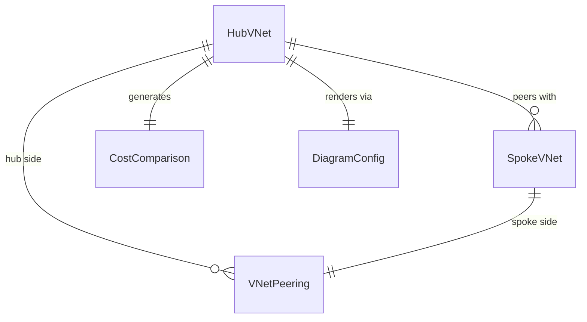

# Data Model: Hub-and-Spoke Network Architecture Skill

**Date**: 2026-06-02

## Entities

### HubVNet

| Field | Type | Description |
|-------|------|-------------|
| name | string | Hub VNet name (e.g., "hub-vnet-eastus") |
| region | string | Azure region (e.g., "eastus") |
| addressSpace | CIDR | VNet address space (e.g., "10.0.0.0/16") |
| firewallSku | enum(Basic, Standard, Premium) | User-selected Firewall SKU |
| gatewayType | enum(VPN, ExpressRoute, None) | Cross-premises connectivity |
| bastionEnabled | boolean | Whether Azure Bastion is deployed |
| dnsResolverEnabled | boolean | Whether DNS Private Resolver is in hub |

**Validation Rules**:
- `firewallSku` must be explicitly provided by user (no default)
- `region` determines pricing lookups
- `addressSpace` must be large enough to contain all hub subnets

### SpokeVNet

| Field | Type | Description |
|-------|------|-------------|
| name | string | Spoke VNet name (e.g., "spoke-prod-01") |
| purpose | string | Workload description (e.g., "Production Web App") |
| addressSpace | CIDR | Spoke address space (e.g., "10.1.0.0/24") |
| peeringToHub | boolean | Always true (peered to hub) |
| gatewayTransit | boolean | Uses hub gateway for on-prem connectivity |
| environment | enum(Production, Non-Production, Dev, Test, Staging) | Environment classification |

**Validation Rules**:
- Max 10 spokes rendered individually in diagrams/tables
- Beyond 10: summarized as "N spokes × unit cost"
- Must be in same region as hub (single-region constraint)

### VNetPeering

| Field | Type | Description |
|-------|------|-------------|
| hubVNet | ref(HubVNet) | Reference to hub |
| spokeVNet | ref(SpokeVNet) | Reference to spoke |
| costPerGb | decimal | $0.01/GB same-region |
| estimatedMonthlyGb | decimal | User-provided or estimated traffic volume |
| allowGatewayTransit | boolean | Hub shares gateway with spoke |
| useRemoteGateway | boolean | Spoke uses hub's gateway |

### CostComparison

| Field | Type | Description |
|-------|------|-------------|
| resource | string | Shared resource name (e.g., "Azure Firewall Standard") |
| hubCostMonthly | decimal | Cost when shared in hub (1×) |
| perSpokeCostMonthly | decimal | Cost if duplicated per spoke (N×) |
| spokeCount | integer | Number of spokes |
| monthlySavings | decimal | Calculated: perSpokeCostMonthly × (N-1) |

### DiagramConfig

| Field | Type | Description |
|-------|------|-------------|
| depthLevel | enum(L100, L200, L300, L400) | Detail level |
| spokeCount | integer | Number of spokes to render |
| includeOnPrem | boolean | Show on-premises connectivity |
| showSubnets | boolean | Show subnet-level detail (L300+) |
| showRouteTables | boolean | Show UDR detail (L400) |

## Relationships

## State Transitions

The agent's hub-spoke advisory flow follows this state machine:

1. **Classify** → Detect hub-spoke trigger in user query
2. **Gather** → Ask for missing inputs (Firewall SKU, spoke count, region)
3. **Compute** → Call MCP pricing, calculate cost comparison
4. **Render** → Generate Mermaid diagram at appropriate L-level
5. **Deliver** → Present recommendation + diagram + cost table + next steps
