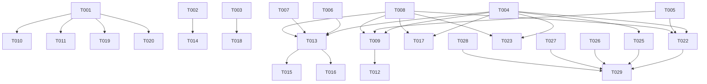

# Tasks: Hub-and-Spoke Network Architecture Skill

**Input**: Design documents from `/specs/002-hub-spoke-networking/`

**Prerequisites**: plan.md ✓, spec.md ✓, research.md ✓, data-model.md ✓, contracts/ ✓, quickstart.md ✓

**Organization**: Tasks are grouped by user story to enable independent implementation and testing of each story.

## Format: `[ID] [P?] [Story] Description`

- **[P]**: Can run in parallel (different files, no dependencies)
- **[Story]**: Which user story this task belongs to (e.g., US1, US2, US3)
- Include exact file paths in descriptions

## Phase 1: Setup (Shared Infrastructure)

**Purpose**: Create project scaffolding — new template files and directory structure for hub-spoke feature.

- [X] T001 Create hub-spoke diagram template at templates/hub-spoke-diagram.md with L100–L400 Mermaid examples per research.md Decision 5
- [X] T002 [P] Create cost comparison template at templates/hub-spoke-cost-comparison.md with table structure per Contract 2
- [X] T003 [P] Create decision matrix template at templates/hub-spoke-decision-matrix.md with 5+ factor comparison per Contract 3

---

## Phase 2: Foundational (Blocking Prerequisites)

**Purpose**: Update the SKILL.md procedure to add hub-spoke as a recognized domain with trigger detection, routing logic, and L-level support. All user stories depend on this.

**⚠️ CRITICAL**: No user story work can begin until this phase is complete.

- [X] T004 Add hub-spoke networking as Domain 9 in .github/skills/microsoft-cloud-advisor/SKILL.md with triggers: "best practice", "price comparison", "VNet peering", "multiple environments", "landing zone", "network topology", "hub-spoke", "spoke" (FR-007)
- [X] T005 Add L-level depth scaling logic to SKILL.md procedure — when hub-spoke domain is classified, check user's requested depth (L100/L200/L300/L400) and scale response detail per research.md Decision 5 (FR-008)
- [X] T006 [P] Add Firewall SKU clarification step to SKILL.md — when cost/pricing question is detected AND Firewall SKU not provided, agent MUST ask user which SKU (Basic/Standard/Premium) before proceeding (FR-002, research.md Decision 2)
- [X] T007 [P] Add MCP pricing graceful degradation logic to SKILL.md — attempt `mcp_azure_mcp_pricing` call, if unavailable show approximate estimates with disclaimer per research.md Decision 4 and Error/Degradation Contract
- [X] T008 Sync public skill copy: copy updated .github/skills/microsoft-cloud-advisor/SKILL.md to skills/microsoft-cloud-advisor/SKILL.md. ⚠️ This task MUST run LAST after all other SKILL.md edits in any phase are complete (including reopened T013, T025). Both copies must be byte-identical.

**Checkpoint**: SKILL.md now recognizes hub-spoke domain, routes correctly, asks for SKU, handles pricing fallback. User story implementation can begin.

---

## Phase 3: User Story 1 — Best Practice Network Architecture Advisory (Priority: P1) 🎯 MVP

**Goal**: When a user asks about Azure networking best practices, the agent recommends hub-spoke with shared hub resources, produces a Mermaid diagram, and provides actionable next steps.

**Independent Test**: Ask the agent "What's the best practice for Azure networking?" → verify it responds with hub-spoke recommendation, hub services table, Mermaid diagram, and next steps per Contract 1.

### Implementation for User Story 1

- [X] T009 [US1] Add best-practice advisory procedure to SKILL.md Domain 9 — when classified as best-practice trigger, output: (1) summary recommendation, (2) hub services table, (3) Mermaid diagram from templates/hub-spoke-diagram.md at appropriate L-level, (4) WAF pillar alignment (Security: centralized firewall; Cost Optimization: shared resources; Reliability: spoke isolation), (5) alternatives note, (6) next steps (Contract 1, FR-001, Constitution Principle IV)
- [X] T010 [P] [US1] Write L100 Mermaid diagram example in templates/hub-spoke-diagram.md — simple hub + 2-3 spoke boxes with peering arrows, no subnet detail (FR-004)
- [X] T011 [P] [US1] Write L200 Mermaid diagram example in templates/hub-spoke-diagram.md — hub services labeled (Firewall, Gateway, Bastion, DNS), spokes named by purpose (FR-004)
- [X] T012 [US1] Add hub services table content to SKILL.md procedure — table listing Azure Firewall, VPN/ExpressRoute Gateway, Azure Bastion, DNS Private Resolver with one-line descriptions per Contract 1 section 2

**Checkpoint**: US1 complete — best-practice questions get hub-spoke recommendation with diagram.

---

## Phase 4: User Story 2 — Price Comparison with Hub Shared Resources (Priority: P1) 🎯 MVP

**Goal**: When a user asks about hub-spoke cost, the agent asks for Firewall SKU + spoke count, calls MCP pricing, and produces a savings table showing shared vs. duplicated resource costs.

**Independent Test**: Ask "Compare cost of hub-spoke vs per-VNet firewall for 4 spokes" → verify agent asks SKU, then produces cost comparison table with monthly savings per Contract 2.

### Implementation for User Story 2

- [X] T013 [US2] Add cost comparison procedure to SKILL.md Domain 9 — when classified as cost/pricing trigger: (1) ask Firewall SKU if missing (Basic/Standard/Premium), (2) ask target Azure region if missing — default to East US 2 as a clearly-labeled editable assumption when unknown (FR-002), (3) ask expected monthly inter-VNet data transfer (GB/month per spoke) — default to 1,000 GB/month/spoke as a clearly-labeled editable assumption when unknown (FR-005), (4) call `mcp_azure_mcp_pricing` for Firewall/Gateway/Bastion in the resolved region, (5) calculate shared-vs-duplicated savings, (6) add VNet peering cost at $0.01/GB × the GB/month volume, (7) present net savings (Contract 2, FR-002, FR-005)
- [X] T014 [P] [US2] Populate templates/hub-spoke-cost-comparison.md with example table showing Firewall Standard, VPN Gateway, Bastion columns for hub (1×) vs. per-spoke (N×) with savings formula
- [X] T015 [P] [US2] Add spoke count rendering rules to cost comparison procedure — ≤10 spokes: individual rows; >10 spokes: "N spokes × unit cost" summary (FR-004 spoke limit rule)
- [X] T016 [US2] Add "Generate Excel calculator" as a next-step option in cost comparison output — reference existing templates/cost-calculator-template.md for Excel MCP integration. Ensure hub-spoke cost data maps to Domain 6 format: region-parameterized pricing (resolved region or East US 2 default), peering volume assumption (GB/month per spoke or 1,000 default), Networking sheet placement, and Assumptions sheet editable input cells per constitution Domain 6 rules

**Checkpoint**: US2 complete — cost questions get live-priced comparison table with savings.

---

## Phase 5: User Story 3 — Single Spoke vs Multiple Spokes Decision (Priority: P2)

**Goal**: When a user asks about spoke topology, the agent produces a decision matrix with 5+ factors and scenario-based recommendations.

**Independent Test**: Ask "Should I use one spoke or multiple spokes?" → verify decision table with ≥5 factors and scenario recommendations per Contract 3.

### Implementation for User Story 3

- [X] T017 [US3] Add decision matrix procedure to SKILL.md Domain 9 — when classified as spoke-topology trigger: output (1) decision summary, (2) comparison table with factors from research.md Decision 6, (3) scenario recommendations, (4) next steps (Contract 3, FR-003)
- [X] T018 [P] [US3] Populate templates/hub-spoke-decision-matrix.md with the 6-factor comparison table (Isolation, Cost, Compliance, Management, Scalability, Team Autonomy) and 3 scenario recommendations (dev/test → single; production+compliance → multiple; multi-team → multiple)

**Checkpoint**: US3 complete — spoke topology questions get structured decision matrix.

---

## Phase 6: User Story 4 — Hub-Spoke Architecture Diagram Generation (Priority: P2)

**Goal**: When a user requests a network diagram, the agent produces a Mermaid hub-spoke diagram at the requested L-level with correct hub services, spokes, and optional on-prem connectivity.

**Independent Test**: Ask "Show me a hub-spoke architecture diagram at L300" → verify Mermaid output with subnet-level detail (GatewaySubnet, AzureFirewallSubnet, AzureBastionSubnet) and IP ranges.

### Implementation for User Story 4

- [X] T019 [US4] Add L300 Mermaid diagram example in templates/hub-spoke-diagram.md — include subnet names (GatewaySubnet, AzureFirewallSubnet, AzureBastionSubnet, AzureFirewallManagementSubnet), IP ranges (10.0.x.0/26), NSG references (FR-004, FR-010)
- [X] T020 [P] [US4] Add L400 Mermaid diagram example in templates/hub-spoke-diagram.md — include route tables (UDR to Firewall), Firewall policy rules, DNS Private Zones (FR-008, FR-010)
- [X] T021 [P] [US4] Add on-premises connectivity element to diagram templates — ExpressRoute/VPN connection node with gateway transit annotation; conditionally included when user specifies on-prem (Contract 4)
- [X] T022 [US4] Add diagram generation procedure to SKILL.md Domain 9 — when diagram is requested: detect L-level, select appropriate template section, render with user-specified spoke count (max 10 individual; >10 use collapsed "Spoke Group (N spokes)" node), include on-prem if specified (FR-004, Contract 4)

**Checkpoint**: US4 complete — diagram requests get L-appropriate Mermaid with correct topology.

---

## Phase 7: User Story 5 — Landing Zone Hub-Spoke Foundation (Priority: P3)

**Goal**: When a user asks about Azure Landing Zones, the agent presents hub-spoke as the networking foundation, explaining connectivity subscription and management group alignment.

**Independent Test**: Ask "How do I set up an Azure Landing Zone?" → verify hub-spoke is presented as networking foundation with connectivity subscription reference.

### Implementation for User Story 5

- [X] T023 [US5] Add landing zone procedure to SKILL.md Domain 9 — when classified as landing-zone trigger: frame hub-spoke as Enterprise-Scale connectivity foundation, reference management group hierarchy, connectivity subscription, and platform-landing-zone separation (FR-006)
- [X] T024 [P] [US5] Add L300+ landing zone detail to SKILL.md — when depth is L300+, include Azure Firewall policies, route tables for forced tunneling, DNS Private Resolver in hub, and reference to Azure Landing Zone accelerator (FR-010)

**Checkpoint**: US5 complete — landing zone questions always lead with hub-spoke as networking foundation.

---

## Phase 8: Polish & Cross-Cutting Concerns

**Purpose**: Handle edge cases, Virtual WAN comparison (FR-009), and validate all contracts are met.

- [X] T025 [P] Add Virtual WAN comparison procedure to SKILL.md — when "Virtual WAN" or "VWAN" trigger detected: provide a qualitative tradeoff comparison (customer-managed hub-spoke vs. Microsoft-managed VWAN) by default per Contract 5 and research.md Decision 7; produce a quantified VWAN vs. hub-spoke cost table (VWAN hub unit + connection units + data processing) ONLY when the user explicitly requests a cost comparison (FR-009)
- [X] T026 [P] Add edge case handling to SKILL.md — when mesh networking asked: acknowledge as alternative, explain hub-spoke preference (centralized security, cost); when flat network detected: recommend phased migration to hub-spoke (spec Edge Cases)
- [X] T027 [P] Add security controls section to SKILL.md — at L300+ include NSG rules, Private Endpoints, Azure Firewall network rules in hub-spoke guidance (FR-010)
- [X] T028 Validate cloud-advisor.agent.md — confirm US7 hub-spoke section triggers match FR-007 trigger list; add any missing triggers from spec to agent frontmatter in .github/agents/cloud-advisor.agent.md
- [X] T029 End-to-end validation — run all 6 quickstart.md test scenarios manually, verify each contract is satisfied (including the three updated clarifications: region default East US 2, peering volume default 1,000 GB/month/spoke, VWAN qualitative-by-default), document any gaps

---

## Dependencies

## Parallel Execution Opportunities

| Phase | Parallelizable Tasks | Reason |
|-------|---------------------|--------|
| Phase 1 | T001 ∥ T002 ∥ T003 | Separate template files, no dependencies |
| Phase 2 | T006 ∥ T007 | Different SKILL.md sections, independent logic |
| Phase 3 | T010 ∥ T011 | Different L-level sections in same template |
| Phase 4 | T014 ∥ T015 | Different files/sections |
| Phase 6 | T019 ∥ T020 ∥ T021 | Different L-level sections and elements |
| Phase 8 | T025 ∥ T026 ∥ T027 | Independent SKILL.md sections |

## Implementation Strategy

1. **MVP (Phase 1–4)**: Setup + Foundational + US1 + US2 = agent can recommend hub-spoke and produce cost comparisons. This covers both P1 user stories.
2. **Increment 2 (Phase 5–6)**: US3 + US4 = decision matrix and diagram generation at all L-levels.
3. **Increment 3 (Phase 7–8)**: US5 + polish = landing zone integration, Virtual WAN comparison, edge cases, validation.
4. **Total estimated scope**: 29 tasks across 8 phases. Core MVP is tasks T001–T016 (16 tasks).
