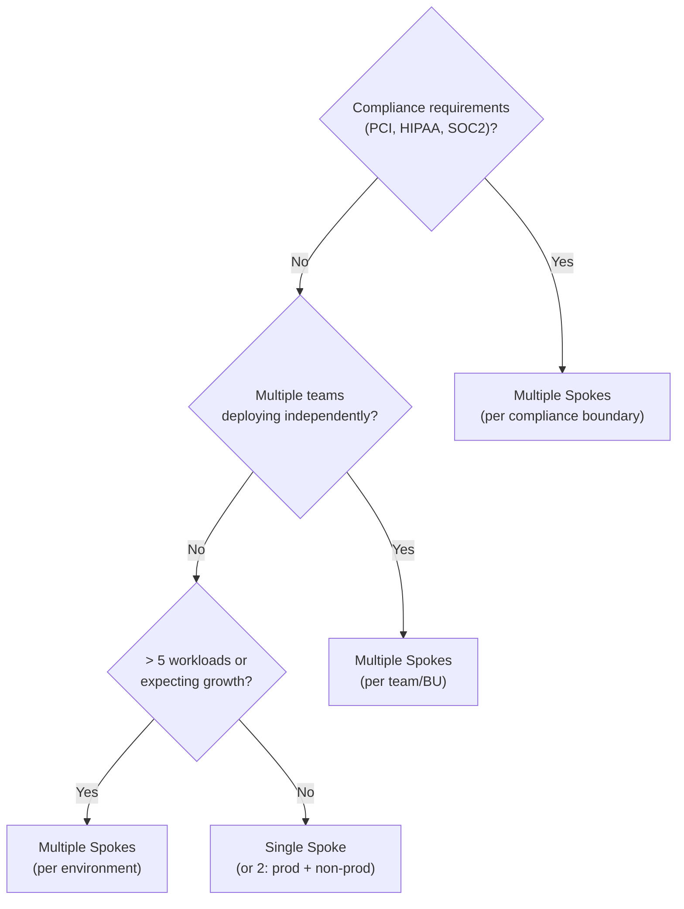

# Hub-and-Spoke Decision Matrix: Single vs. Multiple Spokes

Use this template when advising on spoke topology decisions.

## Decision Summary

The choice between single and multiple spokes depends on workload isolation requirements, compliance boundaries, team structure, and cost tolerance. Multiple spokes are recommended for production workloads in regulated industries or multi-team organizations.

## Comparison Table (6 Factors)

| Factor | Single Spoke | Multiple Spokes | Weight |
|--------|-------------|-----------------|--------|
| **Isolation** | Shared fault domain — one spoke failure affects all workloads | Independent fault domains — spoke failure is contained | High |
| **Cost** | Lower — fewer peering connections ($0.01/GB × 1 peering), simpler routing | Higher — more peering connections, per-spoke UDRs, potentially more NSGs | Medium |
| **Compliance** | Harder to segment regulated data — requires subnet-level NSGs and ASGs | Natural compliance boundaries — dedicated spoke per regulatory domain (PCI, HIPAA) | High |
| **Management** | Simpler — one VNet, fewer NSGs, single address space to plan | More complex — but scalable with Azure Policy, Blueprints, and IaC | Medium |
| **Scalability** | Limited by single VNet address space (max /16 = 65k IPs) | Each spoke has independent address space — practically unlimited | Medium |
| **Team Autonomy** | Shared responsibility — all teams in one VNet, RBAC at subnet level | Delegated per spoke — each team owns their spoke RBAC, NSGs, and routing | High |

## Scenario Recommendations

### Scenario 1: Dev/Test or Small Organization
**Recommendation**: Single spoke (or 2 spokes: one prod, one non-prod)

- Few workloads (< 5 applications)
- Single team manages everything
- No regulatory compliance requirements
- Cost-sensitive — minimize peering overhead
- Acceptable shared blast radius

### Scenario 2: Production with Compliance Requirements
**Recommendation**: Multiple spokes (one per compliance boundary)

- Regulated industry (finance, healthcare, government)
- PCI DSS, HIPAA, SOC2 require network segmentation
- Audit requirements demand clear boundaries
- Different data classification levels (public, internal, confidential)
- Need to demonstrate isolation to auditors

### Scenario 3: Multi-Team / Enterprise
**Recommendation**: Multiple spokes (one per team or business unit)

- Multiple teams deploying independently
- Different release cadences per team
- Teams need autonomy over their network policies
- Subscription-level isolation desired (spoke per subscription)
- Azure Landing Zone alignment (one spoke per landing zone)

## Decision Flowchart

## Next Steps

1. Identify compliance boundaries in your organization
2. Map teams to workloads to determine spoke ownership
3. Plan IP address spaces (hub: /16, spokes: /16 or /24 each)
4. Review Azure Landing Zone spoke patterns for enterprise alignment
5. Consider starting with 2 spokes (prod + non-prod) and expanding
