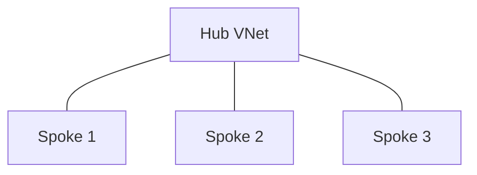
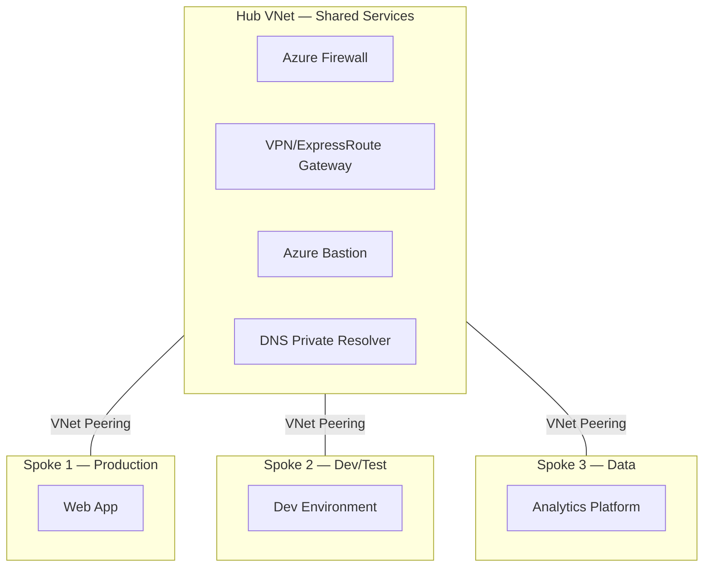
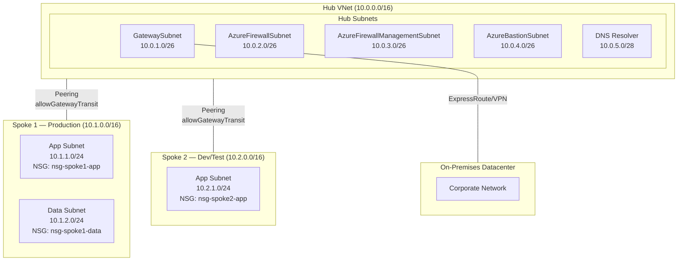
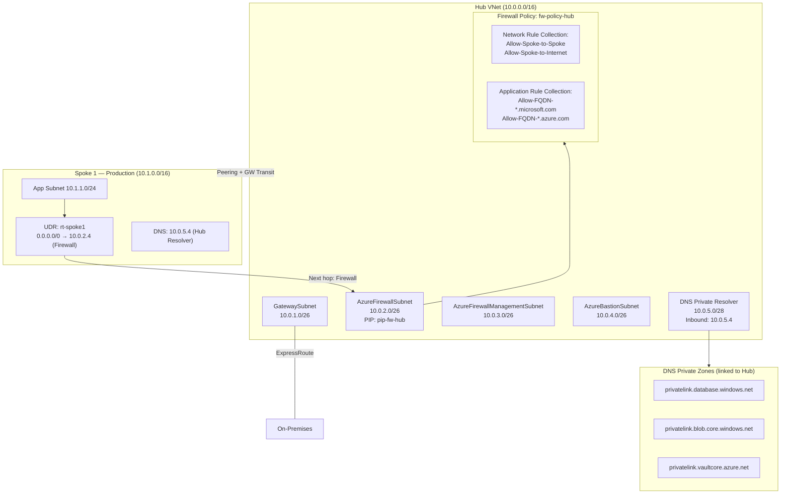
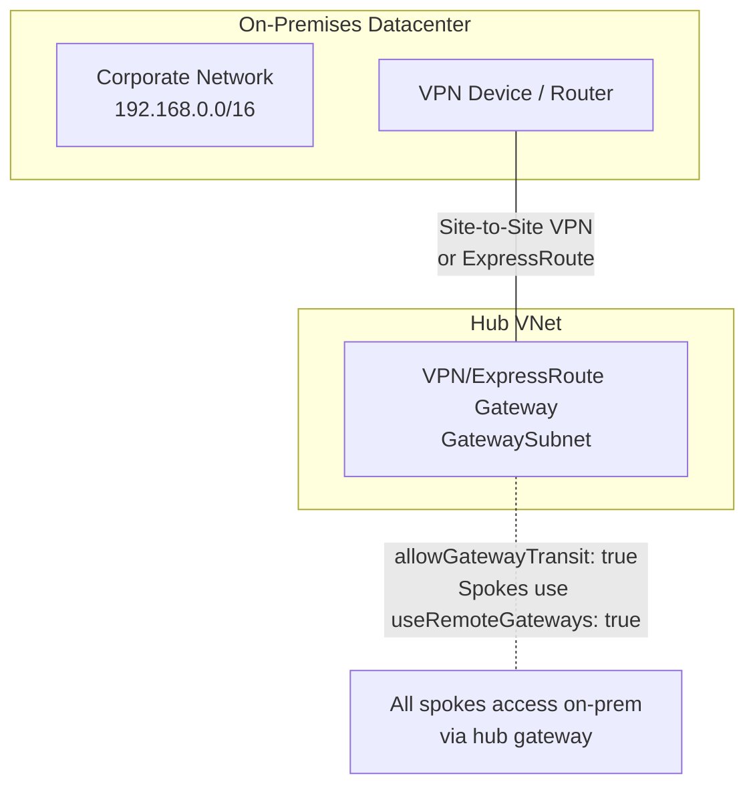
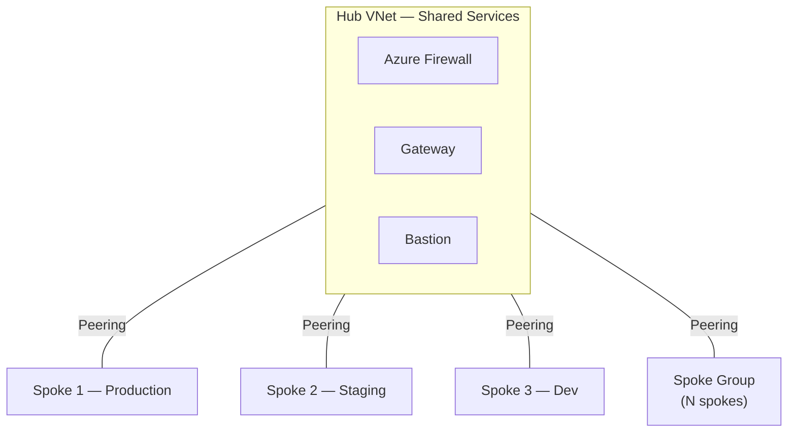

# Hub-and-Spoke Architecture Diagram Templates

Use these Mermaid diagram templates at the appropriate L-level depth.

## L100 — Executive Overview

Simple hub + spoke topology. No internal detail.

**Use when**: L100 depth, executive audience, first introduction to hub-spoke concept.

---

## L200 — Architecture Overview

Hub services labeled, spokes named by purpose.

**Use when**: L200 depth, IT architects, showing what services live in each VNet.

---

## L300 — Engineering Detail

Subnet-level detail with IP ranges and NSG references.

**Use when**: L300 depth, engineers implementing the network, need subnet and IP planning.

---

## L400 — Deep Dive / Specialist

Route tables, Firewall policy rules, DNS Private Zones, and NSG flow.

**Use when**: L400 depth, network security specialists, need UDR flow, firewall rules, DNS resolution chain.

---

## On-Premises Connectivity Element

Add this when user specifies on-prem or hybrid connectivity:

---

## Collapsed Spoke Group (>10 Spokes)

When rendering more than 10 spokes, use a collapsed group node:

**Rule**: Render up to 10 spokes individually. Beyond 10, use the collapsed "Spoke Group (N spokes)" node.
