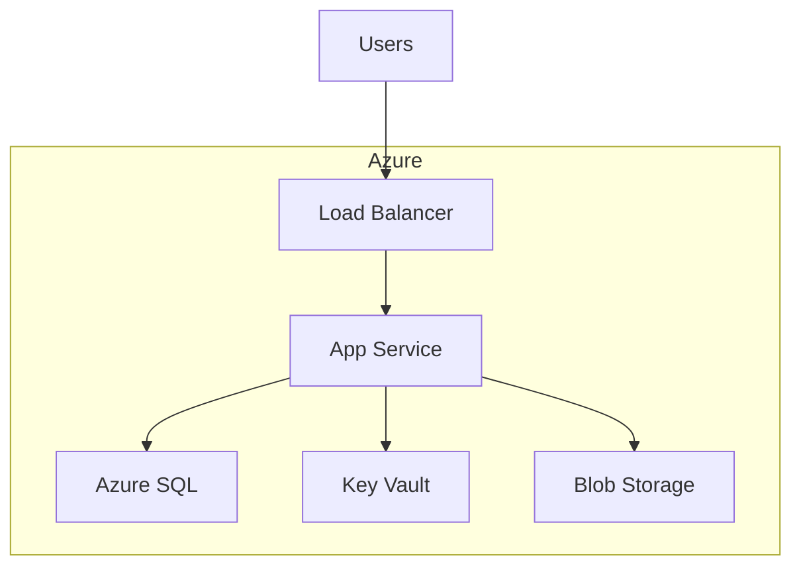
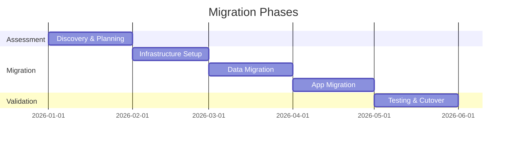

# PPT Slide Templates — Markdown Reference

This document provides the full set of slide templates for generating PowerPoint-ready markdown using the Microsoft Cloud Advisor skill.

---

## Format Rules

1. Each slide is separated by `---` on its own line
2. `# Heading` = Slide title
3. `## Subheading` = Subtitle
4. Bullet lists = Slide body content
5. `> Speaker notes:` = Hidden presenter notes
6. Mermaid code blocks = Diagrams
7. Tables = Comparison/data slides
8. Max 6 bullets per slide

---

## Template Library

### 1. Title Slide

```markdown
---
# [Project Name]
## [Subtitle — e.g., Azure Migration Proposal]

**Prepared by**: [Name/Team]  
**Date**: [Date]  
**Audience**: [Stakeholders]

---
```

### 2. Agenda Slide

```markdown
---
# Agenda

1. Current State Assessment
2. Recommended Architecture
3. Migration Approach
4. Cost Analysis
5. Timeline & Risks
6. Next Steps

---
```

### 3. Current State Slide

```markdown
---
# Current State

| Component | Technology | Pain Point |
|-----------|-----------|------------|
| Web Tier | IIS / .NET Framework | EOL runtime |
| Database | SQL Server 2016 | No HA |
| Storage | NAS | Capacity limits |

> Speaker notes: Emphasize the EOL risk as the primary driver

---
```

### 4. Architecture Diagram Slide

```markdown
---
# Target Architecture



> Speaker notes: Explain the managed service benefits for each component

---
```

### 5. Comparison / Options Slide

```markdown
---
# Migration Options

| Criteria | Lift & Shift | Re-Platform | Re-Architect |
|----------|:---:|:---:|:---:|
| Timeline | 2 months | 4 months | 8 months |
| Cost (setup) | Low | Medium | High |
| Long-term TCO | High | Medium | Low |
| Innovation | None | Some | Full |

**Recommendation**: Re-Platform — balances speed with modernization

---
```

### 6. Cost Summary Slide

```markdown
---
# Monthly Cost Estimate

| Service | SKU | Monthly Cost |
|---------|-----|-------------|
| App Service | P2v3 | $290 |
| Azure SQL | S3 | $150 |
| Storage | Hot LRS | $45 |
| Networking | VPN + LB | $120 |
| **Total** | | **$605/mo** |

*Annual: ~$7,260 (vs. $15,000 on-prem)*

> Speaker notes: 52% cost reduction vs. current infrastructure

---
```

### 7. Timeline / Gantt Slide

```markdown
---
# Implementation Timeline



---
```

### 8. Risks Slide

```markdown
---
# Key Risks & Mitigations

| Risk | Impact | Likelihood | Mitigation |
|------|--------|-----------|------------|
| Data loss during migration | High | Low | Blue-green deployment + backups |
| Performance degradation | Medium | Medium | Load testing in staging |
| Skill gap | Medium | High | Azure training + partner support |

---
```

### 9. Next Steps Slide

```markdown
---
# Next Steps

- [ ] Approve architecture and budget
- [ ] Set up Azure landing zone
- [ ] Begin Phase 1 assessment
- [ ] Schedule weekly sync meetings
- [ ] Engage Microsoft FastTrack (if eligible)

**Owner**: [Name]  
**Target Start**: [Date]

---
```

### 10. Thank You / Q&A Slide

```markdown
---
# Questions?

**Contact**: [email/teams]  
**Documentation**: [link to repo/wiki]  
**Azure Portal**: portal.azure.com

---
```

---

## Usage Tips

- Combine templates in sequence to build a complete deck
- Replace `[placeholders]` with actual values
- Mermaid diagrams render in most modern slide tools (or export as images)
- Speaker notes help presenters but won't show on slides
- Use the Cost Calculator (Excel) for detailed numbers, reference summary on slides
